# 第一章：数据类型（⭐）

## 1.1 概述

* 根据`变量`中`存储`的`值`的`不同`，我们可以将`变量`分为两类：
  * `普通变量`：变量所对应的内存中存储的是`普通值`。
  * `指针变量`：变量所对应的内存中存储的是`另一个变量的地址`。

* 如下图所示：


> [!NOTE]
>
> 普通变量和指针变量的相同点：
>
> * 普通变量有内存空间，指针变量也有内存空间。
> * 普通变量有内存地址，指针变量也有内存地址。
> * 普通变量所对应的内存空间中有值，指针变量所对应的内存空间中也有值。
>
> 普通变量和指针变量的不同点：
>
> * 普通变量所对应的内存空间存储的是普通的值，如：整数、小数、字符等；指针变量所对应的内存空间存储的是另外一个变量的地址。
> * 普通变量有普通变量的运算方式，而指针变量有指针变量的运算方式（后续讲解）。

* 那么，在 C 语言中变量的数据类型就可以这么划分，如下所示：

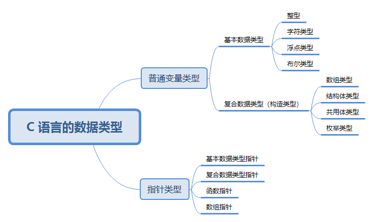

> [!NOTE]
>
> * 根据`普通变量`中`存储`的`值`的类型不同，可以将`普通变量类型`划分为`基本数据类型`（整型、字符类型、浮点类型、布尔类型）和`复合数据类型`（数组类型、结构体类型、共用体类型、枚举类型）。
> * 根据`指针变量`所`指向空间`中`存储`的`值`的类型不同，可以将`指针类型`分为`基本数据类型指针`、`复合数据类型指针`、`函数指针`、`数组指针`等，例如：如果指针所指向的空间保存的是 int 类型，那么该指针就是 int 类型的指针。

## 1.2 整数类型

### 1.2.1 概述

* 整数类型简称整型，用于存储整数值，如：12、20、50 等。
* 根据所占`内存空间`大小的不同，可以将整数类型划分为：
* ① 短整型：

| 类型                                 | 存储空间（内存空间） | 取值范围                            |
| ------------------------------------ | -------------------- | ----------------------------------- |
| unsigned short （无符号短整型）      | 2 字节               | 0 ~ 65,535 (2^16 - 1)               |
| [signed] short（有符号短整型，默认） | 2 字节               | -32,768 (- 2^15) ~ 32,767 (2^15 -1) |

* ② 整型：

| 类型                             | 存储空间（内存空间） | 取值范围                                    |
| -------------------------------- | -------------------- | ------------------------------------------- |
| unsigned int（无符号整型）       | 4 字节（通常）       | 0 ~ 4294967295 (0 ~2^32 -1)                 |
| [signed] int（有符号整型，默认） | 4 字节（通常）       | -2147483648（- 2^31） ~ 2147483647 (2^31-1) |

* ③ 长整型：

| 类型                                | 存储空间（内存空间） | 取值范围        |
| ----------------------------------- | -------------------- | --------------- |
| unsigned long（无符号长整型）       | 4 字节（通常）       | 0 ~2^32 -1      |
| [signed] long（有符号长整型，默认） | 4 字节（通常）       | - 2^31 ~ 2^31-1 |

* ④ 长长整型：

| 类型                                     | 存储空间（内存空间） | 取值范围        |
| ---------------------------------------- | -------------------- | --------------- |
| unsigned long long（无符号长整型）       | 8 字节（通常）       | 0 ~2^64 -1      |
| [signed] long long（有符号长整型，默认） | 8 字节（通常）       | - 2^63 ~ 2^63-1 |

> [!NOTE]
>
> * ① C 语言默认没有规定各种数据类型所占存储单元的长度，但是通常需要遵守：`sizeof(short int) ≤ sizeof(int) ≤ sizeof(long int) ≤ sizeof(long long)` ，具体的存储空间由编译系统自行决定；其中，sizeof 是测量类型或变量、常量长度的运算符。
> * ② short 至少 2 个字节，long 至少 4 个字节。
> * ③ 之所以这么规定，是为了可以让 C 语言长久使用，因为目前主流的 CPU 都是 64 位，但是在 C语言刚刚出现的时候，CPU 还是以 8 位和 16 位为主。如果当时就将整型定死为 8 位或 16 位，那么现在我们肯定不会再学习 C 语言了。
> * ④ 整型分为有符号 signed 和无符号 unsigned 两种，默认是 signed。
> * ⑤ 在实际开发中，`最常用的整数类型`就是 `int` 类型了，如果取值范围不够，就使用 long 或 long long 。
> * ⑥ C 语言中的`格式占位符`非常多，只需要大致了解即可；因为，我们在实际开发中，一般都会使用 C++ 或 Rust 以及其它的高级编程语言，如：Java 等，早已经解决了需要通过`格式占位符`来输入和输出变量。

### 1.2.2 短整型（了解）

* 语法：

```c
unsigned short x = 10 ; // 无符号短整型
```

```c
short x = -10; // 有符号短整型
```

> [!NOTE]
>
> * ① 有符号表示的是正数、负数和 0 ，即有正负号。无符号表示的是 0 和正数，即正整数，没有符号。
> * ② 在 `printf` 中`无符号短整型（unsigned short）`的`格式占位符`是 `%hu` ，`有符号短整型（signed short）`的`格式占位符`是 `%hd` 。
> * ③ 可以通过 `sizeof` 运算符获取`无符号短整型（unsigned short）` 和 `有符号短整型（signed short）` 的`存储空间（所占内存空间）`。
> * ③ 可以通过 `#include <limits.h>` 来获取 `无符号短整型（unsigned short）` 和`有符号短整型（signed short）`的`取值范围`。


* 示例：定义和打印短整型变量

```c
#include <stdio.h>

int main() {

    // 定义有符号 short 类型
    signed short s1 = -100;

    printf("s1 = %hd \n", s1); // s1 = -100

    // 定义无符号 short 类型
    unsigned short s2 = 100;
    printf("s2 = %hu \n", s2); // s2 = 100

    // 定义 short 类型，默认是有符号
    short s3 = -200;
    printf("s3 = %hd \n", s3); // s3 = -200

    return 0;
}
```


* 示例：获取类型占用的内存大小（存储空间）

```c
#include <stdio.h>

int main() {

    size_t s1 = sizeof(unsigned short);
    printf("unsigned short 的存储空间是 %zu 字节 \n", s1); // 2

    size_t s2 = sizeof(signed short);
    printf("signed short 的存储空间是 %zu 字节 \n", s2); // 2

    size_t s3 = sizeof(short);
    printf("short 的存储空间是 %zu 字节 \n", s3); // 2

    return 0;
}
```


* 示例：获取类型的取值范围

```c
#include <limits.h>
#include <stdio.h>

int main() {

    printf("unsigned short 类型的范围是[0,%hu]\n", USHRT_MAX); // [0,65535]
    printf("short 类型的范围是[%hd,%hd]\n", SHRT_MIN,SHRT_MAX); // [-32768,32767]

    return 0;
}
```

### 1.2.3 整型

* 语法：

```c
unsigned int x = 10 ; // 无符号整型
```

```c
int x = -10; // 有符号整型
```

> [!NOTE]
>
> * ① 有符号表示的是正数、负数和 0 ，即有正负号。无符号表示的是 0 和正数，即正整数，没有符号。
> * ② 在 `printf` 中`无符号整型（unsigned int）`的`格式占位符`是 `%u` ，`有符号整型（signed int）`的`格式占位符`是 `%d` 。
> * ③ 可以通过 `sizeof` 运算符获取`无符号整型（unsigned int）` 和 `有符号整型（signed int）` 的`存储空间（所占内存空间）`。
> * ③ 可以通过 `#include <limits.h>` 来获取 `无符号整型（unsigned int）` 和`有符号整型（signed int）`的`取值范围`。


* 示例：定义和打印整型变量

```c
#include <stdio.h>

int main() {

    // 定义有符号 int 类型
    signed int i1 = -100;

    printf("i1 = %d \n", i1); // i1 = -100

    // 定义无符号 int 类型
    unsigned int i2 = 100;
    printf("i2 = %u \n", i2); // i2 = 100

    // 定义 int 类型，默认是有符号
    short i3 = -200;
    printf("i3 = %d \n", i3); // i3 = -200

    return 0;
}
```


* 示例：获取类型占用的内存大小（存储空间）

```c
#include <stdio.h>

int main() {

    size_t i1 = sizeof(unsigned int);
    printf("unsigned int 的存储空间是 %zu 字节 \n", i1); // 4

    size_t i2 = sizeof(signed int);
    printf("signed int 的存储空间是 %zu 字节 \n", i2); // 4

    size_t i3 = sizeof(int);
    printf("int 的存储空间是 %zu 字节 \n", i3); // 4

    return 0;
}
```


* 示例：获取类型的取值范围

```c
#include <limits.h>
#include <stdio.h>

int main() {

    printf("unsigned int 类型的范围是[0,%u]\n", UINT_MAX); // [0,4294967295]
    printf("int 类型的范围是[%d,%d]\n", INT_MIN,INT_MAX); // [-2147483648,2147483647]

    return 0;
}
```

### 1.2.4 长整型（了解）

* 语法：

```c
unsigned long x = 10 ; // 无符号长整型
```

```c
long x = -10; // 有符号长整型
```

> [!NOTE]
>
> * ① 有符号表示的是正数、负数和 0 ，即有正负号。无符号表示的是 0 和正数，即正整数，没有符号。
> * ② 在 `printf` 中`无符号长整型（unsigned long）`的`格式占位符`是 `%lu` ，`有符号长整型（signed long）`的`格式占位符`是 `%ld` 。
> * ③ 可以通过 `sizeof` 运算符获取`无符号长整型（unsigned long）` 和 `有符号长整型（signed long）` 的`存储空间（所占内存空间）`。
> * ③ 可以通过 `#include <limits.h>` 来获取 `无符号长整型（unsigned long）` 和`有符号长整型（signed long）`的`取值范围`。


* 示例：定义和打印长整型变量

```c
#include <stdio.h>

int main() {

    // 定义有符号 long 类型
    signed long l1 = -100;

    printf("l1 = %ld \n", l1); // l1 = -100

    // 定义无符号 long 类型
    unsigned long l2 = 100;
    printf("l2 = %lu \n", l2); // l2 = 100

    // 定义 long 类型，默认是有符号
    long l3 = -200;
    printf("l3 = %ld \n", l3); // l3 = -200

    return 0;
}
```


* 示例：获取类型占用的内存大小（存储空间）

```c
#include <stdio.h>

int main() {

    size_t l1 = sizeof(unsigned long);
    printf("unsigned long 的存储空间是 %zu 字节 \n", l1); // 4

    size_t l2 = sizeof(signed long);
    printf("signed long 的存储空间是 %zu 字节 \n", l2); // 4

    size_t l3 = sizeof(long);
    printf("long 的存储空间是 %zu 字节 \n", l3); // 4

    return 0;
}
```


* 示例：获取类型的取值范围

```c
#include <limits.h>
#include <stdio.h>

int main() {

    printf("unsigned long 类型的范围是[0,%lu]\n", ULONG_MAX); // [0,4294967295]
    printf("long 类型的范围是[%ld,%ld]\n", LONG_MIN,LONG_MAX); // [-2147483648,2147483647]

    return 0;
}
```

### 1.2.5 长长整型（了解）

* 语法：

```c
unsigned long long x = 10 ; // 无符号长长整型
```

```c
long long x = -10; // 有符号长长整型
```

> [!NOTE]
>
> * ① 有符号表示的是正数、负数和 0 ，即有正负号。无符号表示的是 0 和正数，即正整数，没有符号。
> * ② 在 `printf` 中`无符号长长整型（unsigned long long）`的`格式占位符`是 `%llu` ，`有符号长长整型（signed long long）`的`格式占位符`是 `%lld` 。
> * ③ 可以通过 `sizeof` 运算符获取`无符号长长整型（unsigned long long）` 和 `有符号长长整型（signed long long）` 的`存储空间（所占内存空间）`。
> * ③ 可以通过 `#include <limits.h>` 来获取 `无符号长长整型（unsigned long long）` 和`有符号长长整型（signed long long）`的`取值范围`。


* 示例：定义和打印长长整型变量

```c
#include <stdio.h>

int main() {

    // 定义有符号 long long 类型
    signed long long ll1 = -100;

    printf("ll1 = %lld \n", ll1); // ll1 = -100

    // 定义无符号 long long 类型
    unsigned long long ll2 = 100;
    printf("ll2 = %llu \n", ll2); // ll2 = 100

    // 定义 long long 类型，默认是有符号
    long long ll3 = -200;
    printf("ll3 = %lld \n", ll3); // ll3 = -200

    return 0;
}
```


* 示例：获取类型占用的内存大小（存储空间）

```c
#include <stdio.h>

int main() {

    size_t ll1 = sizeof(unsigned long long);
    printf("unsigned long long 的存储空间是 %zu 字节 \n", ll1); // 8

    size_t ll2 = sizeof(signed long long);
    printf("signed long long 的存储空间是 %zu 字节 \n", ll2); // 8

    size_t ll3 = sizeof(long long);
    printf("long long 的存储空间是 %zu 字节 \n", ll3); // 8

    return 0;
}
```


* 示例：获取类型的取值范围

```c
#include <limits.h>
#include <stdio.h>

int main() {

    printf("unsigned long long 类型的范围是[0,%llu]\n", ULLONG_MAX); // [0,18446744073709551615]
    printf("long long 类型的范围是[%lld,%lld]\n", LLONG_MIN,LLONG_MAX); // [-9223372036854775808,9223372036854775807]

    return 0;
}
```

### 1.2.6 字面量后缀

* `字面量`是`源代码`中一个`固定值`的`表示方法`，用于直接表示数据，即：

```c
int num1 = 100; // 100 就是字面量
```

```c
long num2 = 100L; // 100L 就是字面量
```

```c
long long num3 = 100LL; // 100LL 就是字面量
```

> [!NOTE]
>
> * ① 默认情况下的，整数字面量的类型是 int 类型。
> * ② 如果需要表示 long 类型的字面量，需要添加后缀 l 或 L ，建议 L。
> * ③ 如果需要表示 long long类型的字面量，需要添加后缀 ll 或 LL，建议 LL 。
> * ④ 如果需要表示无符号整数类型的字面量，需要添加 u 或 U，建议 U 。


* 示例：

```c
#include <stdio.h>

int main() {

    int num = 100;
    printf("num = %d\n", num); // num = 100

    long num2 = 100L;
    printf("num2 = %ld\n", num2); // num2 = 100

    long long num3 = 100LL;
    printf("num3 = %lld\n", num3); // num3 = 100

    unsigned int num4 = 100U;
    printf("num4 = %u\n", num4); // num4 = 100

    unsigned long num5 = 100LU;
    printf("num5 = %lu\n", num5); // num5 = 100

    unsigned long long num6 = 100ULL;
    printf("num6 = %llu\n", num6); // num6 = 100

    return 0;
}
```

### 1.2.7 精确宽度类型

* 在前文，我们了解到 C 语言的整数类型（short 、int、long、long long）在不同计算机上，占用的字节宽度可能不一样。但是，有的时候，我们希望整数类型的存储空间（字节宽度）是精确的，即：在任意平台（计算机）上都能一致，以提高程序的可移植性。

> [!NOTE]
>
> * Java 语言中的数据类型的存储空间（字节宽度）是一致的，这也是 Java 语言能够跨平台的原因之一（最主要的原因还是 JVM）。
> * 在嵌入式开发中，使用精确宽度类型可以确保代码在各个平台上的一致性。

* 在 C 语言的标准头文件 `<stdint.h>` 中定义了一些新的类型别名，如下所示：

| 类型名称 | 含义            |
| -------- | --------------- |
| int8_t   | 8 位有符号整数  |
| int16_t  | 16 位有符号整数 |
| int32_t  | 32 位有符号整数 |
| int64_t  | 64 位有符号整数 |
| uint8_t  | 8 位无符号整数  |
| uint16_t | 16 位无符号整数 |
| uint32_t | 32 位无符号整数 |
| uint64_t | 64 位无符号整数 |

> [!NOTE]
>
> 上面的这些类型都是类型别名，编译器会指定它们指向的底层类型，如：在某个系统中，如果 int 类型是 32 位，那么 int32_t 就会指向 int ；如果 long 类型是 32 位，那么 int32_t 就会指向 long。


* 示例：

```c
#include <stdio.h>
#include <stdint.h>

int main() {

    // 变量 x32 声明为 int32_t 类型，可以保证是 32 位(4个字节)的宽度。
    int32_t x32 = 45933945;
    printf("x32 = %d \n", x32); // x32 = 45933945

    return 0;
}
```

### 1.2.8 sizeof 运算符

* 语法：

```c
sizeof(表达式)
```

> [!NOTE]
>
> * ① 表达式可以是任何类型的数据类型、变量或常量。
> * ② 返回某种数据类型或某个值占用的字节数量，并且 `sizeof(...)` 的`返回值类型`是 `size_t` 。
> * ③ 在 `printf` 中使用占位符 `%zu` 来处理 `size_t` 类型的值。


* 示例：参数是数据类型

```c
#include <stdio.h>
#include <stddef.h>

int main() {

    size_t s = sizeof(int);

    printf("%zu \n", s); // 4

    return 0;
}
```


* 示例：参数是变量

```c
#include <stdio.h>
#include <stddef.h>

int main() {

    int num = 10;

    size_t s = sizeof(num);

    printf("%zu \n", s); // 4

    return 0;
}
```


* 示例：参数是常量

```c
#include <stdio.h>
#include <stddef.h>

int main() {

    size_t s = sizeof(10);

    printf("%zu \n", s); // 4

    return 0;
}
```

### 1.2.9 数值溢出

* 所谓的数值溢出指的是：当超过一个数据类型能够存放的最大范围的时候，数值就会溢出。
  * 如果达到了最大值，再进行加法计算，数据就会超过该类型能够表示的最大值，叫做上溢出。
  * 如果这个数目前是最小值，再进行减法计算， 数据就会超过该类型的最小值， 叫做下溢出。

* 在 C 语言中，`整数`的`数据类型`分为`无符号`和`有符号`的，其在底层表示和存储是不一样的，即：
  * `无符号整数不使用最高位作为符号位`，所有的位都用于表示数值，如：对于一个 4 位无符号整数，二进制表示的范围是从 0000 到 1111 ，那么十进制表示的范围是从 0 到 15。
  * `有符号整数使用最高位作为符号位`，这意味着它们可以表示正数和负数，通常使用补码来表示有符号整数。在补码表示法中：最高位为 0 表示正数、最高位为 1 表示负数，如：对于一个4位有符号整数，二进制表示的范围是从 0000（0） 到 0111 （7），1000 （-8）到 1111（-1）。

> [!NOTE]
>
> * 在 C 语言中，无符号整数，最高位不是符号位，它是数值的一部分。
> * 在 C 语言中，有符号整数，最高位是符号位，用于表示正负数。

* 对于无符号的数值溢出：
  * 当数据到达最大值的时候，再加 1 就会回到无符号数的最小值。
  * 当数据达到最小值的时候，再减 1 就会回到无符号数的最大值。

* 那么，无符号的上溢出，原理就是这样的：

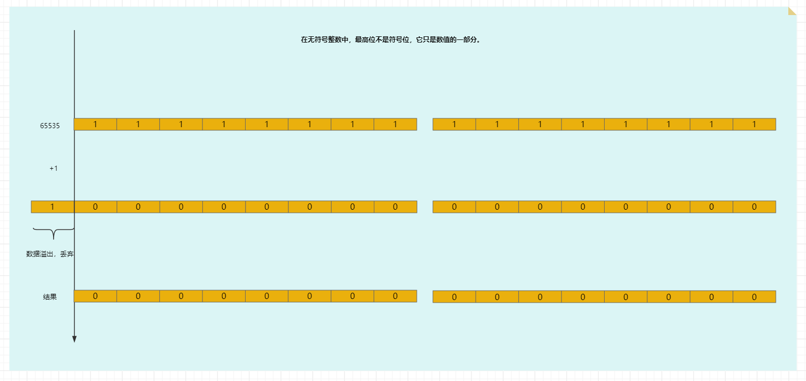

* 那么，无符号的下溢出，原理就是这样的（需要先借位，然后再减）：

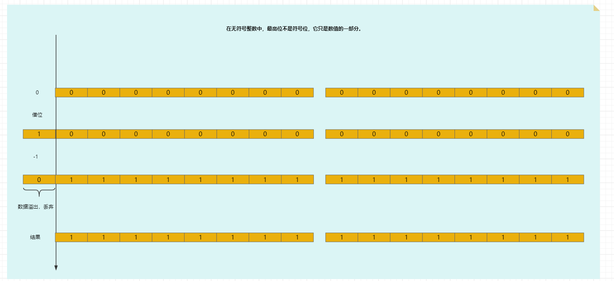

* 对于有符号的数值溢出：
  * 当数据到达最大值的时候，再加 1 就会回到有符号数的最小值。
  * 当数据达到最小值的时候，再减 1 就会回到有符号数的最大值。

* 那么，有符号的上溢出，原理就是这样的：

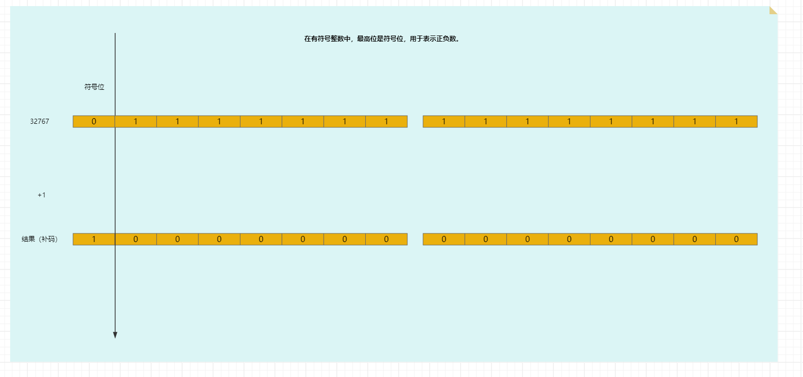

* 那么，有符号的下溢出，原理就是这样的：

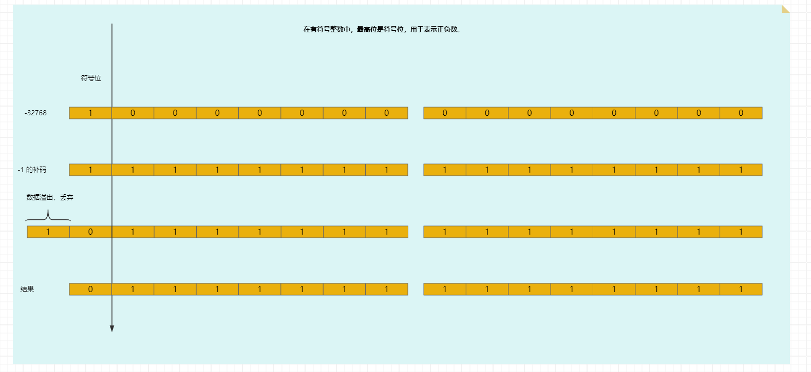

> [!NOTE]
>
> 在实际开发中，选择合适的数据类型，以避免数值溢出问题！！！


* 示例：无符号的上溢出和下溢出

```c
#include <limits.h>
#include <stdio.h>

int main() {

    unsigned short s1 = USHRT_MAX + 1;
    printf("无符号的上溢出 = %hu \n", s1); // 0

    unsigned short s2 = 0 - 1;
    printf("无符号的下溢出 = %hu \n", s2); // 65535

    return 0;
}
```


* 示例：有符号的上溢出和下溢出

```c
#include <limits.h>
#include <stdio.h>

int main() {

    short s1 = SHRT_MAX + 1;
    printf("有符号的上溢出 = %hd \n", s1); // -32768

    short s2 = SHRT_MIN - 1;
    printf("有符号的下溢出 = %hd \n", s2); // 32767

    return 0;
}
```

## 1.3 浮点类型

### 1.3.1 概述

* 在生活中，我们除了使用`整数`，如：18、25 之外，还会使用到`小数`，如：3.1415926、6.18 等，`小数`在计算机中也被称为`浮点数`（和底层存储有关）。
* `整数`在计算机底层的存储被称为`定点存储`，如下所示：


* `小数`在计算机底层的存储被称为`浮点存储`，如下所示：


> [!NOTE]
>
> * ① 计算机底层就是采取类似科学计数法的形式来存储小数的，而科学技术法的表现就是这样的，如：3.12 * 10^-2 ；其中，10 是基数，-2 是指数，而 3.12 是尾数。
> * ② 因为尾数区的内存空间的宽度不同，导致了小数的精度也不相同，所以小数在计算机中也称为浮点数。

* 在 C 语言中，变量的浮点类型，如下所示：

| 类型                    | 存储大小 | 值的范围              | 有效小数位数 |
| ----------------------- | -------- | --------------------- | ------------ |
| float（单精度）         | 4 字节   | 1.2E-38 ~ 3.4E+38     | 6 ~ 9        |
| double（双精度）        | 8 字节   | 2.3E-308 ~ 1.7E+308   | 15 ~ 18      |
| long double（长双精度） | 16 字节  | 3.4E-4932 ~ 1.2E+4932 | 18 或更多    |

> [!NOTE]
>
> * ① 各类型的存储大小和精度受到操作系统、编译器、硬件平台的影响。
> * ② 浮点型数据有两种表现形式：
>   * 十进制数形式：3.12、512.0f、0.512（.512，可以省略 0 ）
>   * 科学计数法形式：5.12e2（e 表示基数 10）、5.12E-2（E 表示基数 10）。
> * ③ 在实际开发中，对于浮点类型，建议使用 double 类型；如果范围不够，就使用 long double 类型。

### 1.3.2 格式占位符

* 对于 float 类型的格式占位符，是 `%f` ，默认会保留 `6` 位小数；可以指定小数位，如：`%.2f` 表示保留 `2` 位小数。
* 对于 double 类型的格式占位符，是 `%lf` ，默认会保留 `6` 位小数；可以指定小数位，如：`%.2lf` 表示保留 `2` 位小数。
* 对于 long double 类型的格式占位符，是 `%Lf` ，默认会保留 `6` 位小数；可以指定小数位，如：`%.2Lf` 表示保留 `2` 位小数。
* 如果想输出`科学计数法`形式的浮点数，则使用 `%e`。


* 示例：

```c
#include <stdio.h>

int main() {

    float f1 = 10.0;

    printf("f1 = %f \n", f1); // f1 = 10.000000
    printf("f1 = %.2f \n", f1); // f1 = 10.00

    return 0;
}
```


* 示例：

```c
#include <stdio.h>

int main() {

    double d1 = 13.14159265354;

    printf("d1 = %lf \n", d1); // d1 = 13.141593
    printf("d1 = %.2lf \n", d1); // d1 = 13.14

    return 0;
}
```


* 示例：

```c
#include <stdio.h>

int main() {

    long double d1 = 13.14159265354;

    printf("d1 = %LF \n", d1); // d1 = 13.141593
    printf("d1 = %.2LF \n", d1); // d1 = 13.14

    return 0;
}
```


* 示例：

```c
#include <stdio.h>

int main() {

    float       f1 = 3.1415926;
    double      d2 = 3.14e2;

    printf("f1 = %.2f \n", f1); // f1 = 3.14
    printf("f1 = %.2e \n", f1); // f1 = 3.14e+00
    printf("d2 = %.2lf \n", d2); // d2 = 314.00
    printf("d2 = %.2e \n", d2); // d2 = 3.14e+02

    return 0;
}
```

### 1.3.3 字面量后缀

* 浮点数字面量默认是 double 类型。
* 如果需要表示 float 类型的字面量，需要后面添加后缀 f 或 F。
* 如果需要表示 long double 类型的字面量，需要后面添加后缀 l 或 L。


* 示例：

```c
#include <stdio.h>

int main() {

    float       f1 = 3.1415926f;
    double      d2 = 3.1415926;
    long double d3 = 3.1415926L;

    printf("f1 = %.2f \n", f1); // f1 = 3.14
    printf("d2 = %.3lf \n", d2); // d2 = 3.142
    printf("d3 = %.4Lf \n", d3); // d3 = 3.1416

    return 0;
}
```

### 1.3.4 类型占用的内存大小（存储空间）

* 可以通过 sizeof 运算符来获取 float、double 以及 long double 类型占用的内存大小（存储空间）。


* 示例：

```c
#include <stdio.h>

int main() {

    printf("float 的存储空间是 %zu 字节 \n", sizeof(float)); // 4
    printf("double 的存储空间是 %zu 字节 \n", sizeof(double)); // 8
    printf("long double 的存储空间是 %zu 字节 \n", sizeof(long double)); // 16

    return 0;
}
```

### 1.3.5 类型的取值范围

* 可以通过 `#include <float.h>` 来获取类型的取值范围。


* 示例：

```c
#include <float.h>
#include <stdio.h>

int main() {

    printf("float 的取值范围是：[%.38f, %f] \n", FLT_MIN, FLT_MAX);
    printf("double 的取值范围是：[%lf, %lf] \n", DBL_MIN, DBL_MAX);
    printf("double 的取值范围是：[%Lf, %Lf] \n", LDBL_MIN, LDBL_MAX);

    return 0;
}
```

## 1.4 字符类型

### 1.4.1 概述

* 在生活中，我们会经常说：今天天气真 `好`，我的性别是 `女`，我今年 `10` 岁，像这类数据，在 C 语言中就可以用字符（char）来表示。
* 在 C 语言中，变量的`字符类型`可以表示`单`个字符，如：`'1'`、`'A'`、`'&'`。

> [!NOTE]
>
> * C 语言的出现在 1972 年，由美国人丹尼斯·里奇设计出来；那个时候，只需要 1 个字节的内存空间，就可以完美的表示拉丁体系（英文）文字，如：a-z、A-Z、0-9 以及一些特殊符号；所以，C 语言中不支持多个字节的字符，如：中文、日文等。
> * C 语言中没有字符串类型，是使用字符数组（char 数组）来模拟字符串的，并且字符数组也不是字符串，而是构造类型。
> * 在 C 语言中，如果想要输出中文、日文等多字节字符，就需要使用字符数组（char 数组）。
> * 在 C++、Java 等高级编程语言中，已经提供了 String （字符串）类型，原生支持 Unicode，可以方便地处理多语言和特殊字符。

* 在 C 语言中，可以使用`转义字符 \`来表示特殊含义的字符。

| **转义字符** | **说明** |
| ------------ | -------- |
| `\b`         | 退格     |
| `\n`         | 换行符   |
| `\r`         | 回车符   |
| `\t`         | 制表符   |
| `\"`         | 双引号   |
| `\'`         | 单引号   |
| `\\`         | 反斜杠   |
| ...          |          |

### 1.4.2 格式占位符

* 在 C 语言中，使用 `%c` 来表示 char 类型。


* 示例：

```c
#include <stdio.h>

int main() {

    char c = '&';

    printf("c = %c \n", c); // c = &

    char c2 = 'a';
    printf("c2 = %c \n", c2); // c2 = a

    char c3 = 'A';
    printf("c3 = %c \n", c3); // c3 = A

    return 0;
}
```

### 1.4.3 类型占用的内存大小（存储空间）

* 可以通过 sizeof 运算符来获取 char 类型占用的内存大小（存储空间）。


* 示例：

```c
#include <stdio.h>

int main() {

    printf("char 的存储空间是 %d 字节\n", sizeof(char)); // 1 
    printf("unsigned char 的存储空间是 %d 字节\n", sizeof(unsigned char)); // 1

    return 0;
}
```

### 1.4.4 类型的取值范围

* 可以通过 `#include <limits.h>` 来获取类型的取值范围。


* 示例：

```c
#include <limits.h>
#include <stdio.h>

int main() {

    printf("char 范围是[%d,%d] \n", CHAR_MIN,CHAR_MAX); // [-128,127]
    printf("unsigned char 范围是[0,%d]\n", UCHAR_MAX); // [0,255]

    return 0;
}
```

### 1.4.5 字符类型的本质

* 在 C 语言中，char 本质上就是一个整数，是 ASCII 码中对应的数字，占用的内存大小是 1 个字节（存储空间），所以 char 类型也可以进行数学运算。


* char 类型同样分为 signed char（无符号）和 unsigned char（有符号），其中 signed char 取值范围 -128 ~ 127，unsigned char 取值范围 0 ~ 255，默认是否带符号取决于当前运行环境。
* `字符类型的数据`在计算机中`存储`和`读取`的过程，如下所示：


* 示例：

```c
#include <limits.h>
#include <stdio.h>

int main() {
    // char 类型字面量需要使用单引号包裹
    char a1 = 'A';
    char a2 = '9';
    char a3 = '\t';
    printf("c1=%c, c3=%c, c2=%c \n", a1, a3, a2);

    // char 类型本质上整数可以进行运算
    char b1 = 'b';
    char b2 = 101;
    printf("%c->%d \n", b1, b1);
    printf("%c->%d \n", b2, b2);
    printf("%c+%c=%d \n", b1, b2, b1 + b2);

    // char 类型取值范围
    unsigned char c1 = 200; // 无符号 char 取值范围 0 ~255
    signed char   c2 = 200; // 有符号 char 取值范围 -128~127，c2会超出范围
    char          c3 = 200; // 当前系统，char 默认是 signed char
    printf("c1=%d, c2=%d, c3=%d", c1, c2, c3);

    return 0;
}
```

## 1.5 布尔类型

### 1.5.1 概述

* 布尔值用于表示 true（真）、false（假）两种状态，通常用于逻辑运算和条件判断。

### 1.5.2 早期的布尔类型

* 在 C 语言标准（C89）中，并没有为布尔值单独设置一个数据类型，所以在判断真、假的时候，使用 `0` 表示 `false`（假），`非 0` 表示 `true`（真）。


* 示例：

```c
#include <stdio.h>

int main() {
	
    // 使用整型来表示真和假两种状态
    int handsome = 0; 
    printf("帅不帅[0 丑，1 帅]： ");
    scanf("%d", &handsome);

    if (handsome) {
        printf("你真的很帅！！！");
    } else {
        printf("你真的很丑！！！");
    }

    return 0;
}
```

### 1.5.3 宏定义的布尔类型

* 判断真假的时候，以 `0` 为 `false`（假）、`1` 为 `true`（真），并不直观；所以，我们可以借助 C 语言的宏定义。


* 示例：

```c
#include <stdio.h>

// 宏定义
#define BOOL int
#define TRUE 1
#define FALSE 0

int main() {

    BOOL handsome = 0;
    printf("帅不帅[FALSE 丑，TRUE 帅]： ");
    scanf("%d", &handsome);

    if (handsome) {
        printf("你真的很帅！！！");
    } else {
        printf("你真的很丑！！！");
    }

    return 0;
}
```

### 1.5.4 C99 标准中的布尔类型

* 在 C99 中提供了 `_Bool` 关键字，用于表示布尔类型；其实，`_Bool`类型的值是整数类型的别名，和一般整型不同的是，`_Bool`类型的值只能赋值为 `0` 或 `1` （0 表示假、1 表示真），其它`非 0` 的值都会被存储为 `1` 。


* 示例：

```c
#include <stdio.h>


int main() {

    _Bool handsome = 0;
    printf("帅不帅[0 丑，1 帅]： ");
    scanf("%d", &handsome);

    if (handsome) {
        printf("你真的很帅！！！");
    } else {
        printf("你真的很丑！！！");
    }

    return 0;
}
```

### 1.5.5 C99 标准头文件中的布尔类型（推荐）

* 在 C99 中提供了一个头文件 `<stdbool.h>`，定义了 `bool` 代表 `_Bool`，`false` 代表 `0` ，`true` 代表 `1` 。

> [!NOTE]
>
> 在 C++、Java 等高级编程语言中是有 boolean 类型的关键字的。


* 示例：

```c
#include <stdio.h>


int main() {

    bool handsome = false;
    printf("帅不帅[false 丑，true 帅]： ");
    scanf("%d", &handsome);

    if (handsome) {
        printf("你真的很帅！！！");
    } else {
        printf("你真的很丑！！！");
    }

    return 0;
}
```

## 1.6 数据类型转换

### 1.6.1 概述

* 在 C 语言编程中，经常需要对不同类型的数据进行运算，运算前需要先转换为同一类型，再运算。为了解决数据类型不一致的问题，需要对数据的类型进行转换。

### 1.6.2 自动类型转换（隐式转换）

#### 1.6.2.1 运算过程中的自动类型转换

* 不同类型的数据进行混合运算的时候，会发生数据类型转换，`窄类型会自动转换为宽类型`，这样就不会造成精度损失。


* 转换规则：
  * ① 不同类型的整数进行运算的时候，窄类型整数会自动转换为宽类型整数。
  * ② 不同类型的浮点数进行运算的时候，精度小的类型会自动转换为精度大的类型。
  * ③ 整数和浮点数进行运算的时候，整数会自动转换为浮点数。
* 转换方向：

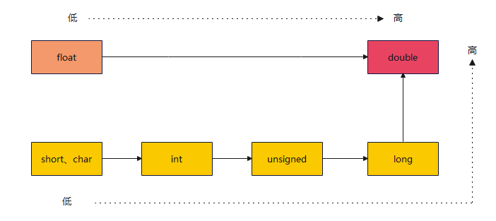

> [!NOTE]
>
> 最好避免无符号整数与有符号整数的混合运算，因为这时 C 语言会自动将 signed int 转为 unsigned int ，可能不会得到预期的结果。


* 示例：

```c
#include <stdio.h>

/**
 * 不同的整数类型混合运算时，宽度较小的类型会提升为宽度较大的类型，比如 short 转为 int ，int 转为 long 等。
 */
int main() {

    short s1 = 10;

    int i = 20;

    // s1 是 short 类型，i 是 int 类型，当 s1 和 i 运算的时候，会自动转为 int 类型后，然后再计算。
    int result = s1 + i;

    printf("result = %d \n", result);

    return 0;
}
```


* 示例：

```c
#include <stdio.h>


int main() {

    int          n2 = -100;
    unsigned int n3 = 20;

    // n2 是有符号，n3 是无符号，当 n2 和 n3 运算的时候，会自动转为无符号类型后，然后再计算。
    int result = n2 + n3;

    printf("result = %d \n", result);

    return 0;
}
```


* 示例：

```c
#include <stdio.h>

/**
* 不同的浮点数类型混合运算时，宽度较小的类型转为宽度较大的类型，比如 float 转为 double ，double 转为 long double 。
*/
int main() {

    float  f1 = 1.25f;
    double d2 = 4.58667435;

    // f1 是 float 类型，d2 是 double 类型，当 f1 和 d2 运算的时候，会自动转为 double 类型后，然后再计算。
    double result = f1 + d2;

    printf("result = %.8lf \n", result);

    return 0;
}
```


* 示例：

```c
#include <stdio.h>

/**
 * 整型与浮点型运算，整型转为浮点型
 */
int main() {

    int    n4 = 10;
    double d3 = 1.67;

    // n4 是 int 类型，d3 是 double 类型，当 n4 和 d3 运算的时候，会自动转为 double 类型后，然后再计算。
    double result = n4 + d3;

    printf("%.2lf", result);

    return 0;
}
```

#### 1.6.2.2 赋值时的自动类型转换

* 在赋值运算中，赋值号两边量的数据类型不同时，等号右边的类型将转换为左边的类型。 
* 如果窄类型赋值给宽类型，不会造成精度损失；如果宽类型赋值给窄类型，会造成精度损失。


> [!NOTE]
>
> C 语言在检查类型匹配方面不太严格，最好不要养成这样的习惯。


* 示例：

```c
#include <stdio.h>

int main() {

    // 赋值：窄类型赋值给宽类型
    int    a1 = 10;
    double a2 = a1;
    printf("a2: %.2f\n", a2); // a2: 10.00

    // 转换：将宽类型转换为窄类型
    double b1 = 10.5;
    int    b2 = b1;
    printf("b2: %d\n", b2); // b2: 10

    return 0;
}
```

### 1.6.3 强制类型转换

* 隐式类型转换中的宽类型赋值给窄类型，编译器是会产生警告的，提示程序存在潜在的隐患，如果非常明确地希望转换数据类型，就需要用到强制（或显式）类型转换。
* 语法：

```c
数据类型 变量名 = (类型名)变量、常量或表达式;
```

> [!NOTE]
>
> 强制类型转换可能会导致精度损失！！！


* 示例：

```c
#include <stdio.h>

int main(){
    double d1 = 1.934;
    double d2 = 4.2;
    int num1 = (int)d1 + (int)d2;         // d1 转为 1，d2 转为 4，结果是 5
    int num2 = (int)(d1 + d2);            // d1+d2 = 6.134，6.134 转为 6
    int num3 = (int)(3.5 * 10 + 6 * 1.5); // 35.0 + 9.0 = 44.0 -> int = 44

    printf("num1=%d \n", num1);
    printf("num2=%d \n", num2);
    printf("num3=%d \n", num3);

    return 0;
}
```


# 第二章：运算符（⭐）

## 2.1 概述

* 运算符是一种特殊的符号，用于数据的运算、赋值和比较等。
* `表达式`指的是一组运算数、运算符的组合，表达式`一定具有值`，一个变量或一个常量可以是表达式，变量、常量和运算符也可以组成表达式，如：


* `操作数`指的是`参与运算`的`值`或者`对象`，如：


* 根据`操作数`的`个数`，可以将运算符分为：
  * 一元运算符（一目运算符）。
  * 二元运算符（二目运算符）。
  * 三元运算符（三目运算符）。
* 根据`功能`，可以将运算符分为：
  * 算术运算符。
  * 关系运算符（比较运算符）。
  * 逻辑运算符。
  * 赋值运算符。
  * 逻辑运算符。
  * 位运算符。
  * 三元运算符。


> [!NOTE]
>
> 掌握一个运算符，需要关注以下几个方面：
>
> * ① 运算符的含义。
> * ② 运算符操作数的个数。
> * ③ 运算符所组成的表达式。
> * ④ 运算符有无副作用，即：运算后是否会修改操作数的值。

## 2.2 算术运算符

* 算术运算符是对数值类型的变量进行运算的，如下所示：

| 运算符 | 描述         | 操作数个数 | 组成的表达式的值         | 副作用 |
| ------ | ------------ | ---------- | ------------------------ | ------ |
| `+`    | 正号         | 1          | 操作数本身               | ❎      |
| `-`    | 负号         | 1          | 操作数符号取反           | ❎      |
| `+`    | 加号         | 2          | 两个操作数之和           | ❎      |
| `-`    | 减号         | 2          | 两个操作数之差           | ❎      |
| `*`    | 乘号         | 2          | 两个操作数之积           | ❎      |
| `/`    | 除号         | 2          | 两个操作数之商           | ❎      |
| `%`    | 取模（取余） | 2          | 两个操作数相除的余数     | ❎      |
| `++`   | 自增         | 1          | 操作数自增前或自增后的值 | ✅      |
| `--`   | 自减         | 1          | 操作数自减前或自减后的值 | ✅      |

> [!NOTE]
>
> 自增和自减：
>
> * ① 自增、自减运算符可以写在操作数的前面也可以写在操作数后面，不论前面还是后面，对操作数的副作用是一致的。
> * ② 自增、自减运算符在前在后，对于表达式的值是不同的。 如果运算符在前，表达式的值是操作数自增、自减之后的值；如果运算符在后，表达式的值是操作数自增、自减之前的值。
> * ③ `变量前++`：变量先自增 1 ，然后再运算；`变量后++`：变量先运算，然后再自增 1 。
> * ④ `变量前--`：变量先自减 1 ，然后再运算；`变量后--`：变量先运算，然后再自减 1 。


* 示例：正号和负号

```c
#include <stdio.h>

int main() {

    int x  = 12;
    int x1 = -x, x2 = +x;

    int y  = -67;
    int y1 = -y, y2 = +y;

    printf("x1=%d, x2=%d \n", x1, x2); // x1=-12, x2=12
    printf("y1=%d, y2=%d \n", y1, y2); // y1=67, y2=-67

    return 0;
}
```


* 示例：加、减、乘、除（整数之间做除法时，结果只保留整数部分而舍弃小数部分）、取模

```c
#include <stdio.h>

int main() {

    int a = 5;
    int b = 2;

    printf("%d + %d = %d\n", a, b, a + b); // 5 + 2 = 7
    printf("%d - %d = %d\n", a, b, a - b); // 5 - 2 = 3
    printf("%d × %d = %d\n", a, b, a * b); // 5 × 2 = 10
    printf("%d / %d = %d\n", a, b, a / b); // 5 / 2 = 2
    printf("%d %% %d = %d\n", a, b, a % b); // 5 % 2 = 1

    return 0;
}
```


* 示例：取模（运算结果的符号与被模数也就是第一个操作数相同。）

```c
#include <stdio.h>

int main() {

    int res1 = 10 % 3;
    printf("10 %% 3 = %d\n", res1); // 10 % 3 = 1

    int res2 = -10 % 3;
    printf("-10 %% 3 = %d\n", res2); // -10 % 3 = -1

    int res3 = 10 % -3;
    printf("10 %% -3 = %d\n", res3); // 10 % -3 = 1

    int res4 = -10 % -3;
    printf("-10 %% -3 = %d\n", res4); // -10 % -3 = -1

    return 0;
}
```


* 示例：自增和自减

```c
#include <stdio.h>

int main() {

    int i1 = 10, i2 = 20;
    int i  = i1++;
    printf("i = %d\n", i); // i = 10
    printf("i1 = %d\n", i1); // i1 = 11

    i = ++i1;
    printf("i = %d\n", i); // i = 12
    printf("i1 = %d\n", i1); // i1 = 12

    i = i2--;
    printf("i = %d\n", i); // i = 20
    printf("i2 = %d\n", i2); // i2 = 19

    i = --i2;
    printf("i = %d\n", i); // i = 18
    printf("i2 = %d\n", i2); // i2 = 18

    return 0;

```


* 示例：

```c
#include <stdio.h>

/*
  随意给出一个整数，打印显示它的个位数，十位数，百位数的值。
  格式如下：
    数字xxx的情况如下：
    个位数：
    十位数：
    百位数：
  例如：
    数字153的情况如下：
    个位数：3
    十位数：5
    百位数：1
 */
int main() {

    int num = 153;

    int bai = num / 100;
    int shi = num % 100 / 10;
    int ge  = num % 10;
    printf("百位为：%d \n", bai);
    printf("十位为：%d \n", shi);
    printf("个位为：%d \n", ge);

    return 0;
}
```

## 2.3 关系运算符（比较运算符）

* 常见的关系运算符，如下所示：

| 运算符 | 描述     | 操作数个数 | 组成的表达式的值 | 副作用 |
| ------ | -------- | ---------- | ---------------- | ------ |
| `==`   | 相等     | 2          | 0 或 1           | ❎      |
| `!=`   | 不相等   | 2          | 0 或 1           | ❎      |
| `<`    | 小于     | 2          | 0 或 1           | ❎      |
| `>`    | 大于     | 2          | 0 或 1           | ❎      |
| `<=`   | 小于等于 | 2          | 0 或 1           | ❎      |
| `>=`   | 大于等于 | 2          | 0 或 1           | ❎      |

> [!NOTE]
>
> * ① C 语言中，没有严格意义上的布尔类型，所以可以 0（假） 或 1（真）表示布尔类型的值。
> * ② 不要将 `==` 写成 `=`，`==` 是比较运算符，而 `=` 是赋值运算符。
> * ③ `>=` 或 `<=`含义是只需要满足 `大于或等于`、`小于或等于`其中一个条件，结果就返回真。


* 示例：

```c
#include <stdio.h>

int main() {

    int a = 8;
    int b = 7;

    printf("a > b 的结果是：%d \n", a > b); // a > b 的结果是：1
    printf("a >= b 的结果是：%d \n", a >= b); // a >= b 的结果是：1
    printf("a < b 的结果是：%d \n", a < b); // a < b 的结果是：0
    printf("a <= b 的结果是：%d \n", a <= b); // a <= b 的结果是：0
    printf("a == b 的结果是：%d \n", a == b); // a == b 的结果是：0
    printf("a != b 的结果是：%d \n", a != b); // a != b 的结果是：1

    return 0;
}
```

## 2.4 逻辑运算符

* 常见的逻辑运算符，如下所示：

| 运算符 | 描述   | 操作数个数 | 组成的表达式的值 | 副作用 |
| ------ | ------ | ---------- | ---------------- | ------ |
| `&&`   | 逻辑与 | 2          | 0 或 1           | ❎      |
| `\|\|` | 逻辑或 | 2          | 0 或 1           | ❎      |
| `!`    | 逻辑非 | 2          | 0 或 1           | ❎      |

* 逻辑运算符提供逻辑判断功能，用于构建更复杂的表达式，如下所示：

| a       | b       | a && b  | a \|\| b | !a      |
| ------- | ------- | ------- | -------- | ------- |
| 1（真） | 1（真） | 1（真） | 1（真）  | 0（假） |
| 1（真） | 0（假） | 0（假） | 1（真）  | 0（假） |
| 0（假） | 1（真） | 0（假） | 1（真）  | 1（真） |
| 0（假） | 0（假） | 0（假） | 0（假）  | 1（真） |

> [!NOTE]
>
> * ① 对于逻辑运算符来说，任何非零值都表示真，零值表示假，如：`5 || 0` 返回 `1` ，`5 && 0` 返回 `0` 。
> * ② 短路现象：
>   * 对于 `a && b` 操作来说，当 a 为假(或 0 )时，因为 `a && b` 结果必定为 0，所以不再执行表达式 b。
>   * 对于 `a || b` 操作来说，当 a 为真(或非 0 )时，因为 `a || b` 结果必定为 1，所以不再执行表达式 b。


* 示例：

```c
#include <stdio.h>

int main() {

    int a = 0;
    int b = 0;

    printf("请输入整数a的值：");
    scanf("%d", &a);
    printf("请输入整数b的值：");
    scanf("%d", &b);

    if (a > b) {
        printf("%d > %d", a, b);
    } else if (a < b) {
        printf("%d < %d", a, b);
    } else {
        printf("%d = %d", a, b);
    }

    return 0;
}
```


* 示例：

```c
#include <stdio.h>

// 短路现象
int main() {

    int i = 0;
    int j = 10;
    if (i && j++ > 0) {
        printf("床前明月光\n"); // 这行代码不会执行
    } else {
        printf("我叫郭德纲\n");
    }
    printf("%d \n", j); //10

    return 0;
}
```


* 示例：

```c
#include <stdio.h>

// 短路现象

int main() {

    int i = 1;
    int j = 10;
    if (i || j++ > 0) {
        printf("床前明月光 \n");
    } else {
        printf("我叫郭德纲 \n"); // 这行代码不会被执行
    }
    printf("%d\n", j); //10

    return 0;
}
```

## 2.5 赋值运算符

* 常见的赋值运算符，如下所示：

| 运算符 | 描述         | 操作数个数 | 组成的表达式的值 | 副作用 |
| ------ | ------------ | ---------- | ---------------- | ------ |
| `==`   | 赋值         | 2          | 左边操作数的值   | ✅      |
| `+=`   | 相加赋值     | 2          | 左边操作数的值   | ✅      |
| `-=`   | 相减赋值     | 2          | 左边操作数的值   | ✅      |
| `*=`   | 相乘赋值     | 2          | 左边操作数的值   | ✅      |
| `/=`   | 相除赋值     | 2          | 左边操作数的值   | ✅      |
| `%=`   | 取余赋值     | 2          | 左边操作数的值   | ✅      |
| `<<=`  | 左移赋值     | 2          | 左边操作数的值   | ✅      |
| `>>=`  | 右移赋值     | 2          | 左边操作数的值   | ✅      |
| `&=`   | 按位与赋值   | 2          | 左边操作数的值   | ✅      |
| `^=`   | 按位异或赋值 | 2          | 左边操作数的值   | ✅      |
| `\|=`  | 按位或赋值   | 2          | 左边操作数的值   | ✅      |

> [!NOTE]
>
> * ① 赋值运算符的第一个操作数（左值）必须是变量的形式，第二个操作数可以是任何形式的表达式。
> * ② 赋值运算符的副作用针对第一个操作数。


* 示例：

```c
#include <stdio.h>

int main() {

    int a = 3;
    a += 3; // a = a + 3
    printf("a = %d\n", a); // a = 6

    int b = 3;
    b -= 3; // b = b - 3
    printf("b = %d\n", b); // b = 0

    int c = 3;
    c *= 3; // c = c * 3
    printf("c = %d\n", c); // c = 9

    int d = 3;
    d /= 3; // d = d / 3
    printf("d = %d\n", d); // d = 1

    int e = 3;
    e %= 3; // e = e % 3
    printf("e = %d\n", e); // e = 0

    return 0;
}
```

## 2.6 位运算符（了解）

### 2.6.1 概述

* C 语言提供了一些位运算符，能够让我们操作二进制位（bit）。
* 常见的位运算符，如下所示。

| 运算符 | 描述       | 操作数个数 | 运算规则                                                     | 副作用 |
| ------ | ---------- | ---------- | ------------------------------------------------------------ | ------ |
| `&`    | 按位与     | 2          | 两个二进制位都为 1 ，结果为 1 ，否则为 0 。                  | ❎      |
| `\|`   | 按位或     | 2          | 两个二进制位只要有一个为 1（包含两个都为 1 的情况），结果为 1 ，否则为 0 。 | ❎      |
| `^`    | 按位异或   | 2          | 两个二进制位一个为 0 ，一个为 1 ，结果为 1，否则为 0 。      | ❎      |
| `~`    | 按位取反   | 2          | 将每一个二进制位变成相反值，即 0 变成 1 ， 1 变 成 0 。      | ❎      |
| `<<`   | 二进制左移 | 2          | 将一个数的各二进制位全部左移指定的位数，左 边的二进制位丢弃，右边补 0。 | ❎      |
| `>>`   | 二进制右移 | 2          | 将一个数的各二进制位全部右移指定的位数，正数左补 0，负数左补 1，右边丢弃。 | ❎      |

> [!NOTE]
>
> 操作数在进行位运算的时候，以它的补码形式计算！！！

### 2.6.2 输出二进制位

* 在 C 语言中，`printf` 是没有提供输出二进制位的格式占位符的；但是，我们可以手动实现，以方便后期操作。


* 示例：

```c
#include <stdio.h>

/**
 * 获取指定整数的二进制表示
 * @param num 整数
 * @return 二进制表示的字符串，不包括前导的 '0b' 字符
 */
char* getBinary(int num) {
    static char binaryString[33];
    int         i, j;

    for (i = sizeof(num) * 8 - 1, j = 0; i >= 0; i--, j++) {
        const int bit   = (num >> i) & 1;
        binaryString[j] = bit + '0';
    }

    binaryString[j] = '\0';
    return binaryString;
}

int main() {

    int a = 17;
    int b = -12;

    printf("整数 %d 的二进制表示：%s \n", a, getBinary(a));
    printf("整数 %d 的二进制表示：%s \n", b, getBinary(b));

    return 0;
}
```

### 2.6.3 按位与

* 按位与 `&` 的运算规则是：如果二进制对应的位上都是 1 才是 1 ，否则为 0 ，即：
  * `1 & 1` 的结果是 `1` 。
  * `1 & 0` 的结果是 `0` 。
  * `0 & 1` 的结果是 `0` 。
  * `0 & 0` 的结果是 `0` 。


* 示例：`9 & 7 = 1`

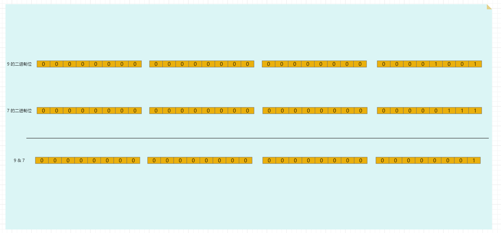


* 示例：`-9 & 7 = 7`

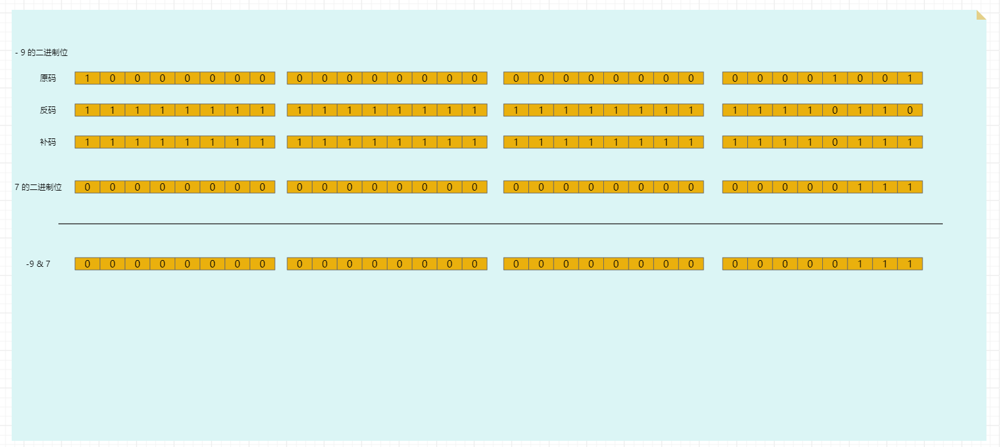

### 2.6.4 按位或

* 按位与 `|` 的运算规则是：如果二进制对应的位上只要有 1 就是 1 ，否则为 0 ，即：
  * `1 | 1` 的结果是 `1` 。
  * `1 | 0` 的结果是 `1` 。
  * `0 | 1` 的结果是 `1` 。
  * `0 | 0` 的结果是 `0` 。


* 示例：`9 | 7 = 15`

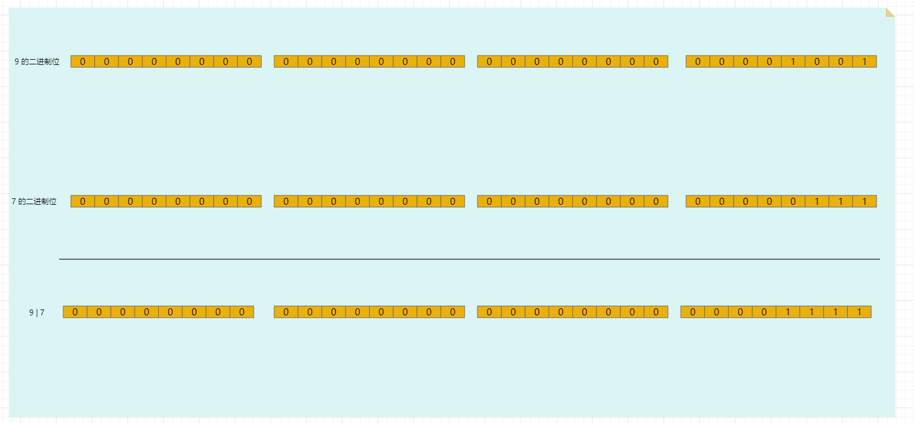


* 示例：`-9 | 7 = -9`

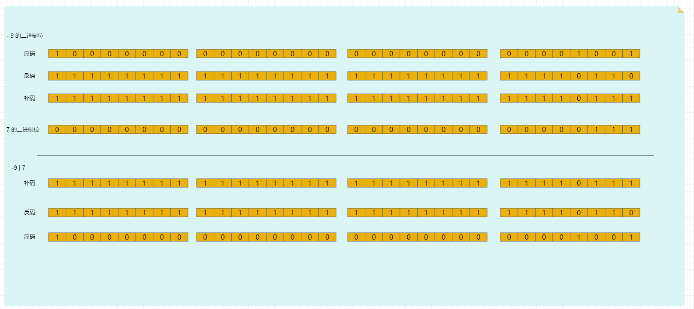

### 2.6.5 按位异或

* 按位与 `^` 的运算规则是：如果二进制对应的位上一个为 1 一个为 0 就为 1 ，否则为 0 ，即：
  * `1 ^ 1` 的结果是 `0` 。
  * `1 ^ 0` 的结果是 `1` 。
  * `0 ^ 1` 的结果是 `1` 。
  * `0 ^ 0` 的结果是 `0` 。

> [!NOTE]
>
> 按位异或的场景有：
>
> * ① 交换两个数值：异或操作可以在不使用临时变量的情况下交换两个变量的值。
> * ② 加密或解密：异或操作用于简单的加密和解密算法。
> * ③ 错误检测和校正：异或操作可以用于奇偶校验位的计算和检测错误（RAID-3 以及以上）。
> * ……


* 示例：`9 ^ 7 = 14`

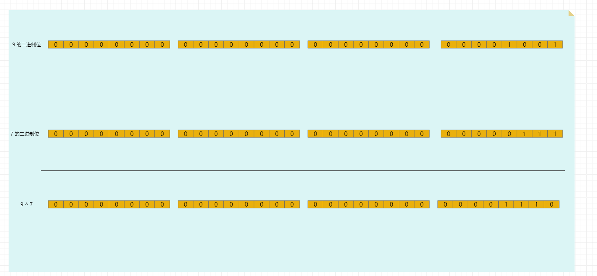


* 示例：`-9 ^ 7 = -16`


### 2.6.6 按位取反

* 运算规则：如果二进制对应的位上是 1，则结果为 0；如果是 0 ，则结果为 1 。
  * `~0` 的结果是 `1` 。
  * `~1` 的结果是 `0` 。


* 示例：`~9 = -10`

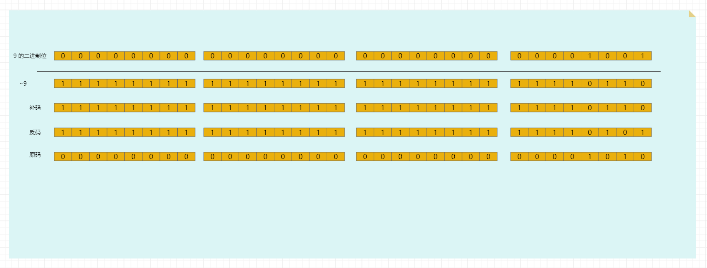


* 示例：`~-9 = 8`


### 2.6.7 二进制左移

* 在一定范围内，数据每向左移动一位，相当于原数据 × 2。（正数、负数都适用）


* 示例：`3 << 4 = 48` （3 × 2^4）

 


* 示例：`-3 << 4 = -48` （-3 × 2 ^4）

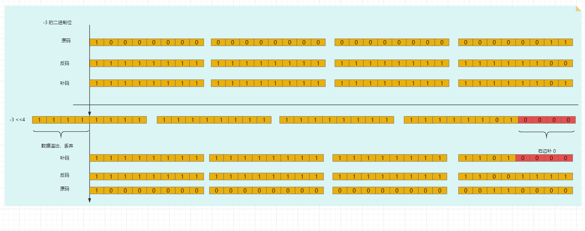

###  2.6.8 二进制右移

* 在一定范围内，数据每向右移动一位，相当于原数据 ÷ 2。（正数、负数都适用）

> [!NOTE]
>
> * ① 如果不能整除，则向下取整。
> * ② 右移运算符最好只用于无符号整数，不要用于负数。因为不同系统对于右移后如何处理负数的符号位，有不同的做法，可能会得到不一样的结果。


* 示例：`69 >> 4 = 4` （69 ÷ 2^4 ） 

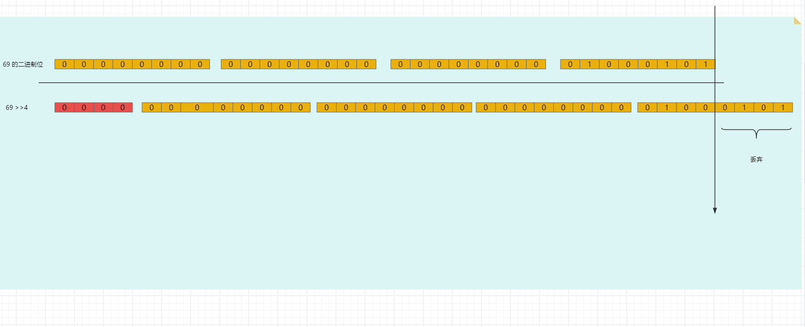


* 示例：`-69 >> 4 = -5` （-69 ÷ 2^4 ）

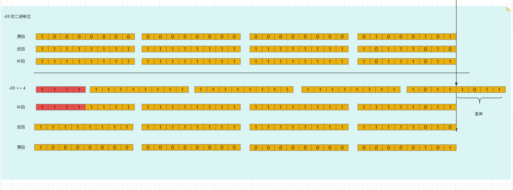

## 2.7 三元运算符

* 语法：

```c
条件表达式 ? 表达式1 : 表达式2 ;
```

> [!NOTE]
>
> * 如果条件表达式为非 0 （真），则整个表达式的值是表达式 1 。
> * 如果条件表达式为 0 （假），则整个表达式的值是表达式 2 。


* 示例：

```c
#include <stdio.h>

int main() {

    int m      = 110;
    int n      = 20;
    int result = m > n ? m : n;
    printf("result = %d\n", result); // result = 110

    return 0;
}
```

## 2.8 运算符优先级

* C 语言中运算符的优先级，如下所示：

| **优先级** | **运算符** | **名称或含义**   | **结合方向** |
| ---------- | ---------- | ---------------- | ------------ |
| **1**      | `[]`       | 数组下标         | 左到右       |
|            | `()`       | 圆括号           |              |
|            | `.`        | 成员选择（对象） |              |
|            | `->`       | 成员选择（指针） |              |
| **2**      | `-`        | 负号运算符       | 右到左       |
|            | `（类型）` | 强制类型转换     |              |
|            | `++`       | 自增运算符       |              |
|            | `--`       | 自减运算符       |              |
|            | `*`        | 取值运算符       |              |
|            | `&`        | 取地址运算符     |              |
|            | `!`        | 逻辑非运算符     |              |
|            | `~`        | 按位取反运算符   |              |
|            | `sizeof`   | 长度运算符       |              |
| **3**      | `/`        | 除               | 左到右       |
|            | `*`        | 乘               |              |
|            | `%`        | 余数（取模）     |              |
| **4**      | `+`        | 加               | 左到右       |
|            | `-`        | 减               |              |
| **5**      | `<<`       | 左移             | 左到右       |
|            | `>>`       | 右移             |              |
| **6**      | `>`        | 大于             | 左到右       |
|            | `>=`       | 大于等于         |              |
|            | `<`        | 小于             |              |
|            | `<=`       | 小于等于         |              |
| **7**      | `==`       | 等于             | 左到右       |
|            | `!=`       | 不等于           |              |
| **8**      | `&`        | 按位与           | 左到右       |
| **9**      | `^`        | 按位异或         | 左到右       |
| **10**     | `\|`       | 按位或           | 左到右       |
| **11**     | `&&`       | 逻辑与           | 左到右       |
| **12**     | `\|\|`     | 逻辑或           | 左到右       |
| **13**     | `?:`       | 条件运算符       | 右到左       |
| **14**     | `=`        | 赋值运算符       | 右到左       |
|            | `/=`       | 除后赋值         |              |
|            | `*=`       | 乘后赋值         |              |
|            | `%=`       | 取模后赋值       |              |
|            | `+=`       | 加后赋值         |              |
|            | `-=`       | 减后赋值         |              |
|            | `<<=`      | 左移后赋值       |              |
|            | `>>=`      | 右移后赋值       |              |
|            | `&=`       | 按位与后赋值     |              |
|            | `^=`       | 按位异或后赋值   |              |
|            | `\|=`      | 按位或后赋值     |              |
| **15**     | `,`        | 逗号运算符       | 左到右       |

> [!WARNING]
>
> * ① 不要过多的依赖运算符的优先级来控制表达式的执行顺序，这样可读性太差，尽量`使用小括号来控制`表达式的执行顺序。
> * ② 不要把一个表达式写得过于复杂，如果一个表达式过于复杂，则把它`分成几步`来完成。
> * ③ 运算符优先级不用刻意地去记忆，总体上：一元运算符 > 算术运算符 > 关系运算符 > 逻辑运算符 > 三元运算符 > 赋值运算符。


# 第三章：附录

## 3.1 字符集和字符集编码

### 3.3.1 概述

* 字符集和字符集编码（简称编码）计算机系统中处理文本数据的两个基本概念，它们密切相关但又有区别。
* 字符集（Character Set）是一组字符的集合，其中每个字符都被分配了一个`唯一的编号`（通常是数字）。字符可以是字母、数字、符号、控制代码（如换行符）等。`字符集定义了可以表示的字符的范围`，但它并不直接定义如何将这些字符存储在计算机中。

> [!NOTE]
>
> ASCII（美国信息交换标准代码）是最早期和最简单的字符集之一，它只包括了英文字母、数字和一些特殊字符，共 128 个字符。每个字符都分配给了一个从 0 到 127 的数字。

* 字符集编码（Character Encoding，简称编码）是一种方案或方法，`它定义了如何将字符集中的字符转换为计算机存储和传输的数据（通常是一串二进制数字）`。简而言之，编码是字符到二进制数据之间的映射规则。

> [!NOTE]
>
> ASCII编码方案定义了如何将 ASCII 字符集中的每个字符表示为 7 位的二进制数字。例如：大写字母`"A"`在ASCII 编码中表示为二进制的`1000001`，十进制的 `65` 。

* `字符集`和`字符集编码`之间的关系如下：


* Linux 中安装帮助手册：

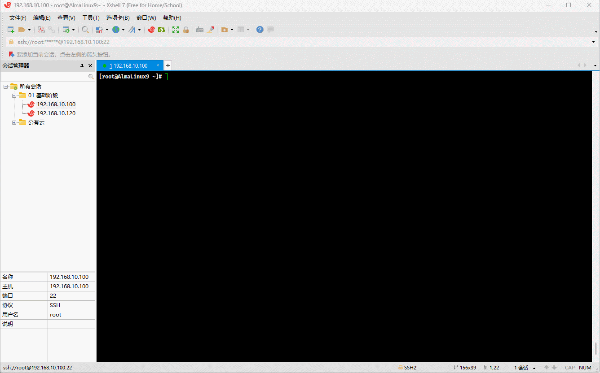

### 3.3.2 ASCII 编码

* 从`冯·诺依曼`体系结构中，我们知道，计算机中所有的`数据`和`指令`都是以`二进制`的形式表示的；所以，计算机中对于文本数据的数据也是以二进制来存储的，那么对应的流程如下：


* 我们知道，计算机是上个世纪 60 年代在美国研制成功的，为了实现字符和二进制的转换，美国就制定了一套字符编码，即英语字符和二进制位之间的关系，即 ASCII （American Standard Code for Information Interchange）编码：
  - ASCII 编码只包括了英文字符、数字和一些特殊字符，一共 128 个字符，并且每个字符都分配了唯一的数字，范围是 0 - 127。
  - ASCII 编码中的每个字符都使用 7 位的二进制数字表示；但是，计算机中的存储的最小单位是 1 B = 8 位，那么最高位统一规定为 0 。

> [!NOTE]
>
> - ① 其实，早期是没有字符集的概念的，只是后来为了解决乱码问题，而产生了字符集的概念。
> - ② 对于英文体系来说，`a-zA-Z0-9`以及一些`特殊字符`一共 `128` 就可以满足实际存储需求；所以，在也是为什么 ASCII 码使用 7 位二进制（2^7 = 128 ）来存储的。

* 在操作系统中，就内置了对应的编码表，Linux 也不例外；可以使用如下的命令查看：

```shell
man ascii
```


* 其对应的 ASCII 编码表，如下所示：


* 但是，随着计算机的发展，计算机开始了东征之路，由美国传播到东方：


- 先是传播到了欧洲，欧洲在兼容 ASCII 编码的基础上，推出了 ISO8859-1 编码，即：
  - ISO8859-1 编码包括基本的拉丁字母表、数字、标点符号，以及西欧语言中特有的一些字符，如：法语中的 `è`、德语中的 `ü` 等。
  - ISO 8859-1 为每个字符分配一个单字节（8 位）编码，意味着它可以表示最多 256 （2^8）个不同的字符（编号从 0 到 255）。
  - ISO 8859-1 的前 128 个字符与 ASCII 编码完全一致，这使得 ASCII 编码的文本可以无缝转换为 ISO 8859-1 编码。


- 计算机继续传播到了亚洲，亚洲（双字节）各个国家分别给出了自己国家对应的字符集编码，如：
  - 日本推出了 Shift-JIS 编码：
    - 单字节 ASCII 范围：0 - 127。
    - 双字节范围：
      - 第一个字节：129 - 159 和 224 - 239 。
      - 第二个字节：64 - 126 和 128 - 252 。
  - 韩国推出了 EUC-KR 编码：
    - 单字节 ASCII 范围：0 - 127。
    - 双字节范围：从 41281 - 65278。
  - 中国推出了 GBK 编码：
    - 单字节 ASCII 范围：0 - 127。
    - 双字节范围：33088 - 65278 。

> [!NOTE]
>
> - ① 通过上面日本、韩国、中国的编码十进制范围，我们可以看到，虽然这些编码系统在技术上的编码范围存在重叠（特别是在高位字节区域），但因为它们各自支持的字符集完全不同，所以实际上它们并不直接冲突。
> - ② 但是，如果一个中国人通过 GBK 编码写的文章，通过邮件发送给韩国人，因为韩国和中国在字符集编码上的高位字节有重叠部分，必然会造成歧义。

### 3.3.3 Unicode 编码

- 在 Unicode 之前，世界上存在着数百种不同的编码系统，每一种编码系统都是为了支持特定语言或一组语言的字符集。这些编码系统，包括：ASCII、ISO 8859 系列、GBK、Shift-JIS、EUC-KR 等，它们各自有不同的字符范围和编码方式。这种多样性虽然在局部范围内解决了字符表示的问题，但也带来了以下几个方面的挑战：
  - `编码冲突`：由于不同的编码系统可以为相同的字节值分配不同的字符，因此在不同编码之间转换文本时，如果没有正确处理编码信息，就很容易产生乱码。这种编码冲突在尝试处理多种语言的文本时尤为突出。
  - `编码的复杂性`：随着全球化的发展，软件和系统需要支持越来越多的语言，这就要求开发者和系统同时处理多种不同的编码系统。这不仅增加了开发和维护的复杂性，而且也增加了出错的风险。
  - `资源限制`：在早期计算机技术中，内存和存储资源相对有限。不同的编码标准要求系统存储多套字符集数据，这无疑增加了对有限资源的消耗。
  - ……
- 针对上述的种种问题，为了推行全球化，Unicode 应运而生，Unicode 的核心规则和设计原则是建立一个全球统一的字符集，使得世界上所有的文字和符号都能被唯一地识别和使用，无论使用者位于何地或使用何种语言。这套规则包括了字符的编码、表示、处理和转换机制，旨在确保不同系统和软件间能够无缝交换和处理文本数据。
  - `通用字符集 (UCS)`：Unicode 为每一个字符分配一个唯一的编号（称为`“码点”`）。这些码点被组织在一个统一的字符集中，官方称之为 “通用字符集”（Universal Character Set，UCS）。码点通常表示为 `U+` 后跟一个十六进制数，例如：`U+0041` 代表大写的英文字母 `“A”`。
  - `编码平面和区段`：Unicode 码点被划分为多个 “平面（Planes）”，每个平面包含 65536（16^4）个码点。目前，Unicode定义了 17 个平面（从 0 到16），每个平面被分配了一个编号，从 “基本多文种平面（BMP）” 的 0 开始，到 16 号平面结束。这意味着 Unicode 理论上可以支持超过 110万（17*65536）个码点。

- Unicode 仅仅只是字符集，给每个字符设置了唯一的数字编号而已，却没有给出这些数字编号实际如何存储，可以通过如下命令查看：


- 为了在计算机系统中表示 Unicode 字符，定义了几种编码方案，这些方案包括 UTF-8、UTF-16 和 UTF-32 等。
  - **UTF-8**：使用 1 - 4 个字节表示每个 Unicode 字符，兼容 ASCII，是网络上最常用的编码。
  - **UTF-16**：使用 2 - 4 个字节表示每个 Unicode 字符，适合于需要经常处理基本多文种平面之外字符的应用。
  - **UTF-32**：使用固定的 4 个字节表示每个 Unicode 字符，简化了字符处理，但增加了存储空间的需求。
- `Unicode 字符集`和对应的`UTF-8 字符编码`之间的关系，如下所示：


