# 第一章：计算机网络在信息时代的作用

## 1.1 计算机网络的各类应用

* 随着信息技术、计算机技术和通信技术的迅猛发展和密切结合，计算机网络已经成为 21 世纪这个信息时代的核心，以因特网（互联网）为代表的计算机网络，已悄然改变了人们的生活、学习、工作甚至思维方式，并对国民经济、国家安全、社会稳定等方面产生着巨大的影响。
* 计算机网络的普及使得信息获取变得更加便捷和高效，人们可以随时随地通过网络获取海量的信息资源。通过计算机网络，人们能够方便地进行电子邮件、即时消息和视频会议等交流，极大地提升了工作和学习的效率。此外，电子商务的兴起，使得购物不再受时间和空间的限制，极大地方便了人们的生活。
* 计算机网络在教育领域的应用也在不断深化，在线教育的发展，让人们能够通过网络进行远程学习，获取新的知识和技能，提高自身的竞争力。各种教育资源和课程通过网络平台传播，使得优质教育资源能够惠及更多的人群。
* 社交网络的出现，更是改变了人们的交流方式，通过各种社交媒体平台，人们可以轻松地与朋友、家人以及全球各地的人们进行互动和交流，分享生活中的点滴。此外，计算机网络在推动各行各业的创新和发展方面也起到了重要作用，通过大数据、人工智能等新技术的应用，企业能够更加精准地了解市场需求，提升生产效率和服务质量。
* 总之，计算机网络已深刻融入到社会的方方面面，成为现代社会`不可或缺`的一部分（`很重要`）。未来，随着技术的进一步发展，计算机网络将继续发挥其巨大的影响力，推动社会不断向前发展。

## 1.2 计算机网络带来的负面问题

* 计算机网络的普及和广泛应用虽然带来了诸多便利，但是也不可避免的引发了一系列负面问题；以下是一些主要的负面问题：
  * **隐私泄露**：由于网络信息的广泛传播，个人隐私数据容易被非法获取或滥用，造成隐私泄露。例如：社交媒体平台上的个人信息可能被不法分子利用进行诈骗或其他非法活动。
  * **网络犯罪**：计算机网络的发展也滋生了各种网络犯罪，如：黑客攻击、病毒传播、网络诈骗、钓鱼网站等，这些犯罪行为给个人和企业带来了巨大损失。
  * **信息泛滥和虚假信息**：网络上的信息量巨大，其中夹杂了大量的虚假信息和谣言，容易误导公众。例如：社交媒体上的虚假新闻可能引发社会恐慌和不必要的恐惧。
  * **网络成瘾**：过度依赖网络导致网络成瘾问题，尤其是在青少年中表现突出。这种成瘾可能影响学习、工作和日常生活，甚至造成心理和生理上的健康问题。
  * **网络霸凌**：社交平台上存在的网络霸凌现象对青少年的心理健康构成威胁。匿名性使得一些人敢于在网络上对他人进行言语攻击或骚扰，造成受害者的心理创伤。
  * **工作与生活的界限模糊**：网络的便利性使得工作和生活的界限变得模糊，许多人在工作时间外仍被工作事务所困扰，影响了工作与生活的平衡，导致压力和焦虑增加。
  * **数字鸿沟**：虽然计算机网络在不断普及，但仍然存在着显著的数字鸿沟，即不同地区和社会阶层之间在网络使用和获取信息方面存在巨大差异，这种不平等可能进一步加剧社会的不公平。
  * **版权和知识产权问题**：网络的开放性和信息的易传播性使得版权和知识产权保护面临严峻挑战，许多原创作品和创新成果可能被盗版和非法复制。
* 这些负面问题提示我们在享受计算机网络带来的便利时，也需要积极采取措施应对其带来的挑战，以确保网络的健康和可持续发展。


# 第二章：因特网

## 2.1 网络、互联网和因特网的关系（⭐）

* 计算机网络是指通过各种通信介质（如：光纤、电缆、无线电波等）将多台计算机及其相关设备互联起来，以实现资源共享和信息传递的系统。

* 在生活中，最为常见的`网络`就是`有线网络`和`无线网络`，如下所示：

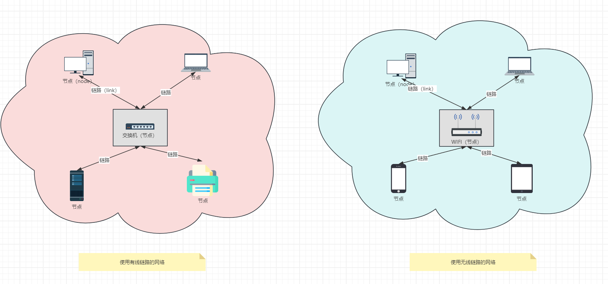

* 如果将网络的内部的细节屏蔽，那么对应的图示，如下所示：


* 如果采用`路由器`等设备，将各个网络互联，就形成了`互联网`（互联网是一个由众多计算机网络（包括局域网和广域网）互相连接而形成的全球性网络，它是“网络的网络”），如下所示：

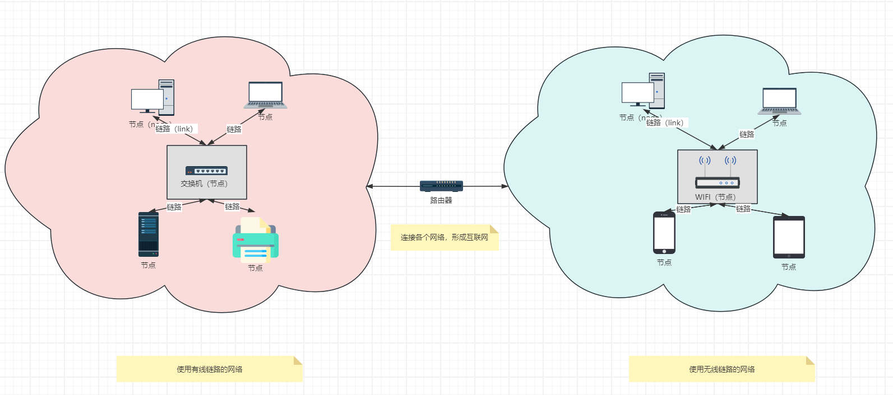

* 如果将网络的内部的细节屏蔽，那么对应的图示，如下所示：


* 所谓的`因特网`是指全球规模最大、最著名的开放性互联网络，它是一个公共网络，通过一系列协议（如：TCP/IP）使得全世界的计算机能够互联互通。

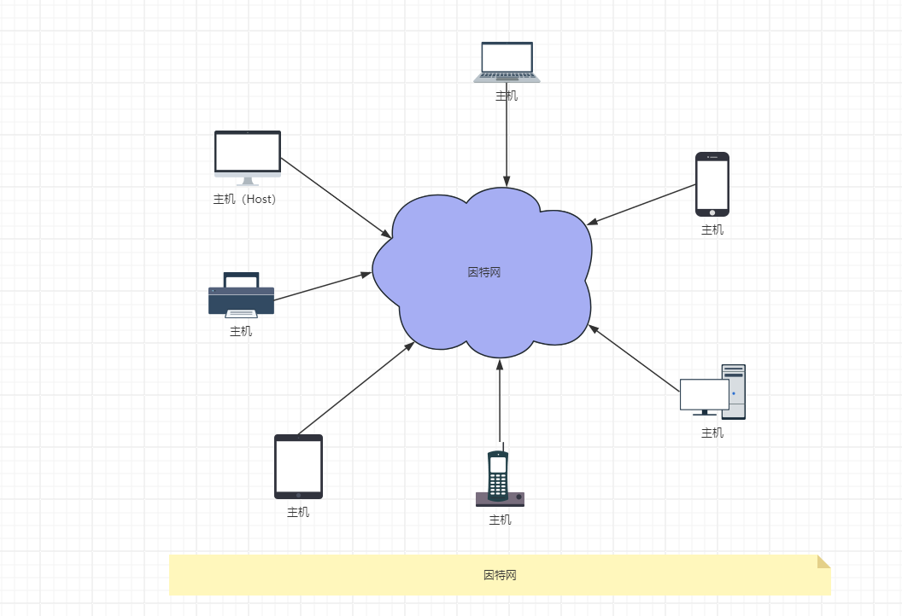

> [!NOTE]
>
> 区别：
>
> * **网络**是最基本的概念，指任何一组互联的计算机系统，不论规模大小，也不论是否连接到更大范围的网络。
> * **互联网**（互连网）是一个更高级的概念，指的是通过标准协议互相连接的多个网络的集合体。
> * **因特网**是全球范围内的公共互联网，是互联网的具体实现，被广泛使用以进行通信、信息交换和服务提供。
>
> 联系：
>
> * **网络**构成了**互联网**的基础，即互联网是由无数个小的网络互相连接而成的。
> * **因特网**就是这些互联网络的具体应用，是全球范围内使用最广泛的互联网形式。
> * 所有的**网络**都可以是**互联网**的一部分，只要它们遵循标准协议并互相连接起来。

> [!IMPORTANT]
>
> 在实际交流的时候，我们并不会严格区分互联网和因特网，并且人们口中的互联网实际上就是因特网。

## 2.2 因特网的发展史

* 因特网的发展史是一段充满创新、合作和技术进步的历程，它从一个小型的学术网络演变成了全球性的信息基础设施。以下是因特网发展史中的一些关键里程碑：

  * ① 初期发展阶段（1960 年代）
    * ARPANET：美国国防部高级研究计划局（ARPA）在 1969 年建立了第一个计算机网络，即 ARPANET。这是世界上第一个分组交换网络。
    * 早期研究：在 1960 年代，研究者开始探索计算机之间的连接和通信技术，包括`分组交换`理论。
  * ② 标准化和扩展阶段（1970 年代）：
    * TCP/IP 协议的发明：1973 年，Vint Cerf 和 Bob Kahn 提出了 `TCP/IP` 协议，这是现代互联网的基础协议。
    * Ethernet：1973 年，Robert Metcalfe 和他的同事发明了以太网（Ethernet），它成为局域网（LAN）技术的标准。
  * ③ 互联网的形成（1980 年代）：
    * 域名系统（DNS）：1983 年，域名系统（DNS）被引入，以简化网络地址的管理和使用。
    * NSFNET：1986 年，美国国家科学基金会（NSF）建立了 NSFNET，这是一个高速主干网，连接了多个研究机构和大学，推动了互联网的快速发展。
  * ④ 万维网的诞生和普及（1990 年代）
    * 万维网（WWW）：1990 年，蒂姆·伯纳斯-李（Tim Berners-Lee）发明了万维网（WWW），引入了 HTTP 协议和 HTML 语言，使信息共享更加便捷。
    * 商业化和普及：1990 年代中期，互联网开始商业化，许多`互联网服务提供商（ISP）`出现，互联网用户迅速增加。
  * ⑤ 移动互联网和宽带接入（2000 年代）：
    * 宽带技术：ADSL、光纤等宽带接入技术的发展，使得网络速度大幅提升。
    * 移动互联网：智能手机的普及和无线网络技术（如：3G、4G）的发展，使得移动互联网成为主流。
  * ⑥ 云计算和物联网（2010 年代）：
    * 云计算：云计算技术的发展，提供了强大的计算和存储能力，使得各种基于云的服务和应用成为可能。
    * 物联网（IoT）：物联网技术的进步，使得大量设备能够连接到网络，进行数据交换和智能控制。
  * ⑦ 未来趋势（2020 年代及以后）
    - 5G 和 6G：5G 网络的部署提供了更快的速度和更低的延迟，6G 技术的研究也在进行中。
    - 人工智能和大数据：人工智能和大数据分析技术在网络中的应用越来越广泛，推动了智能网络的发展。
    - 量子计算和量子网络：量子计算和量子网络技术的研究，可能带来新的网络通信和计算模式。

* 总之，因特网的发展是技术进步、商业创新和社会需求共同驱动的结果，未来的发展将继续受到新技术的推动，并不断改变我们的生活和工作方式。

## 2.3 ISP

### 2.3.1 概述

* ISP 是 Internet Service Provider 的缩写，意为 `“互联网服务提供商”`。ISP 提供连接互联网所需的各种服务和技术支持。

### 2.3.2  ISP 的一些关键功能和角色

#### 2.3.2.1 提供互联网接入（⭐）

* ISP 的主要功能是为个人用户、企业和其他组织提供连接互联网的服务，如下所示：

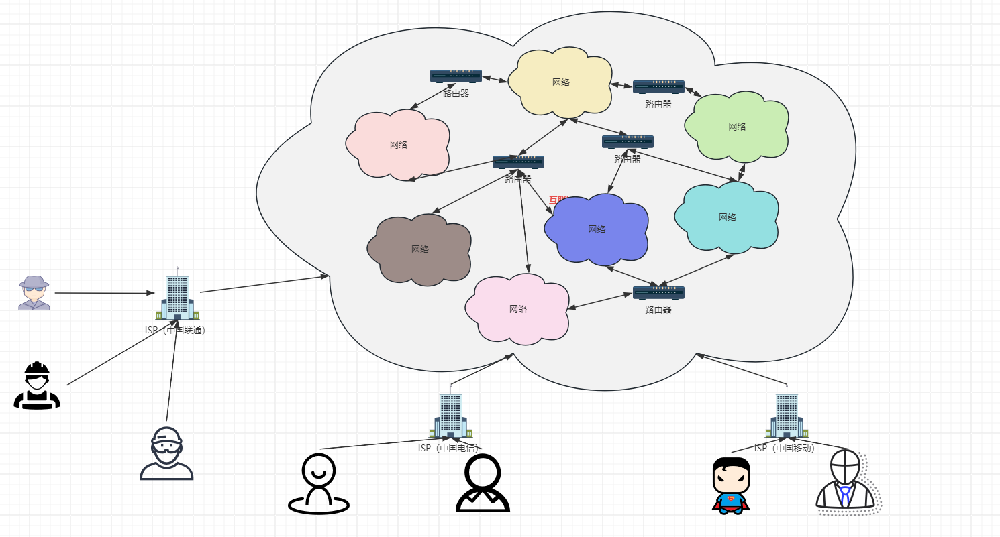

* 具体方式包括：
  * ~~**拨号接入**：通过电话线连接互联网，这是一种早期的连接方式。~~
  * **宽带接入**：包括 DSL（数字用户线路）、电缆调制解调器和光纤接入，提供高速互联网连接。
  * **无线接入**：通过移动网络（如：3G、4G、5G）提供互联网接入。
  * **卫星接入**：在偏远或农村地区，通过卫星提供互联网接入。
* 目前，因特网已经发展成为`基于 ISP 的多层次结构的互联网络`，即：

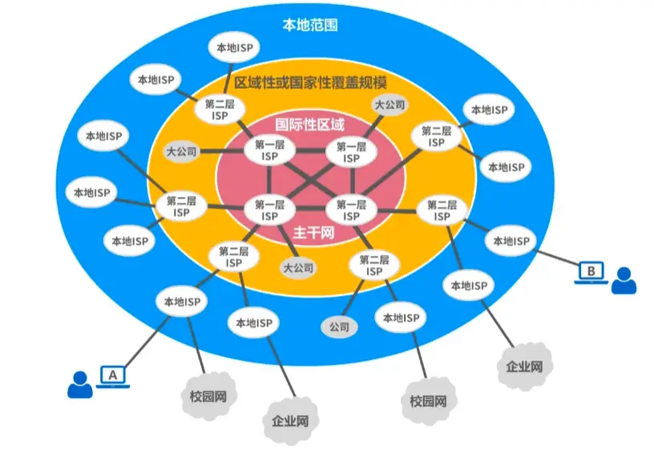

> [!NOTE]
>
> 个人也可以成为 ISP，但实际操作起来需要克服众多技术、法律和财务上的挑战。这通常更适合具有相关技术背景、一定财务实力以及法律和市场知识的人。如果有兴趣，可以先从小规模的本地 ISP 或社区网络开始，逐步积累经验和资源。

#### 2.3.2.2 分配 IP 地址

* ISP 负责分配 IP 地址给用户和设备，以便在互联网上进行通信，包括 IPv4 和 IPv6 地址。

#### 2.3.2.3 提供域名服务

* ISP 提供域名解析服务（DNS），将用户输入的域名转换为相应的 IP 地址，从而访问目标网站或服务。

#### 2.3.2.4 网络路由和传输

* ISP 管理和维护网络基础设施，包括路由器和交换机，确保数据包在互联网上的有效传输和路由。

#### 2.3.2.5 提供附加服务

* 许多 ISP 还提供各种附加服务，包括：

  - 电子邮件服务：为用户提供电子邮件账户和服务。

  - 网络安全服务：提供防火墙、反病毒保护和其他安全服务。

  - Web 托管：为用户提供网站托管服务。

  - 云服务：提供云存储、云计算等服务。

#### 2.3.2.6 客户支持

* ISP 提供技术支持和客户服务，帮助用户解决连接问题、配置设备和解答疑问。

#### 2.3.2.7 内容过滤和监管

* 根据法律法规要求，ISP 可能会对某些内容进行过滤和监管，以阻止不良信息的传播。

### 2.3.3 常见的 ISP

* 美国：Comcast、AT&T、Verizon。
* 中国：中国电信、中国联通、中国移动。
* 欧洲：BT（英国）、Orange（法国）、Deutsche Telekom（德国）。


# 第三章：电路交换、分组交换和报文交换

## 3.1 ~~电路交换（Circuit Switching）~~

### 3.1.1 概述 

* 在电话问世之后不久，人们就发现，要让所有的电话都两两相连是不现实的。
* 如果 `2` 部电话需要互相通信，则需要 `1` 根电话线，即：


* 如果是 `5` 部电话需要互相通信，则需要 `10` 根电话线，即：

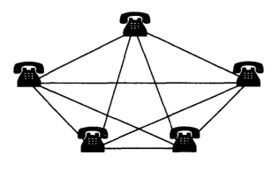

* 那么，如果是 `n` 部电话需要互相通信，则需要 `n(n-1) /2`  根电话线；显然不太可能，于是人们认识到要使得每一部电话都能够很方便的和另一部电话进行通信，就需要使用一个`中间设备`将这些电话连接起来，这个`中间设备`就是`电话交换机`，即：

  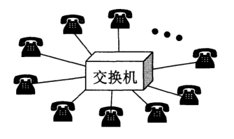

> [!NOTE]
>
> * ① 每一部电话都需要连接到电话交换机上，可以将电话交换机简单的看成是一个有多个开关的开关器，可以将需要通信的任意两部电话的电话线路按需接通，从而大大减少了连接的电话线的数量。
> * ② 当电话机的数量增多的时候，就需要使用很多彼此连接起来的电话交换机来完成全网的交换任务，用这样的方法，就构成了覆盖全世界的电信网。
>
> 

### 3.1.2 定义和工作原理等

* 定义：电话交换机接通电话线的方式就是电路交换，电路交换是一种通信方法，在通信会话开始前，通信双方之间建立一个专用的通信路径（电路）。在整个会话期间，这条路径一直保持专用，直到会话结束。

> [!NOTE]
>
> 从通信资源的分配角度来看，交换（Switching）就是按照某种方式动态的分配传输线路上的资源。

* 电路交换工作原理，如下所示：
  * ① 建立连接（分配通信资源）：通信开始前，网络在发送方和接收方之间建立一条专用的物理电路（在使用电话交换打电话之前，必须先拨号请求建立连接。当被叫用户听到电话交换机送来的拨号音并摘机后，从主叫端到被叫端就建立了一条连接，即一条专用的物理通路，这条连接保证了双方通话时所需要的通信资源，而这些资源在双方通信的时候不会被其他用户占用）。
  * ② 传输数据（一直占用通信资源）：数据在这条专用电路上传输，整个过程没有其它数据流的干扰（主叫和被叫双方互相通电话，在整个通话期间，第 ① 步建立连接所分配的通信资源始终被占用）。
  * ③ 释放连接（归还通信资源）：通信结束后，专用电路被释放，供其他用户使用（通话完毕挂机后，电话交换机释放刚才使用的这条专用的物理通道，即将刚才占用的所有通信资源归还给电信网）。
* 其对应的图示，如下所示：


* 应用场景：
  * 传统电话网络：每次通话都建立一条专用的电路。
  * 适用于实时性要求高的通信，如：语音通话。
* 优缺点：

| 优点                                 | 缺点                                                 |
| ------------------------------------ | ---------------------------------------------------- |
| 保证了通信的连续性和低延迟。         | 资源利用率低，电路在会话期间独占，其他用户无法使用。 |
| 整个会话期间专用路径，传输稳定可靠。 | 建立和释放连接时间较长。                             |

> [!NOTE]
>
> * ① `计算机之间的数据传送是突发式`的，当使用`电路交换`来传送计算机数据的时候，其`线路的传输效率一般会很低`，线路上真正用来传送数据的时间往往不到 10% 甚至 1% ，已被用户占用的通信线路资源在绝大部分时间里都是空闲的；如：当用户正在输入和编辑一份正在待传输的文件的时候， 用户所占用的通信资源暂时未被利用，该通信资源也不能被其他用户利用，宝贵的通信线路资源就这样被白白的浪费了。
> * ② 系统不具有存储数据的能力，不能平滑通信量。

## 3.2 分组交换（Packet Switching，⭐）

### 3.2.1 概述

* 假设下图是`因特网`的一部分，即：


* 在因特网中，最重要的`分组交换机`就是`路由器`，它负责将各种网络互联（互连）起来，并对接收到的分组（若干个小的数据包）进行转发，即进行分组交换。
* 假设，主机 H6 的用户要给主机 H2 的用户发送一条消息，通常我们将表示该消息的整块数据称为一个报文，即：


* 在发送报文之前，先将较长的报文划分为一个个更小的等长数据段，即：


* 在每个数据段的前面，加上一些由必要的控制信息组成的首部后，就构成了一个分组，也可以简称为包，即：

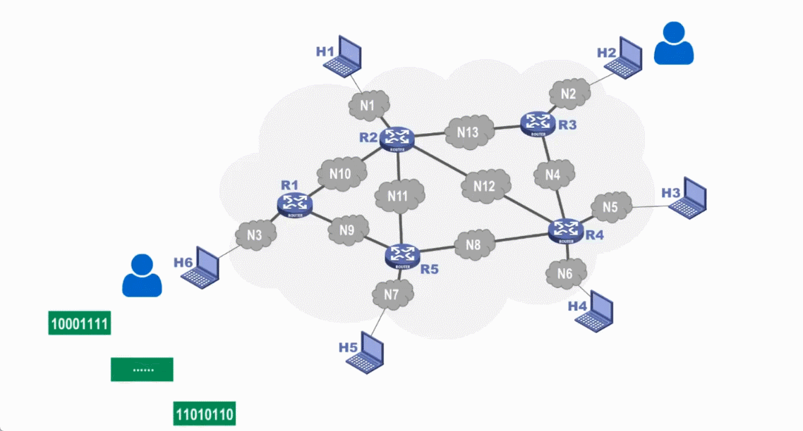

* 添加首部虽然看起来增加了传输的数据量；但是，首部起着非常关键的作用，即：首部中一定包含了分组的目的地址，否则分组传输路径中的各个分组交换机（各个路由器）就不知道如何转发分组了。分组交换机收到一个分组后，先将分组暂时存储下来，然后检查其首部，按照首部中的目的地址进行查表转发（表就是路由表），找到合适的转发接口，通过该接口将分组转发给下一个分组交换机（路由器），最终到达分组目的地（主机 H2），即：


* 主机 H2 收到这些分组后，去掉它们的首部，将各数据段组合还原出原始报文，即：

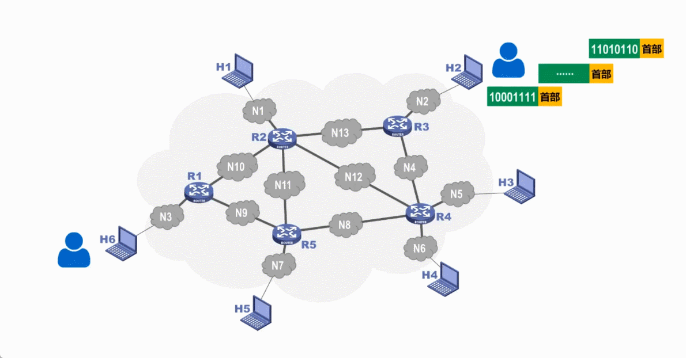

> [!NOTE]
>
> 只演示了分组传输过程中的两种情况：
>
> * ① 各个分组从源站到达目的站可以走不同的路径（不同的路由）。
> * ② 分组乱序，即分组到达目的站的顺序不一定和分组在源站发送的顺序相同。
>
> 对于可能出现的分组丢失、无码、重复等问题并没有演示。

> [!NOTE]
>
> 在上述的分组交换过程中，各端需要完成的任务如下：
>
> * ① 发送端：构造分组和发送分组。
> * ② 路由器：缓存分组和转发分组。
> * ③ 接收端：接收分组和还原报文。

### 3.2.2 定义和工作原理等

* 定义：分组交换是一种通信方法，将数据拆分成若干个小的数据包（分组），每个分组独立地通过网络传输，可能经过不同路径到达目的地，再在目的地重新组装。
* 分组交换的工作原理，如下所示：
  * ① 数据分组：将数据分割为小的分组后，每个分组带有目的地址和序号等控制信息。
  * ② 独立传输：每个分组独立的通过网络，根据当前网络状况选择最优路径。
  * ③ 重新组装：所有分组到达目的地后，根据序号重新组成拼成完整的数据。

* 应用场景：
  * 互联网：TCP/IP 协议是基于分组交换的。
  * 适用于非实时性要求高的数据传输，如：电子邮件、文件传输。
* 优缺点：

| 优点                                                       | 缺点                                           |
| ---------------------------------------------------------- | ---------------------------------------------- |
| 高效利用网络资源：分组可以动态选择路径，避免单一路径拥堵。 | 可能存在延迟和抖动，不适合严格实时要求的应用。 |
| 具有容错性：单个分组丢失不会影响整个数据传输。             | 需要在接收端重新组装数据，有一定的开销。       |

## 3.3 ~~报文交换（Message Switching）~~

* 定义：报文交换是一种通信方法，整个`报文`作为一个`单位`传输，通过网络节点逐段存储转发，直到到达目的地。
* 工作原理：
  * ① 存储转发：报文在每个中间节点暂时存储，等待可用的通信线路，然后转发到下一个节点。
  * ② 报文在每个节点依次传输，直到到达最终目的地。
* 应用场景：
  * 早期的电报网络和一些特定的数据网络。
  * 适用于非实时性要求的应用，如：电子邮件、文件传输。
* 优缺点：

| 优点                                                 | 缺点                                       |
| ---------------------------------------------------- | ------------------------------------------ |
| 可以有效利用网络资源，因为报文可以在各节点暂存等待。 | 存储转发机制导致延迟较大，不适合实时通信。 |
| 适合传输较大的数据块。                               | 需要足够的存储空间在中间节点存储报文。     |

> [!NOTE]
>
> 报文交换对报文的大小没有限制，这就要求交换节点（路由器等）需要有较大的缓存空间；对于目前的计算机网络而言，现在已经较少使用报文交换，而使用较为先进的分组交换方式来代替！！！

## 3.4 三种交换方式的对比

### 3.4.1 电路交换

* 电路交换：先建立连接，然后数据传输，最后连接释放，即：专用路径、低延迟、实时性强，但资源利用率低。


>[!NOTE]
>
>当使用电路交换的时候，一旦建立连接，中间的各个节点交换机都是直通形式的，比特流可以直达终点。

* 优点：
  * 通信时延小：通信线路为通信双方用户专用，数据直达，所以通信时延小；当连续传输大量数据的时候，这一优点非常明显。
  * 有序传输：因为通信双方之间只有一条专用的通信线路，数据只在这一条线路上传输，因为不存在失序问题。
  * 没有冲突：不同的通信双方拥有不同的信道，不会出现争用物理信道的问题。
  * 适用范围广：电路交换既适用于传输模拟信号，也适用于传输数字信号。
  * 实时性强：这主要得益于其时延小的优点。
  * 控制简单：电路交换的节点交换机及其控制都比较简单。

* 缺点：
  * 建立连接时间长：电路交换的平均连接建立时间对于计算机通信来说实在是太长了。
  * 线路独占，使用效率低：电路交换一旦建立连接，物理通路就会通信双方独占，即使通信线路空闲，也不能供其他用户使用，因而信道利用率很低。
  * 灵活性差：只要连接所建立的物理通路中的任何一点出现了故障，就必须重新拨号建立新的连接，这对于十分紧急和重要的通信是很不利的。
  * 难以规格化：电路交换时，数据直达，不同类型、不同规格、不同速率的终端很难相互进行通信，也难以在通信过程中进行差错控制。

### 3.4.2 报文交换

* 报文交换：将整个`报文`作为一个`单位`传输，可以随时发送报文，而不需要事先建立连接，整个报文先传输到相邻节点交换机，全部存储下来后进行查表转发，即：存储转发、适合大数据块传输，但延迟较大，不适合实时通信。


> [!NOTE]
>
> 当使用报文交换的时候，整个报文需要在各个节点交换机上进行存储转发，由于不限制报文的大小，因此需要各个节点交换机都需要具有较大的缓存空间。

* 优点：
  * 无需建立连接：报文交换不需要为通信双方预先建立一条专用的通信线路，不存在建立连接的时延，用户可以随时发送报文。
  * 动态分配线路：当发送方将报文传输给节点交换机的时候，节点交换机先存储整个报文，然后选择一条合适的空闲线路，将报文发送出去。
  * 提高线路的可靠性：如果某条传输路径发生故障，会重新选择另一条路径传输数据，因此提高了传输的可靠性。
  * 提高线路的利用率：通信双方不是固定占用一条通信线路，而是在不同的时间分段部分占用物理线路，因而大大提高了通信线路的利用率。
  * 提供多目标服务：一个报文可以同时发送给多个目的地址，这在电路交换中是很难实现的。
* 缺点：
  * 引起了转发时延：这是因为报文在节点交换机上要经历存储转发的过程。
  * 需要较大的存储缓存空间：这是因为报文交换对报文的大小没有限制。
  * 需要传输额外的信息量：这是因为报文需要携带目标地址、源地址等信息。

### 3.4.3 分组交换（⭐）

* 分组交换：将数据拆分成若干个小的数据包（分组），可以随时发送分组，而不需要事先建立连接，构成原始报文的一个个分组，依次在各个节点交换机上存储转发，各个节点交换机在发送分组的时候，还会缓存接收到的分组，即：动态路径、高效利用网络资源、具有容错性，但可能有延迟和抖动。


>[!NOTE]
>
>当使用分组交换时，构成原始报文的一个个分组，在各个节点交换机上进行存储转发，相比于报文交换，减少了转发时延，还可以避免过长的报文长时间占用链路，同时也有利于进行差错控制。

* 优点：
  * 无需建立连接：分组交换不需要为通信双方预先建立一条专用的通信线路，不存在建立连接的时延，用户可以随时发送分组。
  * 线路利用率高：通信双方不是固定占用一条通信线路，而是在不同的时间分段部分占用物理线路，因而大大提高了通信线路的利用率。
  * 简化了存储管理：这是相对于报文交换而言的，因为分组的长度固定，相应的缓冲区的大小也固定，管理起来相对比较容易。
  * 加速传输：由于分组是逐个传输的，这就使得后一个分组的存储操作和前一个分组的转发操作可以同时进行。
  * 减少出错概率和重发数据量：因为分组比报文要小，因此出错的概率必然减小，即便分组出错，也只需重传出错的分组，这比重传整个报文的数据量要小很多，这样不仅提高了可靠性，也较少了传输时延。
* 缺点：
  * 引起了转发时延：这是因为分组在节点交换机上要经历存储转发的过程。
  * 额外的传输信息量：将原始报文分割为等长的数据块后，每个数据块都要加上源地址、目标地址等控制信息，从而构成分组，因此使得传输的信息量增大了。
  * 对于数据报服务时，可能会出现失序、丢失或重复分组的问题：分组到达目的节点的时候，需要重新还原为原始报文，较为麻烦；如果分组交换采用虚电路服务，虽然没有分组失序的问题，但是存在呼叫建立，数据传输和虚电路释放三个过程。


# 第四章：计算机网络

## 4.1 计算机网络的定义和分类

### 4.1.1 计算机网络的定义

* 计算机网络并没有一个精确且统一的定义，在计算机发展的不同阶段，人们对计算机网络给出了不同的定义，这些定义反映了当时计算机网络技术发展的水平。

* 计算机网络早期最简单的定义是：一些`互`相`连`接的、`自治`的计算机`集合`，以实现资源共享和信息传递；其中：

  * 互连：是指计算机之间可以通过有线或无线的方式进行数据通信。

  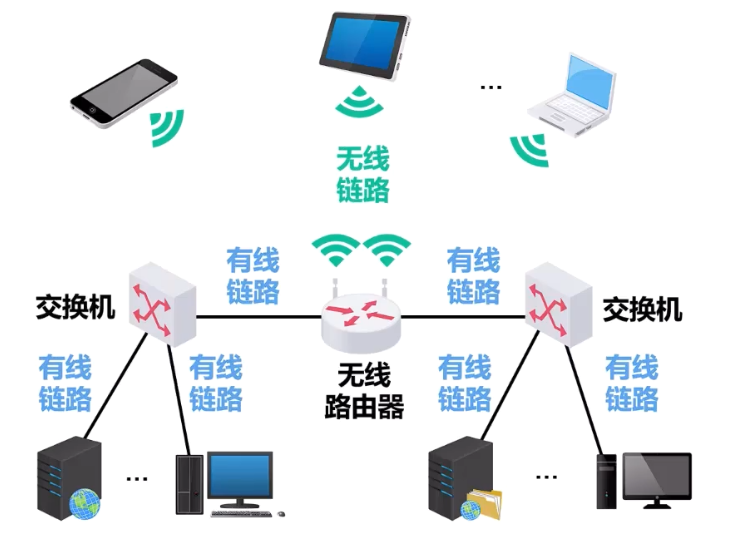

  * 自治：是指独立的计算机，它有自己的硬件和软件，可以单独运行使用。

  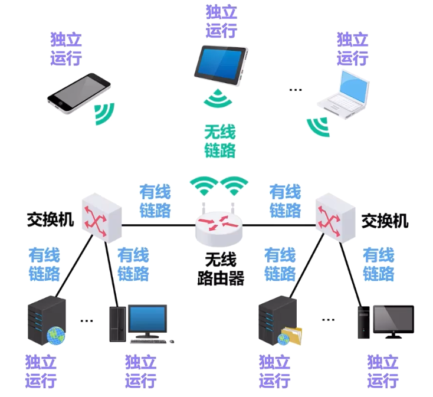

  * 集合：是指至少需要两台计算机。

  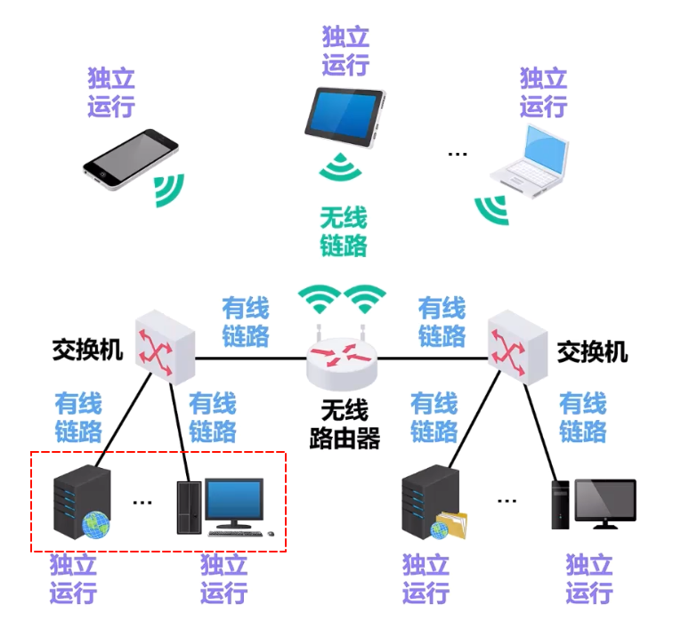

* 现阶段计算机网络的较好定义是：计算机网络主要由一些`通用的`、`可编程的硬件互连`而成的，而这些硬件并非专门用来实现某一特定目的，例如：传输数据或视频信号。这些可编程的硬件能够`传送多种不同类型的数据`，并能`支持广泛和日益增长的应用`。

  * 可编程的硬件：计算机连接的硬件不限于计算机，而是包括了智能手机、具有网络功能的传感器以及智能家电等智能硬件，这些硬件一定包含有中央处理单元（CPU）。
  * 各类应用：计算机网络并非只是用来传送数据，而是能够基于数据传送进而实现各种各样的应用，包括今后可能出现的各种应用。

### 4.1.2 计算机网络的分类

* 可以从不同的角度，对计算机网络进行分类，计算机网络可以分为如下的几种类型：
  * ① 按`交换方式`分类：
    * 电路交换：在通信开始前，建立一条专用的通信路径，通信结束后释放该路径，如：传统的电话网络。
    * 报文交换：数据以报文为单位传输，报文在传输过程中存储在节点设备中，逐步传送到目的地，适用于需要可靠传输的数据通信。
    * `分组交换`：数据被分割成小包（即分组）进行传输，每个分组独立地在网络中传输，最终在目的地重新组装，如：互联网。
  * ② 按`使用者`分类：
    * 公用网络：向公众开放的网络，任何有需求的用户都可以申请加入使用，如：互联网、公共的 WIFI。
    * 专用网络：仅供特定组织或用户使用的网络，通常具有更高的安全性和专门的用途，如：企业内部网、政府机关网络。
  * ③ 按照`传输介质`分类：
    * 有线网络：使用物理介质，如：双绞线、~~同轴电缆~~、光纤等进行数据传输。
    * 无线网络：利用电磁波，如：射频、微波、红外线等进行数据传输，无需物理连接。
  * ④ 按照`网络覆盖范围`分类：
    * `局域网`（LAN，Local Area Network）：通常覆盖一个小型区域，如：办公室、学校、家庭等，具有高数据传输速率、低延迟等特点。
    * 城域网（MAN，Metropolitan Area Network）：覆盖一个城市或大都市范围内，通常用于连接多个局域网。
    * 广域网（WAN，Wide Area Network）：覆盖范围较广，可以跨越城市、国家甚至洲际，连接更大范围的网络资源。
    * `个人区域网`（PAN，Personal Area Network）：覆盖个人工作环境，如：蓝牙、红外线等个人设备间的连接。
  * ⑤ 按照`网络拓扑结构`分类：
    * 总线型（Bus）：所有计算机都连接到一条主干线上，信号在主干线上双向传播。
    
    
    
    * 星型（Star）：所有计算机都连接到一个中心节点或集线器，通信通过中心节点进行。
    
    
    
    * 环型（Ring）：每台计算机连接到相邻的两台，形成一个闭合环路，数据沿环路单向或双向传输。
    
    
    
    * `网状型（Mesh）`：每台计算机都与网络中的其他计算机直接连接，提供多条冗余路径以提高可靠性。
    
    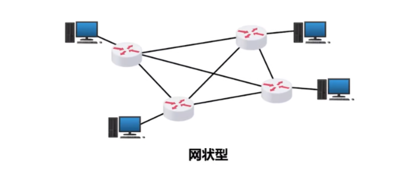
    
    * 树型（Tree）：结合了星型和总线型结构，呈分层结构，适用于大型网络。
  * ⑥ 按照`网络用途`分类：
    * 互联网（Internet）：全球范围内连接数以亿计的计算机，使用 TCP/IP 协议进行通信。
    * 企业网（Intranet）：企业内部专用的网络，用于企业内部的信息交换和资源共享。
    * 外联网（Extranet）：在企业网基础上，扩展到与特定外部组织或合作伙伴的连接，提供受控的访问权限。
  * ⑦ 按照`网络协议`分类：
    * `TCP/IP 网络`：基于 TCP/IP 协议族，广泛用于互联网和局域网。
    * ~~IPX/SPX 网络~~：由 Novell 公司开发的网络协议，曾经用于 Novell NetWare 网络。
    * ~~NetBEUI 网络~~：由 IBM 开发，主要用于小型局域网的一个轻量级协议。
  * ⑧ ……
  
* 每种分类方式从不同角度描述了计算机网络的特征和应用场景，它们共同构成了当今复杂多样的计算机网络体系。

## 4.2 计算机网络的指标

### 4.2.1 概述

* 计算机网络的`性能指标`被用来从不同方面`衡量`计算机网络的`性能`。
* 常用的 `8` 个计算机网络性能指标有：
  * 速率。
  * 带宽。
  * 吞吐量。
  * 时延。
  *  时延带宽积。
  * 往返时间。
  * 利用率。
  * 丢包率。

### 4.2.2 速率

* 为了能够更好的理解速率，我们需要先了解比特，即：
  * 比特（bit，记为小写的 b）是计算机中最小的数据单位（计算机内部的所有数据处理和传输都是基于二进制位进行的），一个 bit 就是二进制数字中的 0 或 1。
  * 但是，计算机中常用的数据存储单位却是字节（byte，记为大写的 B），常用的数据存储单位有：字节（B）、千字节（KB）、兆字节（MB）、吉字节（GB）、太字节（TB） 等。

> [!NOTE]
>
> bit 和 B 的换算关系如下：
>
> * 1 B = 8 bit。
> * 1 KB = 2^10 B = 1024 B 。
> * 1 MB = 2 ^10 KB = 1024 KB 。
> * 1 GB = 2 ^10 MB = 1024 MB 。
> * 1 TB = 2 ^10 GB = 1024 GB 。
> * ……

> [!IMPORTANT]
>
> * ① `传输速率`通常使用`位每秒`（bps，bits per second）来表示，而存储容量通常使用字节（B）来表示。
> * ② 网络带宽经常用兆比特每秒（Mbps）来表示，这里的 “bit” 强调的是传输的数据量。
> * ③ 硬盘、内存等的容量通常用字节（如：MB, GB, TB）来表示，这里的 “byte” 强调的是存储的数据量。

* 因为计算机内部的所有数据处理和传输都是以二进制进行的，所以`速率`是指`数据的传送速率`，即`每秒传送多少个比特`（bps）。
* 速率的基本单位是`比特/s`（bit/s，可简写为 b/s，有时也记为 bps，即 bits per second）。速率的常用单位有`千比特/s`（kb/s 或 kbps）、`兆比特/s`（Mb/s 或 Mbps）、`吉比特/s`（Gb/s 或 Gbps）、`太比特/s`（Tb/s 或 Tbps） 等。

> [!NOTE]
>
> 速率常用单位的换算：
>
> * 1 kb/s = 10^3 b/s = 1000 b/s 。
> * 1 Mb/s = 10^3 kb/s = 1000 kb/s 。
> * 1 Gb/s = 10^3 Mb/s = 1000 Mb/s 。
> * 1 Tb/s = 10^3 Gb/s = 1000 Gb/s 。
> * ……

> [!IMPORTANT]
>
> - **传输速率**：为了统一标准和便于理解，国际标准化组织（ISO）和国际电信联盟（ITU）规定传输速率应使用十进制前缀。因此，传输速率单位，如：Kbps、Mbps、Gbps、Tbps 等使用 1000 作为倍数。这种方式更直观，也更符合一般公众的认知习惯。
> - **存储容量**：国际电工委员会（IEC）规定，存储容量单位使用二进制前缀，如：KiB、MiB、GiB、TiB 等来明确区分。这是为了减少混淆，因为在存储容量中，二进制前缀与计算机的实际存储机制更加吻合。
> - **总结**：传输速率使用 1000 作为倍数是为了与国际单位制（SI）标准保持一致，便于标准化和全球一致理解。而存储容量中使用 1024 作为倍数是为了符合计算机二进制系统的特点，虽然两者在数值上略有差异，但这样区分能够减少混淆，明确表达数据量的实际意义。


* 示例：如果有一个待发送的数据块，大小是 100 MB，网卡的发送速率为 100 Mbps，则网卡发送完该数据块需要多少时间？

```txt
100 MB        1 MB        2^20 B       2^20 * 8 b
--------- = --------- = ---------  = -------------- = 8.388608 s
100 Mb/s      1 Mb/s      10^6 b/s     10^6  b/s
```

### 4.2.3 带宽

#### 4.2.3.1 带宽在模拟信号系统中

* 定义：在模拟信号系统中，`带宽是指信号所占用的频率范围，从最低频率到最高频率的范围`，通常以赫兹（Hz）为单位。

> [!NOTE]
>
> 带宽对信号传输的影响：
>
> * ① **信号质量**：
>   * 高带宽：能够传送更多的频率成分，信号质量更好，能够更准确的再现原始信号，如：高带宽的音频信号可以传输高质量的音乐。
>   * 低带宽：传输的频率成分有限，信号质量较差，如：低带宽的电话信号虽然足以传输语音，但传输音乐时质量较差。
> * ② **信号容量**：带宽越大，信道能够传输的数据量越大，例如：在数据通信中，带宽越大的网络连接能够传输更多的数据，网络容量越大。


* 示例：电话信号的带宽

```txt
标准电话信号的带宽：传统的电话信号的频率范围是从 300Hz 到 3400Hz，因此电话信号的带宽是 3400Hz - 300Hz = 3100Hz，即 3.1 kHz。
```

```txt
频率范围：电话信号的频率范围为 300Hz 到 3400 Hz，这个范围内的频率包含了人类语音的主要成分，保证了语音的可懂度和清晰度。
```

```
带宽的作用：带宽决定了信号可以包含的频率成分范围。带宽越大，信号可以传输的频率范围越广，能够传输的信息越多，质量越高。在电话信号中，3.1kHz 的带宽足以传输清晰的语音信息，但不足以传输高质量的音乐或其他高频率信息。
```

#### 4.2.3.2 带宽在计算机网络中

* 定义：在计算机网络中，`带宽通常指网络在单位时间内能够传输的最大数据量`，通常以比特每秒（bps）表示。这是一个网络容量的概念。

> [!NOTE]
>
> 带宽表示网络的最大容量，决定了网络能够支持的最大数据流量。，例如：一个具有 1 Gbps 带宽的网络连接能够在理想条件下每秒传输 1 吉比特的数据。

#### 4.2.3.3 数据传送速率（实际传输速率）

* 理论公式（木桶理论）：

```txt
数据传送速率 = min[主机接口速率，线路带宽，交换机或路由器的接口速率] 
```

* 名词解释：
  * `主机接口速率`是指计算机或服务器的网卡（网络接口卡，NIC）的最高数据传输速率，例如：如果网卡是千兆以太网卡（1 Gbps），那么主机接口速率就是 1 Gbps 。
  * `线路带宽`是指网络电缆（如：双绞线）的最大传输能力，例如：CAT-5e 电缆的最大带宽为 1 Gbps，CAT-6 电缆的最大带宽为 10 Gbps（在较短距离内）。
  * `交换机或路由器的接口速率`是指网络设备端口的最大数据传输速率，例如：如果交换机端口是千兆端口（1 Gbps），则接口速率为1 Gbps。如果是10 Gbps 端口，则接口速率为10 Gbps。

> [!NOTE]
>
> 在实际网络环境中，除了上述主要因素外，数据传输速率还可能受到以下因素的影响：
>
> - **① 网络拥塞**：网络中的高流量可能导致拥塞，从而降低实际数据传输速率。
> - **② 协议开销**：网络协议（如：TCP/IP）的开销会占用部分带宽，减少有效数据传输速率。
> - **③ 网络设备性能**：网络设备（如：交换机、路由器）的处理能力和配置也会影响数据传输速率。
> - **④ 传输距离**：特别是对于高速传输，电缆长度也会影响带宽和数据传输速率，例如：CAT-6 电缆在超过 55 米的距离时，可能无法维持 10 Gbps 的速率。


* 其对应的图示，如下所示：


* 那么，可能得数据传送速率就是这样的，即：

| 主机的接口速率 | 线路带宽 | 交换机或路由器的接口速率 | 数据传送速率 |
| -------------- | -------- | ------------------------ | ------------ |
| 1 Gb/s         | 1 Gb/s   | 1 Gb/s                   | 1 Gb/s       |
| 100 Mb/s       | 1 Gb/s   | 1 Gb/s                   | 100 Mb/s     |
| 1 Gb/s         | 100 Mb/s | 1 Gb/s                   | 100 Mb/s     |
| 1 Gb/s         | 1 Gb/s   | 100 Mb/s                 | 100 Mb/s     |

### 4.2.4 吞吐量（⭐）

* 定义：`单位时间内通过某个网络或接口的实际数据量`。吞吐量常被用于对实际网络的测量，以便获知到底有多少数据量通过了网络。

> [!NOTE]
>
> 吞吐量反映了网络实际的传输能力，吞吐量会受到以下因素的影响：
>
> * **① 带宽**：可用的最大传输容量。
> * **② 延迟（Latency）**：数据传输所需的时间。
> * **③ 丢包率**：传输过程中丢失的数据包比例。
> * **④ 协议开销**：网络协议引入的额外数据负载。
> * **⑤ 网络拥塞**：高流量导致的网络堵塞。
> * **⑥ 设备性能**：网络设备（如：路由器、交换机）的处理能力。

* 如果某个用户的线路带宽是 100 Mb/s ，他同时下载视频、浏览网页以及给文件服务器上传文件，并且下载视频的速率是 20 Mb/s、浏览器网页的速率是 600 kb/s、上传文件的速率是 1 Mb/s，如下所示：

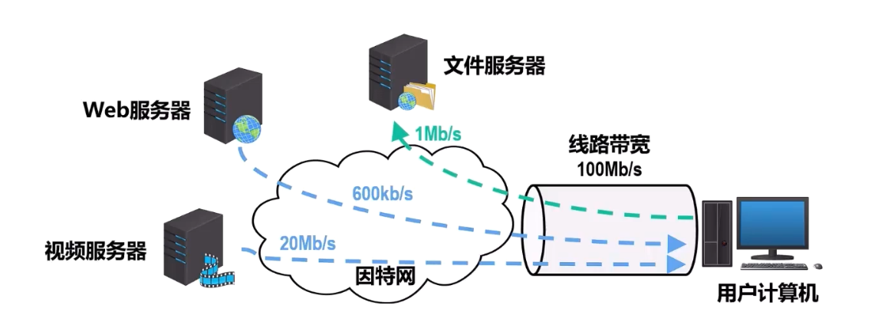

* 那么，吞吐量 = 20 Mb/s + 600 kb/s + 1 Mb/s = 21.6 Mb/s 。

### 4.2.5 时延

* 定义：是指数据从网络的一端传送到另一端所耗费的时间，通常以毫秒（ms）表示，也称为延迟或迟延。数据可以由一个或多个分组、甚至一个比特构成。

> [!NOTE]
>
> 之所以称为称为时延（延迟、迟延）等，就是为了突出时间上的滞后或推迟会影响数据传输的及时性；换言之，时延形象的反映了这种时间上的推迟现象。以下是延迟在计算机网络中的具体影响：
>
> * **① 数据传输时间**：延迟越高，数据从发送端到接收端所需要的时间就越少，这对于需要快速响应的应用（如：视频通话、在线游戏）会造成明显的之滞后感。
> * **② 用户体验**：高延迟会影响用户体验，特别是在实时交互应用中，用户会感到操作或响应不及时。
> * **③ 网络性能**：延迟影响网络整体性能。高延迟会导致数据包在网络中积压，增加网络拥堵，进一步影响传输效率。
> * **④ 协议性能**：许多网络协议（如：TCP）依赖于往返时间（RTT）来调整传输速率。高延迟会影响这些协议的性能，使得数据传输变得不稳定或低效。

- 在下面的例子中，主机 H1 给主机 H3 发送一个分组，即：

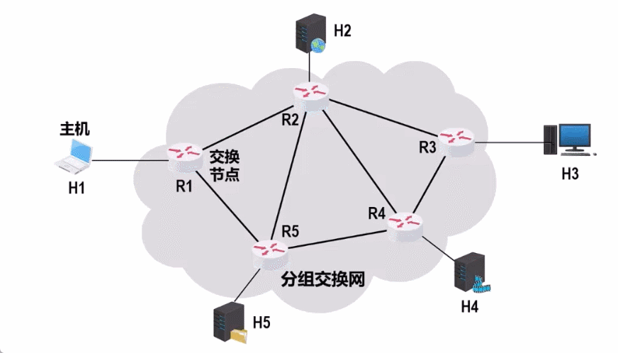

* 那么，该分组在整个传输过程中，所耗费的时间由哪几个部分构成？为了简化问题，我们假设源主机和目的主机之间只有一个路由器和两段链路，即：


* 源主机将分组（数据包）从发送端传输到物理介质上，这需要花费一定的时间，这段时间称为**`发送时延`**，即：


> [!NOTE]
>
> 发送时延(Transmission Delay） = 分组（数据包）长度（b）/  传输速率（b/s）。

* 分组（数据包）的电信号在物理介质（如：电缆、光纤）中传播，这需要花费一定的时间，这段时间称为**`传播时延`**，即：


> [!NOTE]
>
> 传播时延（Propagation Delay） = 传播距离（m） / 信号传播速度（m/s）。


* 当分组（数据包）到达路由器后，会在路由器的输入队列中排队缓存并等待处理，在路由器确定了分组的转发接口后，分组会在输出队列中排队缓存并等待转发，分组在路由器的输入队列和输出队列中排队缓存，所耗费的时间就是**`排队时延`**，即：


> [!NOTE]
>
> * 在分组从源主机传输到目的主机的过程中，分组往往需要经过多个路由器的转发，分组在每个路由器上产生的排队时延的长短，往往取决于网络当时的通信量和路由器自身的性能，由于网络的通信量随时间变化很大，各个路由器的性能也不尽完全相同；因此，排队延迟一般无法用一个简单的公式来计算。并且，当网络通信量很大的时候，会造成路由器的队列溢出，使得分组丢失，这相当于排队时延无穷大。
>
> * 换言之，排队时延（Queuing Delay）依赖于网络流量情况和路由器的缓冲策略，通常不可预知，但在网络拥塞时可能会显著增加。

* 路由器从自己的输入队列中，取出排队缓存并等待处理的分组后，会进行一系列处理工作，例如：检查分组的首部是否误码，提取分组首部中的目的地址，为分组查找相应的转发接口，以及修改分组首部中的部分内容（如：生存时间等），路由器对分组进行的一系列处理工作，所耗费的时间就是**`处理时延`**，即：


> [!NOTE]
>
> 处理时延（Processing Delay）通常依赖于设备的处理能力，一般为固定的毫秒级时间。

* 分组经过路由器的转发传输到目的主机，这又会耗费一个路由器的**`发送时延`**，以及代表该分组的电信号，在另一段链路上传播所耗费的**`传播时延`**，即：


* 🤔 疑惑：既然源主机或路由器有发送时延，那么为什么目的主机或路由器没有接收时延？实际上，是因为目的主机在接收分组信号与分组信号在链路上传播时同时进行的，即：


> [!IMPORTANT]
>
> 综上所示，时延 = 发送时延（数据传送速率） + 传播时延 + 排队时延 + 处理时延。

* 在忽略路由器的排队时延和处理时延的时候，并且分组等长、各链路长度相同、带宽也相同，则 2 个主机，2 个路由器，1 个分组的时延，如下所示：

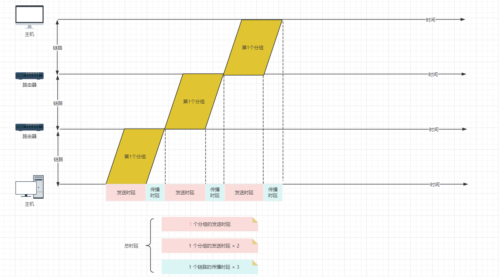

> [!NOTE]
>
> 总时延（忽略排队时延和处理时延） = 1 个分组的发送时延 + 1 个分组的发送时延 * 2 （转发次数 - 1）  + 1 个传播时延 * 3（转发次数）

* 在忽略路由器的排队时延和处理时延的时候，并且分组等长、各链路长度相同、带宽也相同，则 2 个主机，2 个路由器，2 个分组的时延，如下所示：


> [!NOTE]
>
> 总时延（忽略排队时延和处理时延） = 2 个分组的发送时延 + 1 个分组的发送时延 * 2 （转发次数 - 1）+ 1 个传播时延 * 3（转发次数）

* 在忽略路由器的排队时延和处理时延的时候，并且分组等长、各链路长度相同、带宽也相同，则 2 个主机，2 个路由器，3 个分组的时延，如下所示：

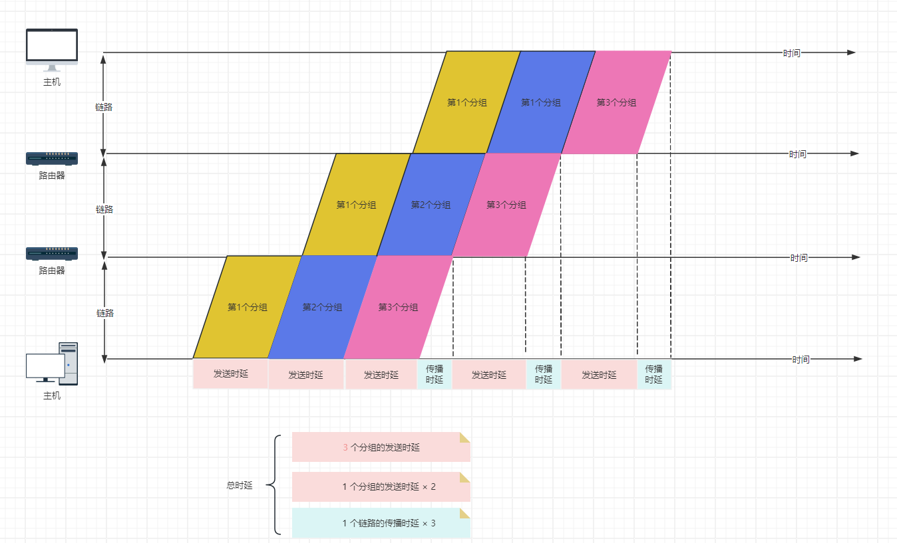

> [!NOTE]
>
> 总时延（忽略排队时延和处理时延） = 3 个分组的发送时延 + 1 个分组的发送时延 * 2 （转发次数 - 1）+ 1 个传播时延 * 3（转发次数）

* 那么，在不考虑排队时延和处理时延的情况下，源主机通过 n 个路由器转发，给目的主机发送 m 个分组的总时延计算公式是（假设各个分组等长，各个链路等长，主机和路由器的发送速率相等）：

```shell
# 其中，m-1 是转发次数
总时延 = n 个分组的发送时延 + 1 个分组的发送时延 * （m - 1） + 1段链路的传播时延 * m
```


* 例题：如下图所示采用的 “存储-转发” 方式的分组交换网中，所有的链路的数据传输速率为 100 Mb/s ，分组大小为 1000 B，其中分组头的大小是 20 B。如果主机 H1 向主机 H2 发送一个大小为 980 000 B 的文件，则在不考虑分组拆装时间和传播延迟的情况下，从 H1 发送开始到 H2 接收为止，需要的时间至少是 ？ 


* 答案：
```txt
∵ 总时延 = n 个分组的发送时延 + 1 个分组的发送时延 * （m - 1） + 1段链路的传播时延 * m，且传播时延不考虑
```

```txt
∴ 总时延 = n 个分组的发送时延 + 1 个分组的发送时延 * （m - 1） 
```

$$
∴ 总时延 = \frac{980\ 000\ \text{B}}{(1000\ \text{B} - 20\ \text{B})} \cdot \frac{1000\ \text{B}}{100\ \text{Mb/s}} + \frac{1000\ \text{B}}{100\ \text{Mb/s}} \cdot (m - 1)
$$

```txt
∵ m = 3 
```

$$
∴ 总时延 = \frac{980\ 000\ \text{B}}{(1000\ \text{B} - 20\ \text{B})} \cdot \frac{1000\ \text{B}}{100\ \text{Mb/s}} + \frac{1000\ \text{B}}{100\ \text{Mb/s}} \cdot (2)
$$

$$
∴ 总时延 = 1000  \times \frac{1000 \times 8 b}{100 \times 1000 \times 1000 b/s} + \frac{1000 \times 8b}{100 \times 1000 \times 1000b/s} \times 2
$$

```txt
∴ 总时延 = 0.08 + 0.00016 = 0.8016s = 80.16 ms
```

### 4.2.6 时延带宽积

* 定义：时延与带宽的乘积，表示网络中可以容纳的最大数据量。
* 意义：时延带宽积用于衡量网络中数据流的“容量”，对于高带宽长时延（如卫星通信）网络特别重要。


### 4.2.7 往返时间

- **定义**：数据包从源节点发送到目的节点并返回源节点所需的时间，通常以毫秒（ms）表示。
- **意义**：RTT是评估网络响应时间的重要指标，对于TCP协议的性能优化尤为关键。

### 4.2.8 利用率

- **定义**：指网络资源的使用情况，通常表示为实际使用的带宽与总带宽的比值，以百分比表示。
- **意义**：利用率反映了网络资源的使用效率，较高的利用率意味着网络资源得到充分利用，但过高可能导致网络拥塞。

### 4.2.9 丢包率

- **定义**：指在传输过程中丢失的数据包占总传输数据包的比例，以百分比表示。
- **意义**：丢包率是网络可靠性的重要指标，高丢包率会导致数据重传，影响网络性能和用户体验。


# 第五章：计算机网络体系结构

## 5.1 常见的三种计算机网络


## 5.2 计算机网络体系结构分层的必要性


