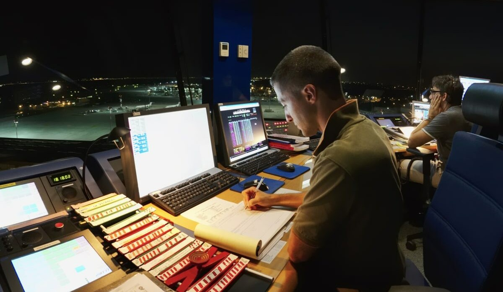
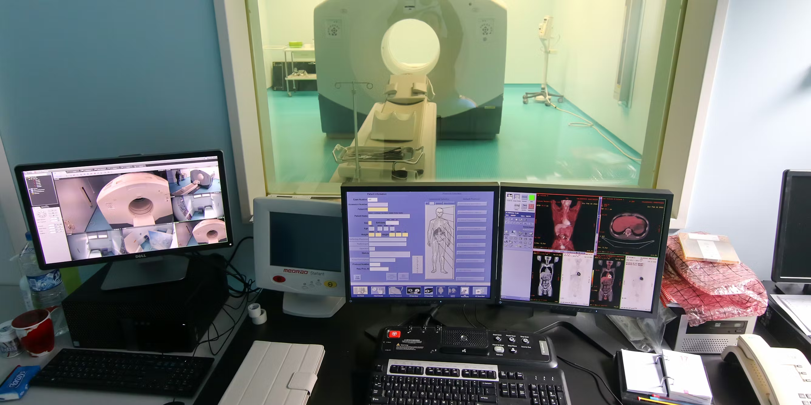
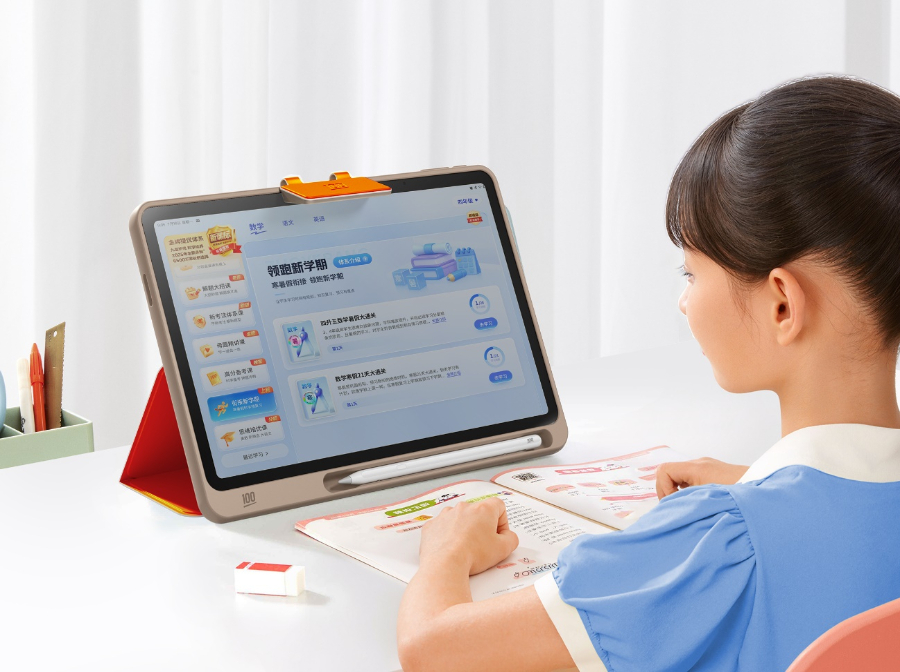
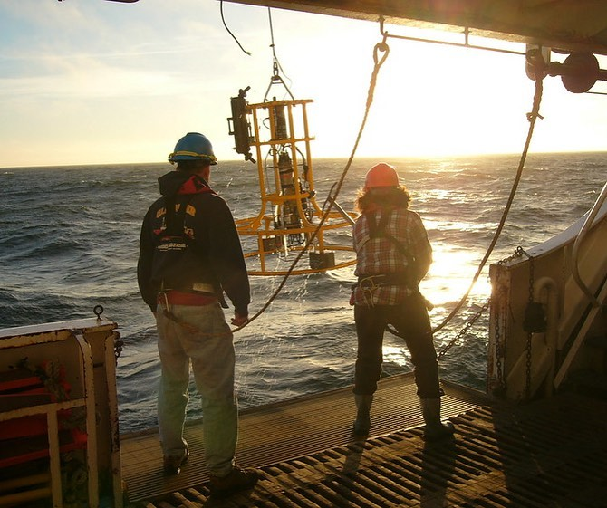
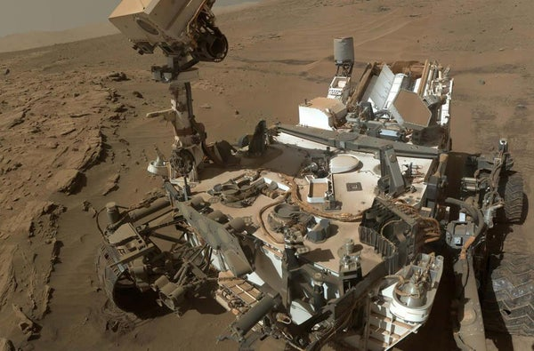
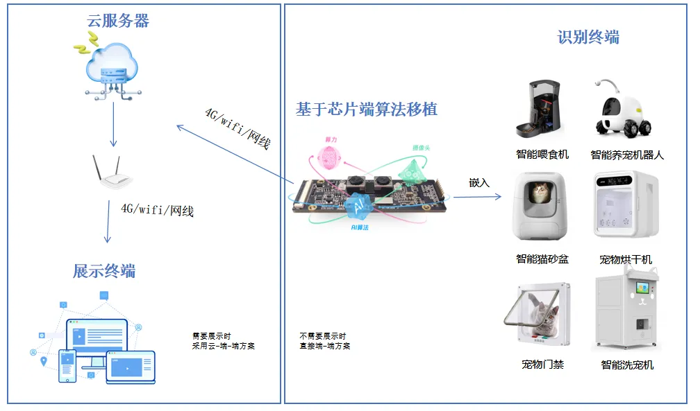

# 第一章：计算机的科学导论

## 1.1 概述

* 计算机确实帮助我们实现了很多不可思议的事情，如：全球通信、国际贸易、交通运输、医学革新、公平教育、网络购物、交友恋爱以及互联网的方方面面。

> [!NOTE]
>
> ::: details 点我查看 具体细节
>
> | 计算机影响的范围 | 例子                        |
> | ---------------- | --------------------------- |
> | 全球通信         |  |
> | 国际贸易         |  |
> | 交通运输         |  |
> | 医学革新         |  |
> | 公平教育         |          |
> | 网络购物         |          |
> | 交友恋爱         |          |
>
> :::

* 计算机帮我们我们 `探索自己的世界` 以及 `探索外面的世界`。

> [!NOTE]
>
> ::: details 点我查看 具体细节
>
> | 计算机影响的范围 | 例子                          |
> | ---------------- | ----------------------------- |
> | 探索自己的世界   |  |
> | 探索外面的世界   |            |
>
> :::

* 计算机也可以帮助我们做很多琐事，如：异地看护宠物、使用 emoji 和朋友聊天等。

> [!NOTE]
>
> ::: details 点我查看 具体细节
>
> | 计算机的影响范围      | 例子                  |
> | --------------------- | --------------------- |
> | 异地看护宠物          |  |
> | 使用 emoji 和朋友聊天 |  |
>
> :::

* 但是，计算机本身并不神秘，并且这门课程也不会教授你如何去编程（编写程序是计算机软件的重要部分）；但是，会提及 `硬件和软件设计` 的逻辑规范。

1.介绍课程目标和内容：探索计算机科学的各个领域，从比特、字节、晶体管和逻辑门到操作系统、虚拟现实和机器人。

 2.强调课程不教授编程，而是探讨计算机科学作为一门学科和技术。 

3.讨论计算机在现代社会的重要性，以及计算机故障对现代生活的影响。

# 第二章：计算机的起源

2:10  

1.追溯计算机的早期历史，提到虽然电子计算机相对较新，但对计算的需求却很古老。

2.介绍阿巴卡斯（Abacus），一种古老的计算工具，展示了其基本原理和在现代社会中的应用。 

3.讨论计算机一词的早期使用，以及它在不同历史时期的意义变化。

# 第三章：计算工具的发展

4:16

1.介绍人类历史上各种计算工具的发展，如阿斯特罗莱伯、滑尺等，并讨论它们如何提高计算速度和准确性。 

2.强调计算工具的发展降低了计算门槛，并放大了人类的思维能力。

# 第四章：机械计算机的发展

6:43

1.介绍机械计算机的发展历程，特别是步进式计算器等重要发明。 

2.讨论机械计算机在解决复杂计算问题中的应用，以及它们如何提高计算效率。

# 第五章：差分引擎与解析引擎

7:18

1.介绍查尔斯·巴贝奇（Charles Babbage）的差分引擎和解析引擎等重要发明。

 2.讨论这些发明如何推动计算机科学的发展，并对其后的计算机设计产生重要影响。

# 第六章：计算机在商业中的应用

9:06

1.讨论计算机在商业中的应用，特别是赫尔曼·荷莱斯（Herman Hollerith）的制表机对人口普查的影响。 

2.介绍国际商业机器公司（IBM）的成立和发展，以及其对计算机产业的重要贡献。
