# 第一章：课程简介

* 对于下面展示的 `计算机硬件` ，相信很多同学都不会陌生。

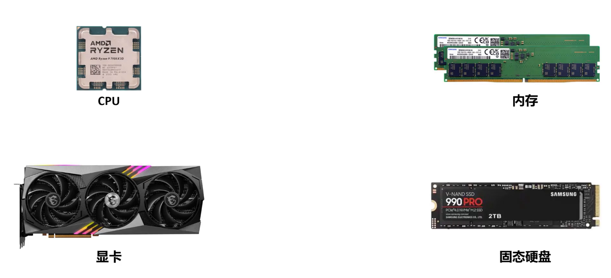

* 将 `上述硬件` 安装到 `计算机主板` 的相应 `插座` 或 `插槽` 中，如下所示：

> [!NOTE]
>
> * ① 将 `CPU` 安装到主板上的 `CPU 插座`。
> * ② 将 `内存条` 安装到主板上的 `内存插槽`。
> * ③ 将 `显卡` 安装到主板上的 `PCIE 接口插槽`。
> * ④ 将 `固态硬盘` 安装到主板上的 `M.2 接口插槽`。

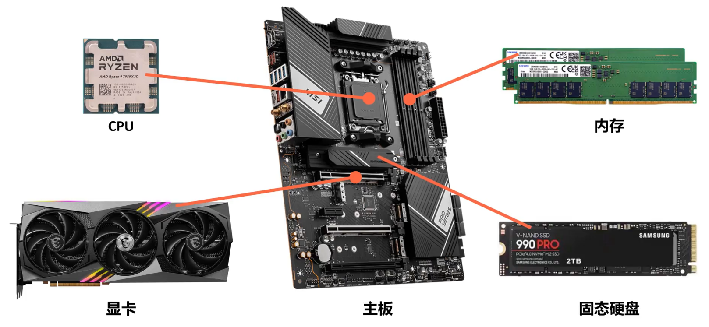

* 有过 `装机经历` 的同学一定知道，还需要给 CPU 安装合适的 `风冷散热器` 或 `水冷散热器` ，再给整个 `硬件系统` 选择一个 `功率合适` 的 `电源` ，并将 `电源` 配套提供的 `电源线` 连接到 `主板` 上的各种相应的 `供电接口` 以及 `显卡` 上的相应 `供电接口`。

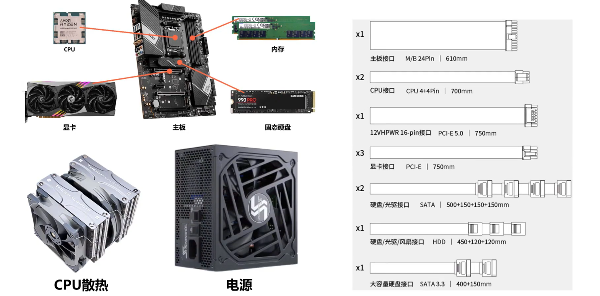

* 之后，将 `上述硬件` 安装到一个 `通风较好` 的` 机箱` ，再配上 `键盘`、`鼠标`、`显示器` 等 `输入输出设备`，就完成了一台计算机硬件的组装。

> [!NOTE]
>
> 地表最强的装机教程：
>
> * ① [硬件茶谈的装机教程](https://www.youtube.com/watch?v=ST65L4pG_6w)。
> * ② [天才赵德柱的装机教程](https://www.youtube.com/watch?v=hX9JmF2bX8w)。

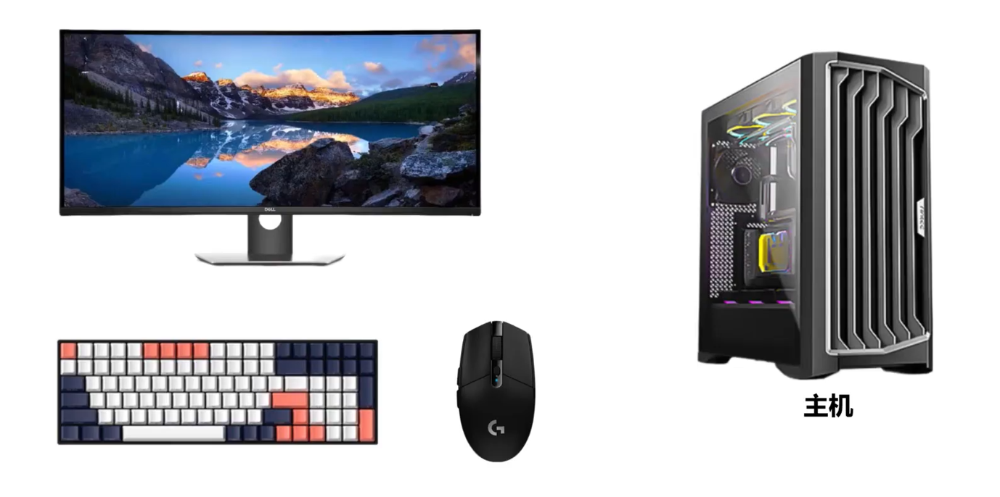

* 至于接下来，就是给 `计算机` 安装 `操作系统` 以及 `各类应用软件` 了，以便我们可以通过计算机解决实际问题。

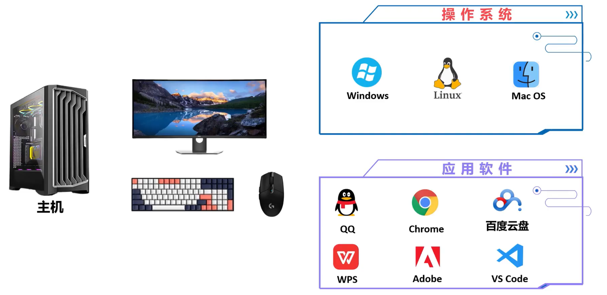

* 即使很多同学 `没有` 上述 `装机` 经历，很多同学在迈入大学校园之前的那个暑假，也会` 选择` 一台心仪的 `笔记本电脑`，作为自己大学生活的学习或娱乐工具，在选择的过程中，对 `CPU`、`内存`、`显卡`、`硬盘` 等 `计算机硬件`，自然而然的会有一定的了解。

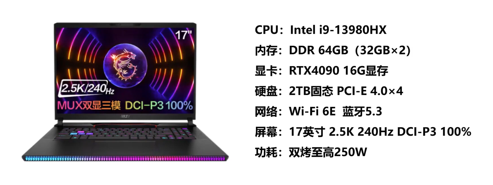

* 即使很多同学，在大一上学期，没有购买自己的台式机或笔记本电脑，也一定会选择一部`智能手机`；因此，对于 `CPU`、`内存`、`显卡`、`硬盘` 等 `计算机硬件`，自然而然的也会有一定的了解。

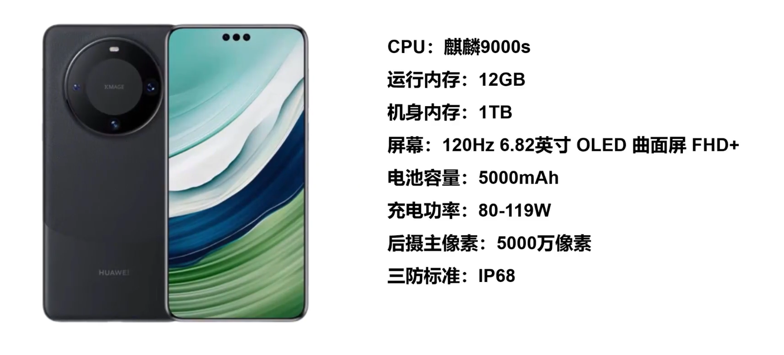

* 介绍到这里，相信很多同学会产生这样的疑问？

> [!NOTE]
>
> * ① 难道这个课程是用来教如何装机？
> * ② 数码 UP 主的养成？

* 不要误会，之所以进行上述举例，就是为了表达同学们对于 `计算机` 实际上一点都不陌生，因为它是我们生活中不可或缺的工具。

> [!IMPORTANT]
>
> * ① 但是，对于 `计算机专业的同学` 来说，仅仅知道如何装机、如何安装软件、如何挑选笔记本电脑和智能手机，是远远不够的。
> * ② 我们需要学习的是 `计算机底层的工作原理`，这也就引出了 `《计算机组成原理》` 这门课程会围绕 ` 哪些问题` 展开。

* 而上述的`这些问题会涉及到哪些计算机硬件`以及`这些硬件又是如何工作的`，我们将在学习 `《计算机组成原理》` 这门课程中，得到解答。

* 对于 `计算机相关专业` 的同学，还需要学习 `《操作系统》`、`《数据结构》`等课程，这样同学们就会对 `整个计算机系统` 有比较深入的理解。

* 在学习了 `《计算机网络》`这门课程后，同学们还会对 `计算机系统之间` 通过 `网络互联` 有一定的理解。

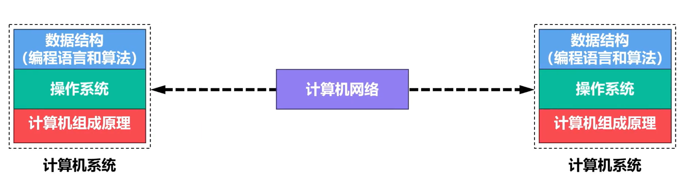

* 那么，上述 `四门课程` 及其 `配套教材`，就是同学们口中的 `四大天书`。

* 然而，这 `四门课程` 也是 `全国硕士研究生入学统一考试` 中 `计算机课程和技术学科` 联考 `指定的课程`，`科目代码` 是 `408` 。

# 第二章：计算机系统的组成

* 一般来说，`计算机系统`由 `硬件系统` 和 `软件系统` 组成，如下所示：

> [!NOTE]
>
> * ① 为了简单起见，我们可以将 `硬件系统` 简称为 `硬件`，而 `软件系统` 则简称为 `软件`。
> * ② `硬件` 是构成计算机系统的 `各种物理装置` 的 `总称`，如：CPU、内存、主板、显卡、固态硬盘、电源、电缆等。
> * ③ 仅仅包含硬件的计算机是无法正常工作的，也没有什么应用价值，只有在 `硬件` 上运行 `软件`，才能使得计算机正常运行，并发挥作用。

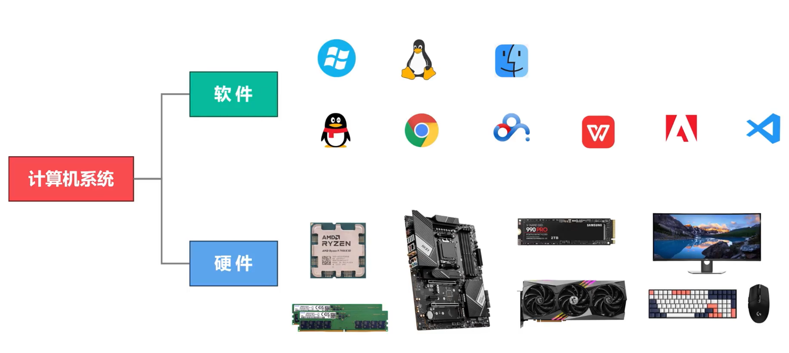

* 一般来说，可以将 `硬件` 划分为 `主机` 和 `外设` 两大类，可以将 `软件` 划分为 `系统软件` 和 `应用软件` 两大类。

> [!NOTE]
>
> * ① 系统软件：为 `管理整个计算机系统` 所编写的程序，如：操作系统、数据库管理系统、网络程序、标准程序库、语言处理程序、服务程序。
> * ② 应用软件：为 `实现用户应用` 所编制的各种程序，如：科学计算、数据处理、过程控制、事务管理。
> * ③ 本课程主要讨论的是 `计算机系统的硬件部分的组成` 以及 `构成计算机硬件的各大部件的基本工作原理`，而计算机系统的`软件部分`会在`计算机软件相关课程`中进行学习。
> * ④ 我们知道，软件需要在硬件上运行，才能使得计算机正常运行并发挥作用；因此，`计算机系统性能的好坏`，取决于 `硬件功能` 和 `软件功能` 的总和。

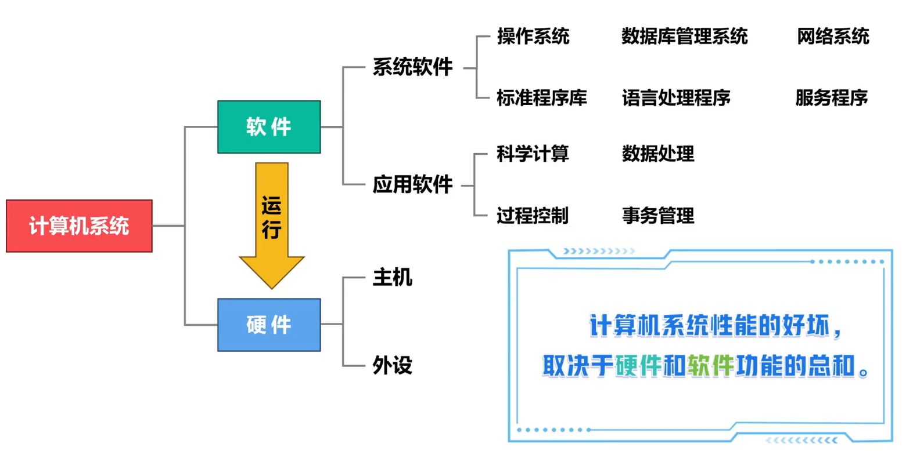

# 第三章：（电子数字）计算机的发展史

## 3.1 遂古之初，谁传道之？

* 1936 年，英国数学家 `艾伦·麦席森·图灵`，如下所示：

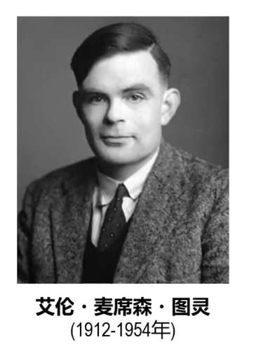

* 在其论文 `《论可计算数及其在判定问题上的应用》`，如下所示：

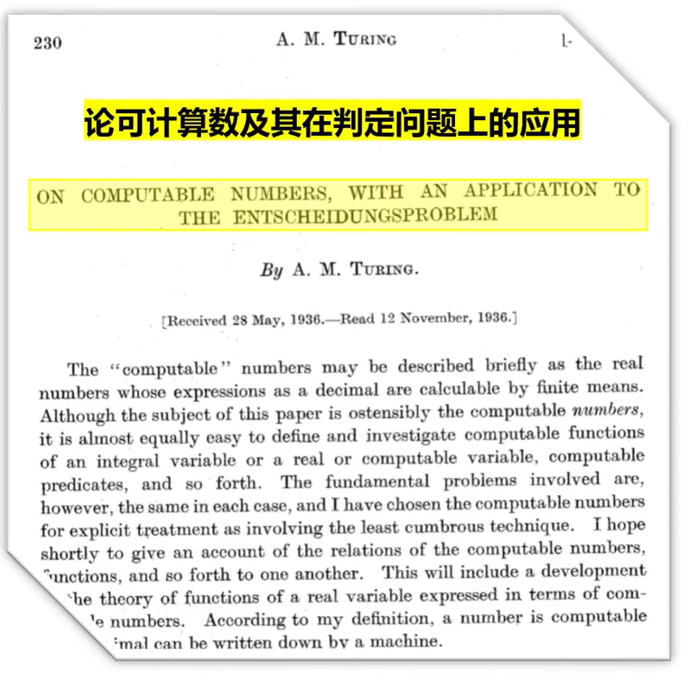

* 提出了一种十分简单，但运算能力极强的理想计算装置，用它可以计算所有能想象到的可计算函数，这一装置只是一种理想的计算模型或者说是一种理想中的计算机，又被称为 `图灵机` 。

> [!NOTE]
>
> * ① `图灵机` 有三部分组成：一条带子、一个读写头和一个控制装置，能执行任何给定的计算，即：能够执行任何可能的任务。
> * ② `图灵` 的这一思想，实际上奠定了现代计算机的基础，即：`现代计算机实际上就是用相应的程序来完成任何设定好的任务` 。
> * ③ 1936 年，`图灵` 在普林斯顿高等研究院进修，遇见了 `冯·诺依曼`，其对 `图灵` 的论文极度赞赏，其后来一再强调，他的 `存储程序` 的思想来源于 `图灵` 。

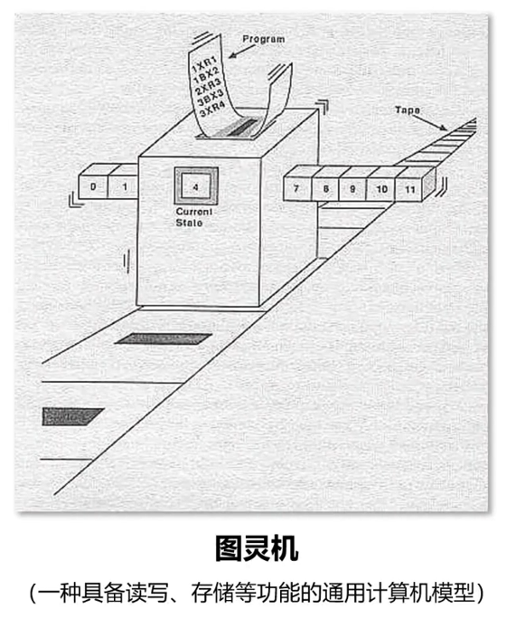

* 1938 年，美国数学家、信息论创始人 `伍德·香农`，如下所示：

* 在其论文 `《继电器和开关电路的符号分析》`，如下所示：

> [!NOTE]
>
> * ① 深刻地揭示了 `布尔代数` 和 `开关电路` 之间的联系，为 `数字电路设计和分析` 奠定了坚实的数学基础。
> * ② 这项开创性的研究为 `计算机科学`、`电子工程` 与 `信息技术的发展` 提供了重要的理论支持，对于现代科技的进步产生了深远的影响。

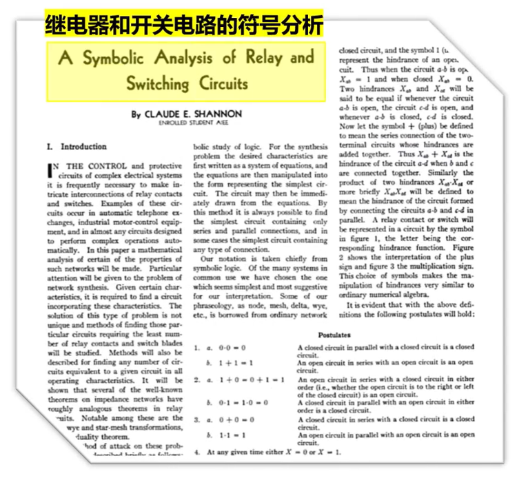

## 3.2 硬件发展

* 1937 年 ~ 1945 年，世界上第一台真正意义上的电子计算机，由美国艾奥瓦州立大学物理系副教授 `阿塔纳索夫` 和当时还是物理系研究生的 `贝瑞` 合作研制成功，如下所示：

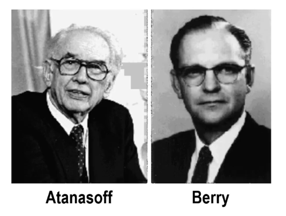

* 该计算机也被称为 `阿塔纳索夫·贝瑞计算机`（`A`tanasoff-`B`erry `C`omputer，简称 ABC） 。

> [!NOTE]
>
> * ① 1937 年开始设计，1942 年成功测试。
> * ② 使用了 300 个电子管。
> * ③ 不可编程，仅用于求解线性方程组。
> * ④ 只是一台样机，并没有完全实现 `阿塔纳索夫` 的构想。

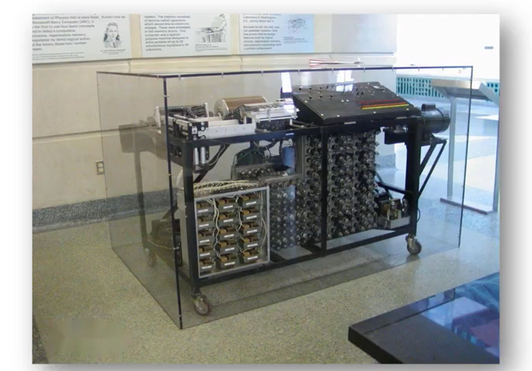

* 1946 年，`莫克利` 和 `艾克特` 基于 ABC 计算机的设计思想，在美国军方的支持以及 `冯·诺依曼` 等人的帮助下，成功研制出了真正实用的电子数学计算机 `ENIAC` 。

> [!NOTE]
>
> * ①  `ENIAC` 的特点：
>
> | 特点           | 描述                                                         |
> | -------------- | ------------------------------------------------------------ |
> | 占地面积       | 170 平方米                                                   |
> | 重量           | 30 吨                                                        |
> | 使用电子管数量 | 18000 个                                                     |
> | 耗电功率       | 150 千瓦                                                     |
> | 运算速度       | 每秒 5000 次加法运算，每秒 400 次乘法运算和立方运算，正弦和余弦等三角函数 |
>
> * ② `ENIAC` 的主要用途是 `弹道参数计算`，即：60 秒射程的弹道，计算时间将由原来的 20 分钟缩短到仅需 30 秒。
> * ③ `莫克利` 和 `艾克特` 制造完成 `ENIAC` 后，就立刻为其申请并获取了美国专利，就是这个专利导致了 `ABC` 和 `ENIAC` 之间长期的 `世界上第一台电子数字计算机` 的头衔之争；1973 年，美国 `明尼达地区法院` 给出了正式宣判，推翻并撤销了 `莫克利` 的专利，即：现在国际计算机界公认的事实就是 `第一台电子数字计算机的真正发明人`是 `阿塔纳索夫` 。

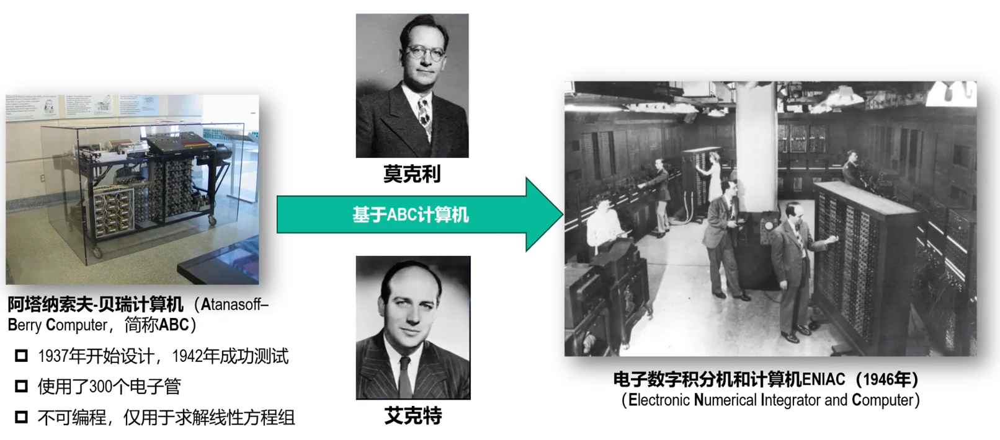

* 从 `ENIAC` 诞生到现在，在这短短的 `七十多年` 的时间里（2025 - 1946 = 79），伴随着电子器件的发展，电子数字计算机的发展日新月异，大致经历了 `电子管时代`、`晶体管时代`、`集成电路时代` 以及 `超大规模集成电路时代`，如下所示：

| 发展阶段               | 使用器件         | 运算速度(次/秒) | 主存                   | 辅存                           | 特点                                                         |
| ---------------------- | ---------------- | --------------- | ---------------------- | ------------------------------ | ------------------------------------------------------------ |
| 第 1 代 (1946 - 1957 ) | 电子管 / 真空管  | 几千 - 几万     | 水银延迟线、磁鼓、磁芯 | 穿孔卡片、穿孔纸带             | 1）使用机器语言编程  2）无操作系统                        |
| 第 2 代 (1958 - 1964 ) | 晶体管           | 几十万 - 几百万 | 磁芯                   | 磁鼓、磁带、磁盘               | 1）主要使用汇编语言编程，开始使用 FORTRAN、COBOL 等高级语言 2）单道批处理系统 |
| 第 3 代 (1965 - 1971)  | 集成电路         | 几百万 - 几千万 | 半导体存储器           | 磁带、磁盘                     | 1）高级语言进一步发展，出现了 B 语言（C 语言的前身) 2）多道批处理系统，分时系统 |
| 第 4 代 (1972 - 至今)  | 超大规模集成电路 | 几十亿 - 几干亿 | 半导体存储器           | 磁盘、磁带、光盘、半导体存储器 | 1）各种高级语言，如：C/C++、Java、Python 2）现代操作系统 |

* 从上述电子数字计算机的发展历程可以看出：`体积越来越小`、`功耗越来越低`、`可靠性越来越高`、`运算速度越来越快`。这些都依赖于电子器件的发展，而背后隐藏着 `众多科学家`、`贝尔实验室`、`仙童半导体`、`德州仪器`、`Intel`、`AMD` 等公司的传奇故事。

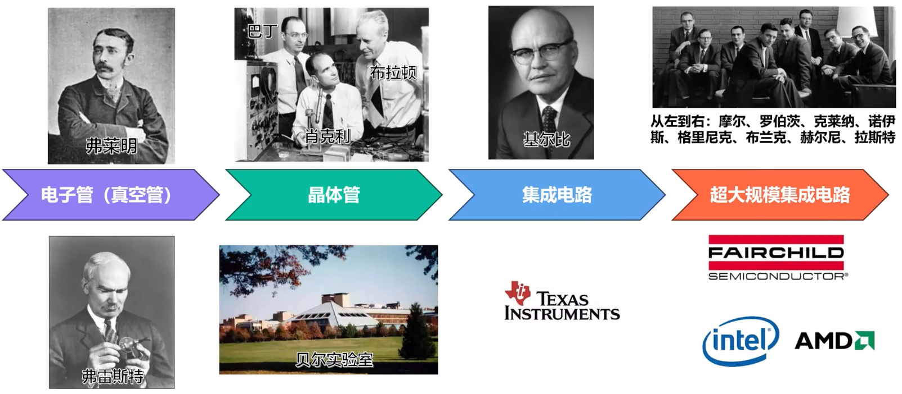

* 由于时间关系，不再逐个介绍，有兴趣的同学们可自行查阅；但是，我们必须提一下 `Intel` 公司的创始人之一 `戈登·摩尔` 于 `1965` 年在接受美国电子杂志的总编采访时对`半导体集成电路`上可容纳的 `晶体管数量`、`性能` 和 `价格` 等发展趋势进行了预测，即：`摩尔定律`。

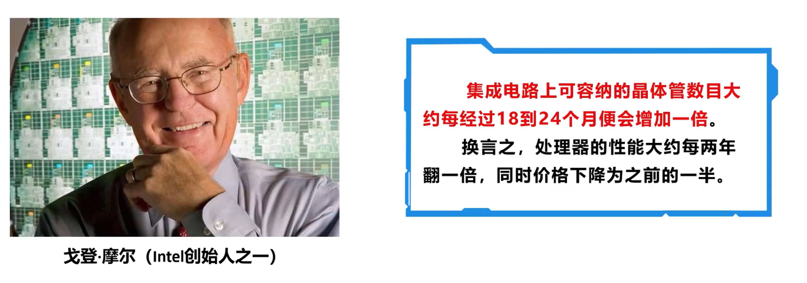

* 半导体集成电路 50 多年的发展历程。证明了 `摩尔定律` 对半导体芯片工业发展前景的预测是基本准确的。近年来，随着半导体芯片的设计、制造以及封装和测试技术的发展，半导体工艺已经接近半导体集成电路的极限；换言之，半导体芯片的发展，开始逐渐偏离摩尔定律的预测。从 2013 年开始，逐步放缓至三年翻一番。下面是 Intel 公司的典型微处理器，即：CPU 从 1970 年 - 2015 年的发展情况。

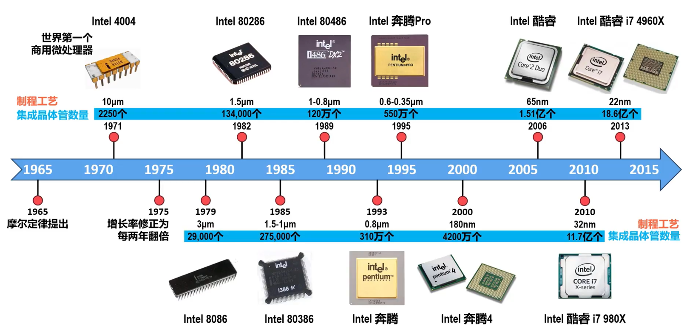

## 3.3 软件发展

* 在计算机早期，人们使用 `机器语言` 来编写程序，机器语言使用二进制代码，如：0000,0000,000000010000 来表示不同的机器指令。

> [!NOTE]
>
> 计算机能够识别和执行这些机器指令；但是，这对编程人员的要求极高：
>
> * ① 一方面需要编程人员对计算机的硬件结构非常熟悉。
> * ② 另一方面机器语言可读性差，易出错和难排错。

* 为了克服 `机器语言` 的上述特点，发展出了 `汇编语言`，其使用一些便于记忆，并且能够表示指令功能的助记符来编写程序。

> [!NOTE]
>
> * ① 尽管使用汇编语言编程比使用机器语言编程的难度有所降低；但是，机器语言依然是面向机器的语言，人们在使用汇编语言前依然需要花费很多时间，去熟悉所使用的计算机的指令集，然后才能使用其对应的符号语言，即：汇编语言
> * ② 换言之，使用汇编语言编程依然不是很方便。

* 为了使得不熟悉具体计算机硬件结构和相应指令集的人，也能很方便的为计算机编写程序，人们创造了各种接近于人类语言的高级语言，如：FORTRAN、Basic、Pascal 以及 C 等。

* 除了编程语言之外，操作系统也伴随着计算机硬件的每一次革新而不断发展，自 20 世纪 70 年代以来，操作系统百家争鸣，涌现了 Unix、Dos、Windows、Linux 以及 MacOS 等著名的操作系统，这部分内容会在操作系统课程中详细讲解，本课程不再赘述。

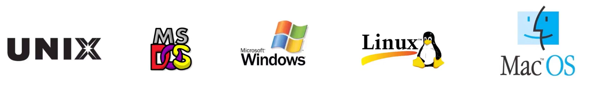

## 3.4 当前计算机的发展趋势

* 当今的计算机发展，正朝着两极化的趋势发展，一级是向`更微型化`发展，要求`低功耗`、`较高性能`以及`多用途`；另一极是向着`更巨型化`发展，要求`超高速`、`并行处理`以及`智能化`。

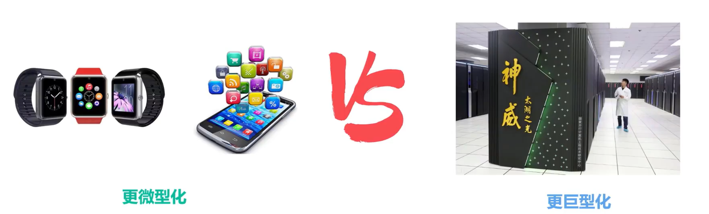

## 3.5 总结

* 计算机的发展，如下所示：

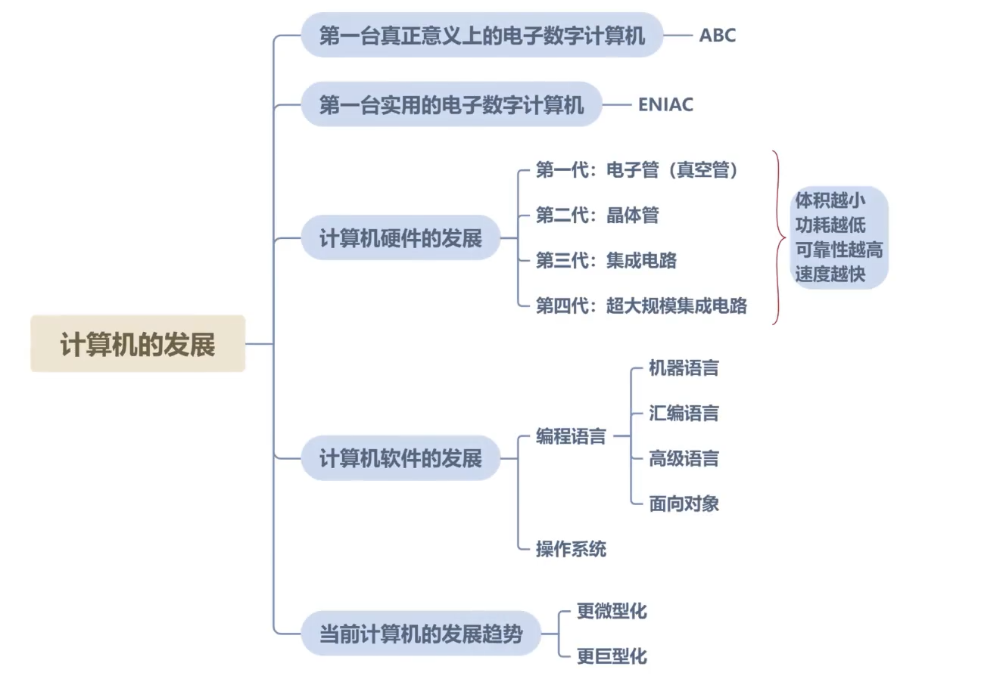

# 第四章：计算机硬件和计算机软件

## 4.1 计算机硬件

### 4.1.1 概述

* 从 20 世界 40 年代中期发展至今，尽管计算机的硬件技术经历了 `电子管`、`晶体管`、`集成电路` 和 `超大规模的集成电路` 等多个发展阶段；但是，当今大多数通用计算机依然符合 `冯·诺依曼计算机` 的主要设计思想。

### 4.1.2 冯·诺依曼计算机的结构

* 世界上第一台实用的电子数字计算机 ENIAC，如下所示：

> [!NOTE]
>
> * ① 采用`十进制`，`没有内存储器`。
> * ② `需要通过旋钮、开关和接插线的不同位置来表示程序`。
>   * 在 ENIAC 上设置一个实用程序，往往需要几天甚至几周的时间。如非必要，使用者很少愿意修改它。
>   * 因此，尽管 ENIAC 是通用的，却总在一段时间内只专用于某个问题，如：弹道计算，其通用价值被大大削弱。
>   * 如果频繁地设置不同程序，机器在很大一部分时间里会处于设置程序过程而无法运行，它的高速性能又被大大浪费了。

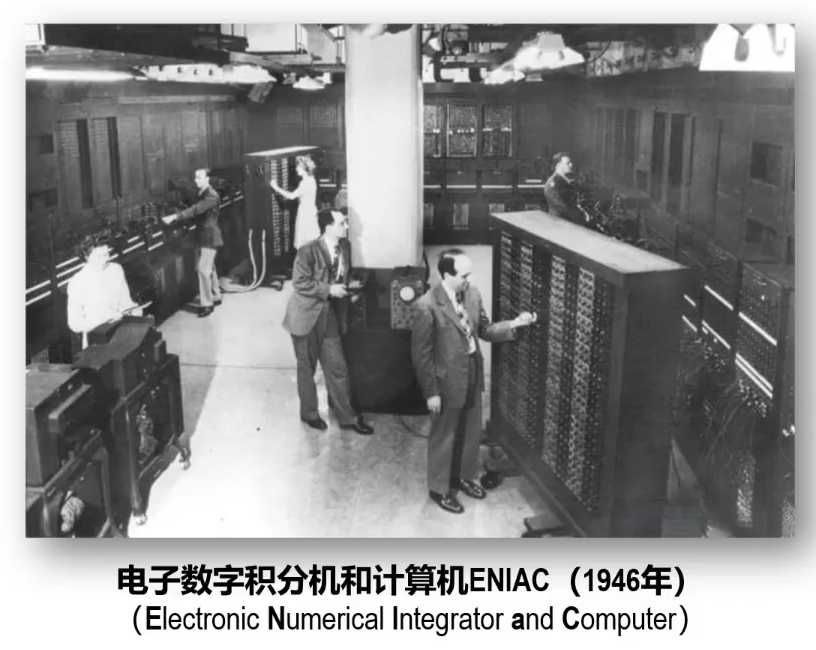

* 在 ENIAC 的总体设计已经完成并进入硬件实现阶段时，来自`曼哈顿计划`（美国的原子弹计划）的 `冯·诺依曼`加入了由 `莫克利` 和 `艾克特` 为主要负责人的 ENIAC 团队，一起讨论对它的改进，即：`程序能够通过穿孔介质输入机器，之后长期驻存在机器内部的存储器中`；换言之，`冯·诺依曼` 计算机的基本思想是 `存储程序` 的思想。

* 尽管上述方案主要是 `莫克利` 和 `艾克特` 的想法；但是，`冯·诺依曼` 还是对 EDVAC 做了更抽象的提炼。1945 年 6 月，在一趟返回 `洛斯·阿拉莫斯国家实验室` 的列车上，`冯·诺依曼` 写出了那篇长达 101 页，影响计算机历史走向的 EDVAC  报告书的第一份草案。该草案不仅详细描述了 EDVAC 的设计，还为现代计算机的发展指明了道路。

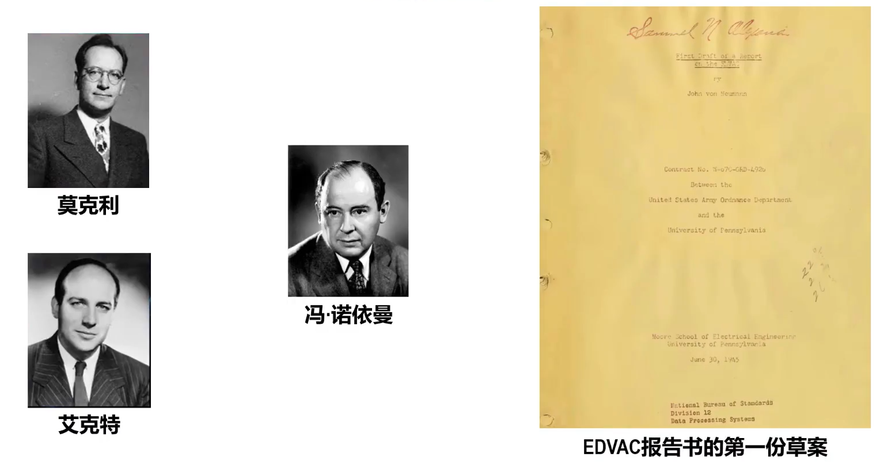

* `冯·诺依曼` 和 `EDVAC` 机，如下所示：

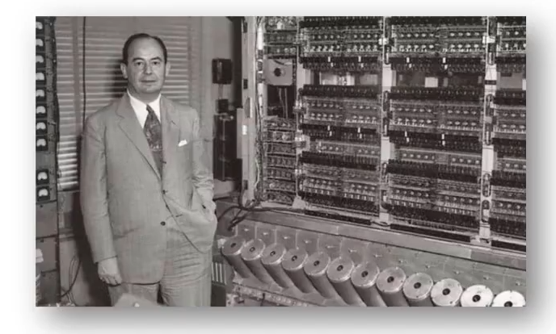

> [!IMPORTANT]
>
> `冯·诺依曼计算机`的主要特点，如下所示：
>
> * ① 构成 `程序` 的 `指令` 和 `数据` 均采用 `二进制` 表示。
> * ② `指令和数据存放在存储器中，按地址访问`。
> * ③ `指令` 在 `存储器` 中按 `顺序` 存放。一般情况下，指令是 `顺序执行` 的。
> * ④ 指令由 `操作码` 和 `地址码` 组成：
>   * 操作码用来表示执行何种操作。
>   * 地址码用来表示操作数在存储器中的位置。
> * ⑤ 机器以 `运算器` 为中心，输入/输出设备和存储器之间的数据传送通过 `运算器` 来完成。
> * ⑥ 计算机硬件由 `运算器`、`控制器`、`存储器`、`输入设备` 和 `输出设备` 组成。

> [!CAUTION]
>
> * ① 或许很多同学此时并不能完全理解上述特点，进而感到了一定的难度。
> * ② 不用担心，随着课程的推进，在我们学习了 `计算机的基本工作原理` 那节课后，就能对上述特点有着更全面和深入的理解。

* `冯·诺依曼计算机的结构`，如下所示：

> [!NOTE]
>
> 使用 `实线箭头` 来表示 `数据线`，使用 `虚线箭头` 来表示 `控制线` 和 `反馈线` 。

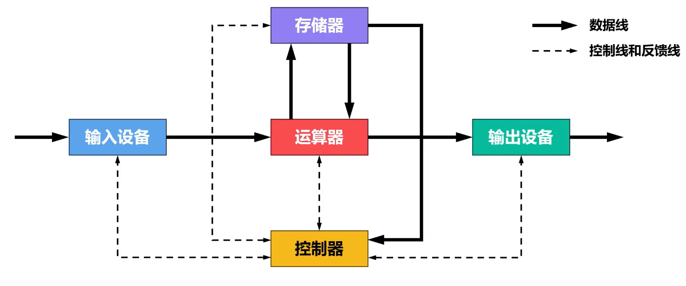

* `控制器` 和 `其它四个部件` 之间，都是通过 `控制线` 和 `反馈线` 相连，因为这些部件需要在 `控制器` 的控制下协调工作，`控制器` 通过 `控制线` 给其它部件发送 `控制信息`，命令这些部件执行相应的任务，而其他部件通过 `反馈线` 将 `自身状态` 和 `任务完成` 情况返回给 `控制器`。
* 例如：在 `控制器` 的控制下，将 `用户信息` 通过 `输入设备`、`运算器` 存放到 `存储器` 中。

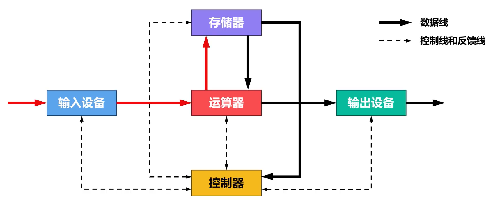

* 例如：在 `控制器` 的控制下，将 `存储器` 中的 `信息` 通过 `运算器`、`输出设备` 进行输出。

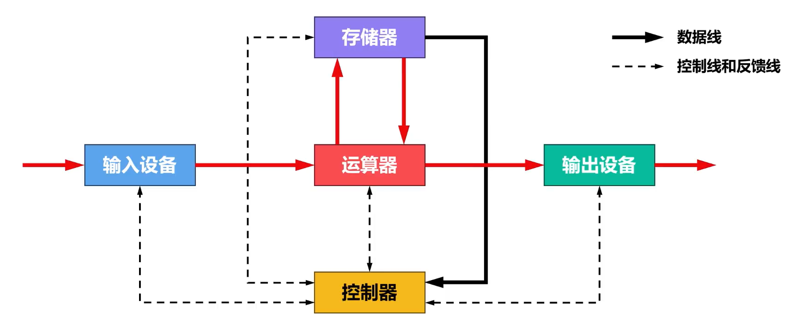

### 4.1.3 现代计算机的结构

* 从 `运算器` 的名称我们可以看出，其 `任务` 就是 `进行运算`。但是，`冯·诺依曼计算机`的这种以 `运算器` 为中心的结构，会造成每次 `输入输出操作` 都需要 `运算器` 的参与，这将浪费很多用于 `运算` 的时间。

> [!NOTE]
>
> `输入输出操作` 可简称为 `I/O 操作`，相应的 `输入输出设备` 可简称为 `I/O 设备`。

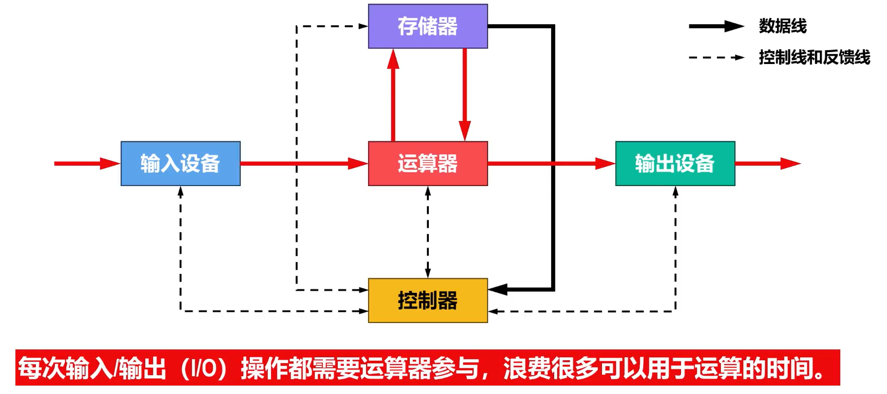

* 为了克服 `冯·诺依曼计算机` 这种以 `运算器` 为中心的结构所带来的缺点，现代计算机一般以 `存储器` 为中心。

> [!NOTE]
>
> * ① 使用 `实线箭头` 来表示 `数据线`，使用 `虚线箭头` 来表示 `控制线` 和 `反馈线` 。
> * ② 现代计算机以 `存储器` 为中心的结构，可以让 `I/O 设备` 和 `存储器` 交换数据，以提高整体效率。

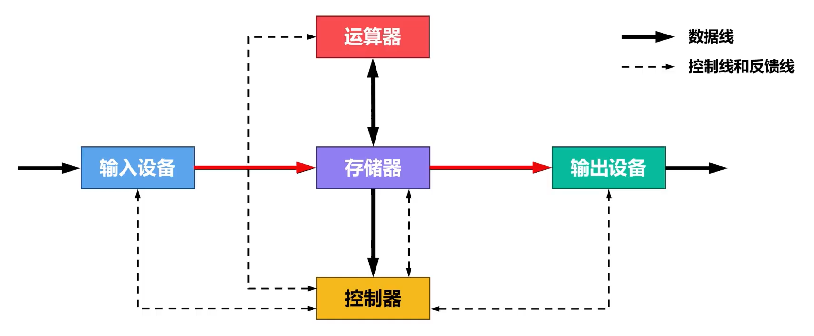

### 4.1.4 五大部件

* `输入设备` 和 `输出设备` 共同实现 `人机交互`，是计算机与外部环境沟通的桥梁，如下所示：

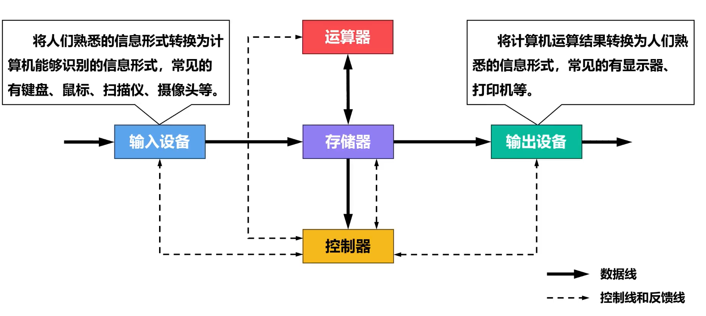

* `存储器` 分为 `主存储器` 和 `辅助存储器`，如下所示：

> [!NOTE]
>
> * ① `内存` 或 `主存` 就是我们装机时所使用的 `内存条`。
> * ② `外存` 或 `辅存` 就是我们装机时所使用的 `机械硬盘` 或 `固态硬盘`。
> * ③ `外存` 中的新必须调入 `内存` 后，才能被 CPU 访问。

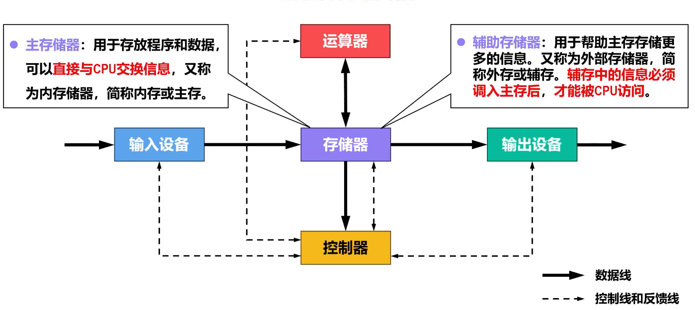

* `运算器`  的核心是 `算术逻辑单元`，如下所示：

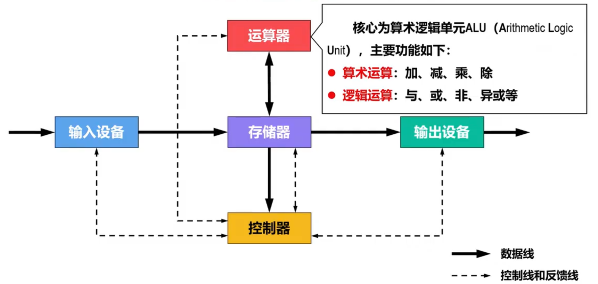

* `控制器` 的核心是 `控制单元` ，如下所示：

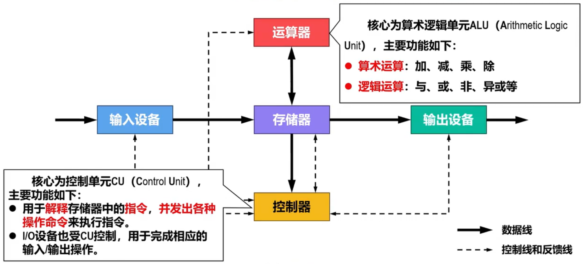

### 4.1.5 五大部件

* `运算器` 除了包含 `算术逻辑单元 ALU` 之外，还包含一些 `相关寄存器`，如下所示：

> [!NOTE]
>
> `相关寄存器` 将在后续的 `计算机的基本工作原理` 那节课中进行介绍。

* `控制器` 除了包含 `控制单元 CU` 之外，也包含一些 `相关寄存器`，如下所示：

> [!NOTE]
>
> `相关寄存器` 将在后续的 `计算机的基本工作原理` 那节课中进行介绍。

* 由于 `运算器` 和 `控制器`  在逻辑关系和电路结构上联系十分紧密，在大规模集成电路制作工艺出现后，这两大部件往往被集成在同一颗芯片上，称为 `中央处理器` ，如下所示：

* `存储器` 分为 `主存储器` 和 `辅助存储器` ，如下所示：

* 我们可以将 `CPU` 和 `内存` 合起来，称为 `主机` ，如下所示：

* 我们可以将 `输入设备` 和 `输出设备` 合起来，称为 I/O 设备，如下所示：

* 我们可以将 `辅助存储器` 和 `I/O 设备`，称为 `外部设备` ，如下所示：

* 上述计算机硬件的 5 大部件之间，通过 `总线` 互连，如下所示：

> [!NOTE]
>
> * ① 之前介绍的 `数据线`、`控制线` 以及 `反馈线` 都属于 `总线` 的范畴。
> * ② 这部分内容会在后续有关总线的那章具体介绍。

 

* 综上所述，现代计算机的结构示意图，如下所示：

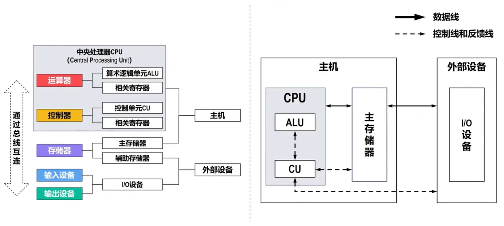

### 4.1.6 总结

* 计算机硬件的结构，如下所示：

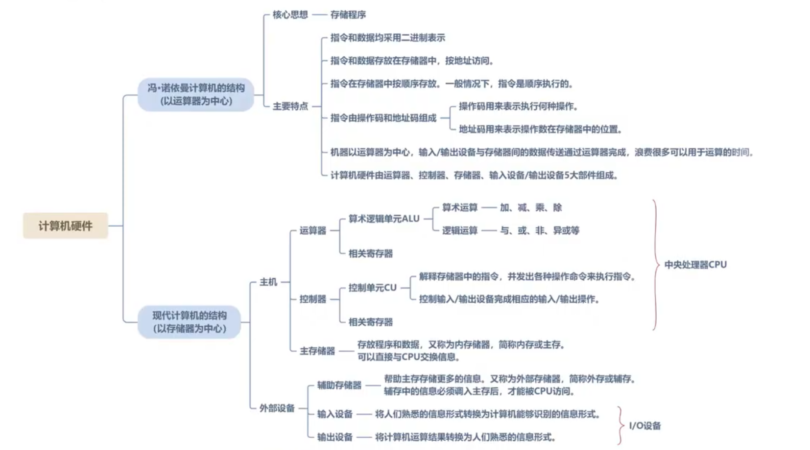

## 4.2 计算机软件

### 4.2.1 概述

* 很多同学都知道，仅包含计算机硬件的计算机系统，是没有任何使用价值的。人们使用计算机的目的：就是让计算机帮助人们解决各类应用问题，这就需要人们针对具体应用问题编写程序，让程序在计算机硬件上运行，进而解决应用问题。
* 程序是软件的重要组成部分，一台计算机中的全部程序和数据，就构成了这台计算机的软件系统。

### 4.2.2 计算机软件的分类

* 通常情况下，会将 `计算机软件` 分为 `系统软件` 和 `应用软件` 两大类，如下所示：

 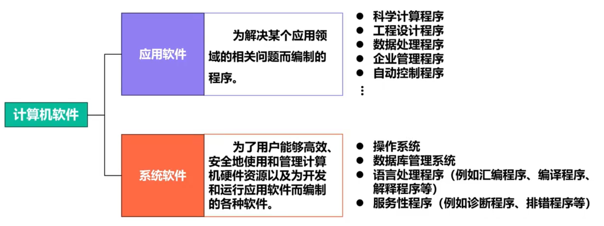

### 4.2.3 计算机软件的发展

#### 4.2.3.1 概述

* 在计算机软件的发展过程中，先后经历了 `机器语言编程`、`汇编语言编程`、`高级语言编程` 等，如下所示：

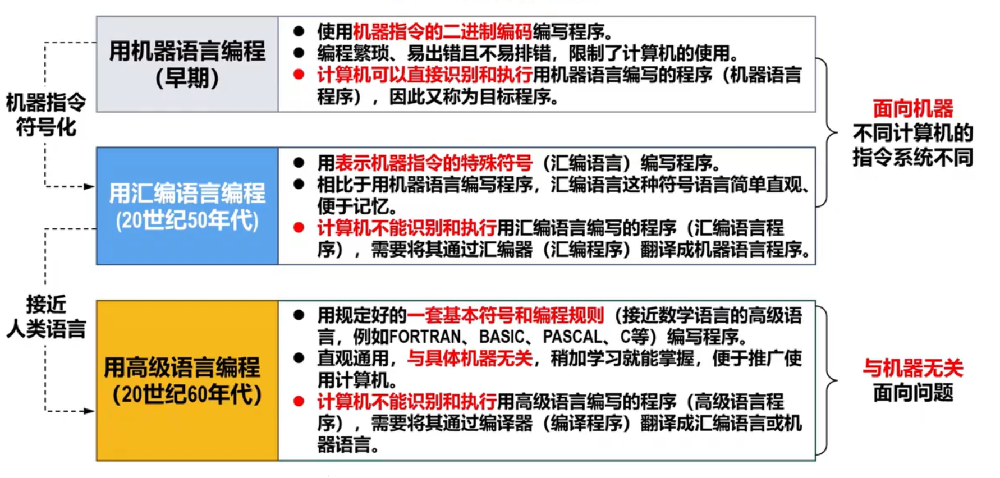

* 下图是使用 Visual Studio 编写的一段非常简单的 C 语言源程序，如下所示：

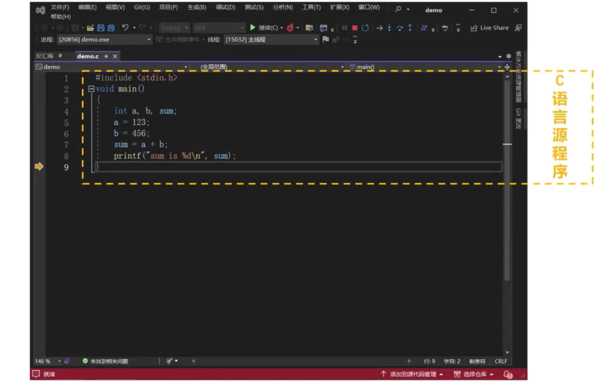

* 我们可以通过 Visual Studio 对其进行 `反汇编` ，以便查看对应的 `汇编语言程序`；同理，我们也可以通过 Visual Studio 看到编译后的 `机器语言程序`，如下所示：

> [!NOTE]
>
> 为了方便用户查看机器指令，Visual Studio 等开发环境，默认使用十六进制的形式显示，而不是二进制的形式显示。

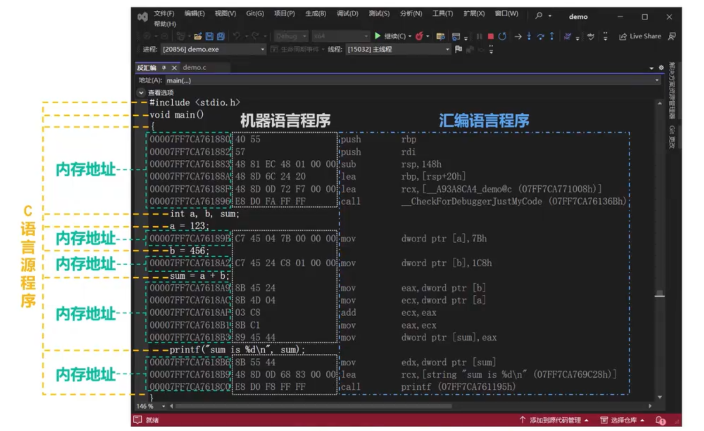

#### 4.2.3.2 程序设计语言 & 语言翻译程序

* `程序设计语言` 和 `语言翻译程序` 的关系，如下所示：

> [!NOTE]
>
> `编译程序`、`解释程序` 以及 `汇编程序` 都属于`翻译程序`。

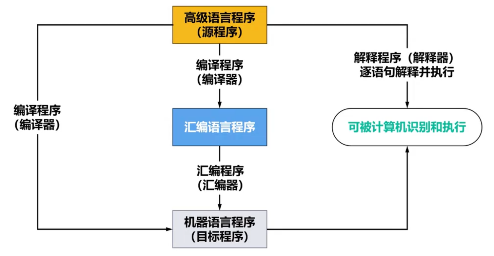

* 下面是使用 GCC 编译 C 语言程序的示意图，如下所示：

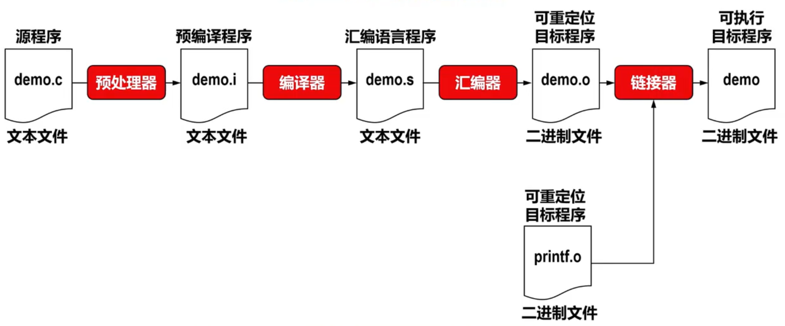

#### 4.2.3.3 计算机软件的发展趋势

* 随着硬件和软件的不断发展，人们又创造出了一类程序，称为 `操作系统`（系统软件）。

> [!NOTE]
>
> * ① `操作系统` 提供了在 `汇编语言` 和 `高级语言` 的使用和实现过程中 `所需的某些基本操作` 。
> * ② `操作系统` 负责 `控制并管理计算机系统的全部硬件资源`（CPU、内存和外部设备等）和 `软件资源`（编译程序、应用程序等）。
> * ③ `操作系统`为用户使用计算机系统 `提供了极为方便的条件` 。

* 随着计算机应用领域的逐渐扩大，还相应地出现了 `其他各类系统软件`（数据库管理系统、网络系统等）以及多种多样的 `应用软件`。
* 随着软件的进一步发展，将会出现 `更高级的计算机语言`，其发展方向是标准化、积木化、产品化以及智能化，最终向自然语言发展，它们能够自动生成程序。

# 第五章：计算机系统的层次结构（分层思想）

## 5.1 概述

* `计算机` 是一个非常复杂的系统，为了 `简化对计算机系统的研究和实现`，可以采用 `分层思想` 将 `计算机系统` 划分为一个 `层次结构` 的系统。
  * 系统中的 `每一层都向其上层提供一个简洁和抽象的接口` ，即：面向接口编程。
  * `每一层的实现细节` 对其上层而言都是 `“看不见”` 的，也就是 `透明` 的，即：面向接口编程。
* `计算机解决问题的过程` 就是 `层次结构` 中各层 `逐层转换` 的过程。
* 学习过活正在学习 `计算机网络课程` 的同学，对上面的叙述应该并不陌生，因为在 `计算机网络课程` 中，计算机网络体系结构的分层思想贯穿了整个课程。
* 和 `计算机网络体系结构` 的分层不同，计算机系统的分层方式，目前并 `没有统一的标准` ，本课程介绍一种将 `计算机系统` 划分为 `六个抽象层` 的 `层次结构`。

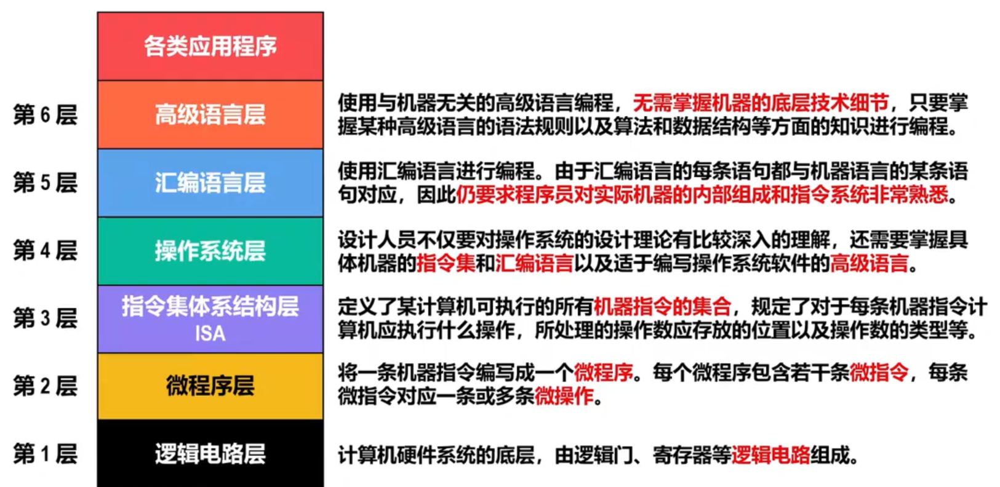

* 上面的第 1 层 ~ 第 6 层，就构成了计算机系统，如下所示：

> [!NOTE]
>
> * ① 第 1 层 ~ 第 3 层属于 `硬件层` ：第 1 层由 `硬件工程师` 设计，而第 2 层 ~ 第 3 层由 `计算机硬件架构师` 设计。
> * ② 第 4 层 ~ 第 6 层属于 `软件层` ，由 `程序员` 设计。
> * ③ 整个层次结构之上，可以看作是面向最终用户的各类应用。

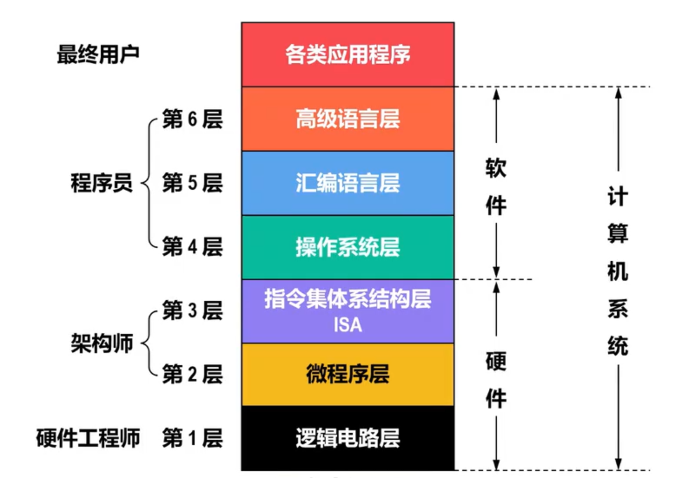

* 本课程主要讨论第 1 层 ~ 第 3 层的相关原理和设计思想，而其余各层的内容均由相应的软件课程讲解，如下所示：

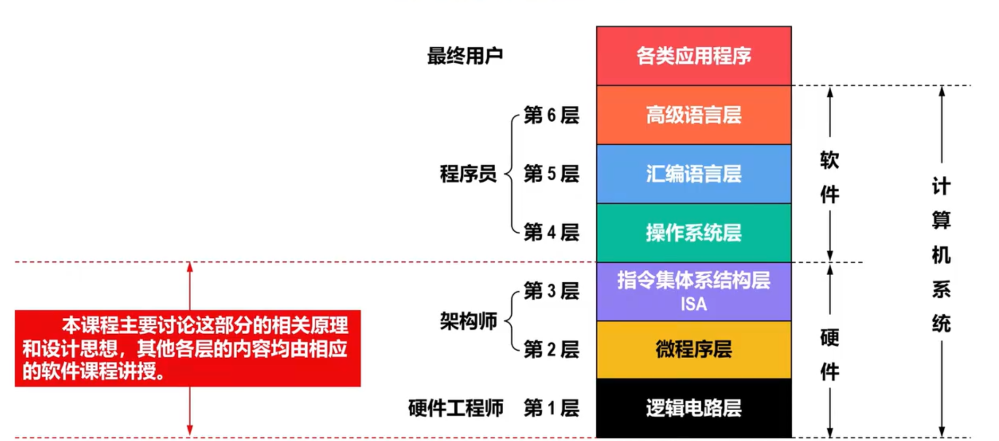

## 5.2 软件和硬件的逻辑功能等价性

### 5.2.1 概述

* ① 在特定条件下，用软件实现的逻辑功能也可以通过硬件电路来实现，反之亦然。

> [!NOTE]
>
> 对于一些特定的计算或控制任务，可以选择将其 `使用软件编程来实现` ，也可以选择 `设计专用硬件电路来实现` ，而两者的结果 `在功能上等效` 。

* ② 软件和硬件的逻辑功能等价性是计算机科学中的一个重要概念，也是计算机体系结构和工程中的基本原则之一。

> [!NOTE]
>
> * 当选择在软件层面实现某些逻辑功能时，这通常意味着使用通用处理器（CPU）来执行程序。
> * 当选择在硬件层面实现这些逻辑功能时，这通常意味着使用专门的硬件电路，如：现场可编程门阵列 FPGA 以及专用集成电路 ASIC 技术。

### 5.2.2 例子

* 在上世纪 90 年，对于 80386 SX-33 的 CPU 而言，需要 VCD 解码卡（硬件），才能播放 VCD 。

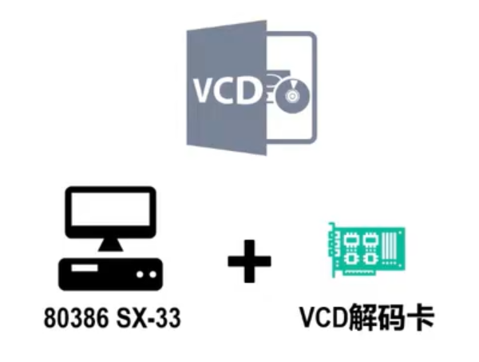

* 但是，随着硬件的升级，对于 80486 DX2/80 的 CPU 而言，Xing 软件（软件），就可以播放 VCD 了。

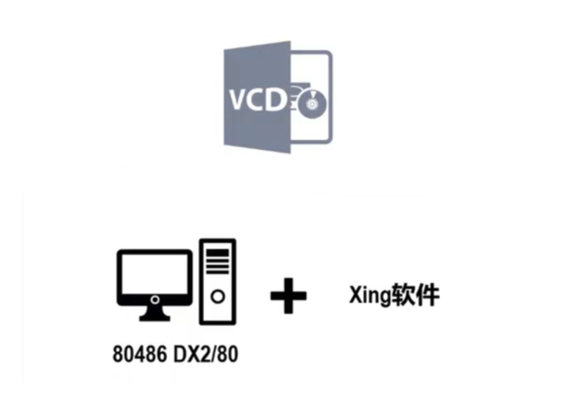

* 1996 年，Intel 推出带有多媒体指令集 MMX 的奔腾 CPU 后，软件解码 VCD 已经不是问题；并且，随着这款 CPU 的普及，VCD 解码卡也逐渐退出市场。

### 5.2.3 软件实现 VS 硬件实现

* 选择软件或硬件来实现某个逻辑功能，通常取决于以下几个因素，如下所示：

| 因素       | 软件实现                                         | 硬件实现                                       |
| ---------- | ------------------------------------------------ | ---------------------------------------------- |
| 性能和速度 | 性能和速度弱于硬件实现                           | 更快的性能和更快的响应时间                     |
| 灵活性     | 相对容易地进行修改和更新                         | 修改和更新需要重新设计和制造                   |
| 成本       | 开发软件相对便宜                                 | 开发和制造硬件比较昂贵                         |
| 应用需求   | 有些任务更适合在软件层面完成，如：操作系统的功能 | 有些任务更适合在硬件层面完成，如：高频交易系统 |

* 当研制一台计算机的时候，设计者必须明确分配每一级的任务，确定哪些功能需要使用硬件实现，哪些功能需要使用软件实现。这是由设计目标、技术水平、性价比等综合因素决定的。

# 第六章：计算机的基本工作原理

## 6.1 概述

* 本节课相当于课程全部章节的概述，目的是让同学们对计算机的基本工作原理有一个初步的、整体的印象。
* 对于没有学习过相关先修课程的跨专业的同学，本节课的难度较大，遇到实在无法理解的内容，请不要 “钻牛角尖”、也不要灰心，暂时放过去，随着后续各章内容的学习，最终一定能够很好地理解本节课的内容。

## 6.2 计算机硬件组成的细化

* 为了能够更好地介绍计算机的基本工作原理，我们首先需要对之前课程中的，已经介绍过的计算机的硬件组成进一步细化。这面是我们之前介绍过的计算机的硬件组成，如下所示：

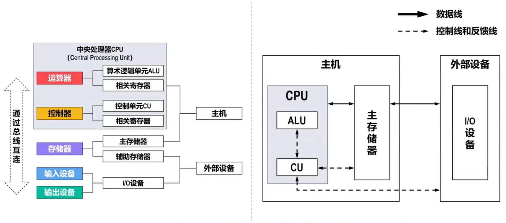

* 之前，我们介绍了 `运算器` 的核心是 `算术逻辑单元 ALU` ，如下所示：

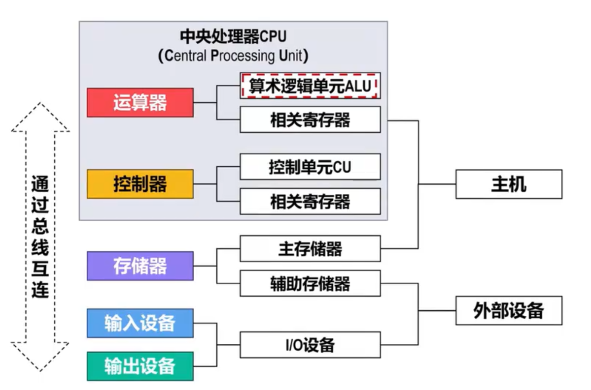

* 而对 `相关寄存器` 并没有进一步介绍。其实，`运算器` 中除了 `ALU` 外，至少还包含 `3` 个寄存器，如下所示：

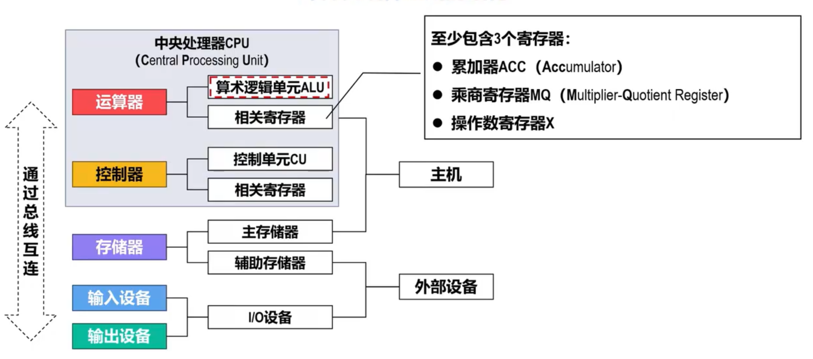

* 此时，我们就可以画出更具体的 `运算器` 的 `结构示意图` ，如下所示：

# 第七章：计算机系统的性能指标

## 7.1 基本性能指标

## 7.2 和运算速度相关的性能指标

